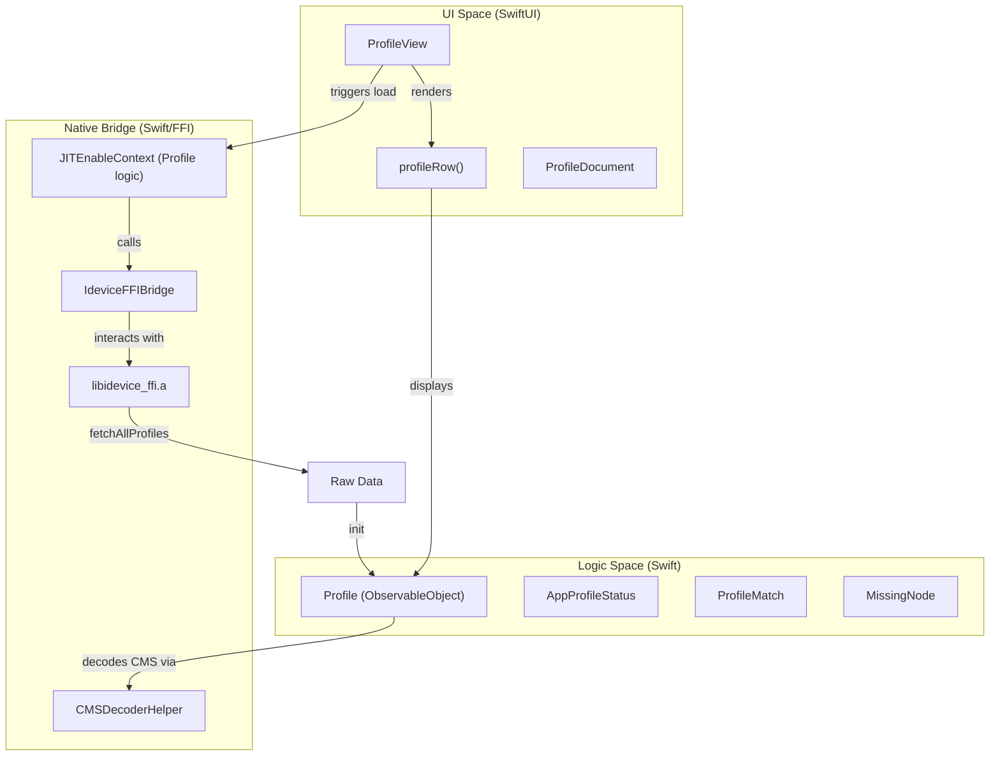
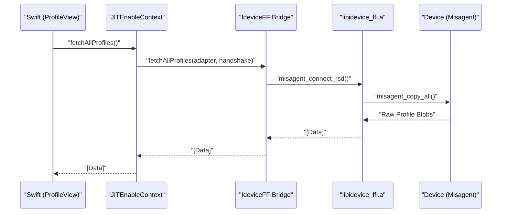

# Provisioning Profile Management

<details>
<summary>Relevant source files</summary>

The following files were used as context for generating this wiki page:

- [StikJIT/Utilities/mountDDI.swift](StikJIT/Utilities/mountDDI.swift)
- [StikJIT/Views/ProfileView.swift](StikJIT/Views/ProfileView.swift)
- [StikJIT/idevice/idevice.h](StikJIT/idevice/idevice.h)
- [StikJIT/idevice/libidevice_ffi.a](StikJIT/idevice/libidevice_ffi.a)

</details>


## Purpose and Scope

This document describes the provisioning profile management system in StikDebug. It covers the `ProfileView` interface for displaying, importing, and managing `.mobileprovision` files, the profile-to-app matching logic with wildcard support, entitlement verification, and the backend APIs for profile CRUD operations via the Misagent service.

## System Architecture

The provisioning profile management system bridges the gap between high-level SwiftUI views and low-level device services. It uses the `Misagent` service to interact with the device's trust store and the `InstallationProxy` service to retrieve metadata for installed applications.

### Component Interaction Diagram

This diagram maps natural language concepts to the specific code entities responsible for profile operations.



**Sources:** [StikJIT/Views/ProfileView.swift:10-45](), [StikJIT/Views/ProfileView.swift:116-134](), [StikJIT/idevice/libidevice_ffi.a:1-10]()

---

## Data Models and Parsing

### The Profile Class
The `Profile` class is the central data model for a single provisioning profile. It handles the extraction of XML plist data from the CMS (Cryptographic Message Syntax) wrapper common in `.mobileprovision` files.

*   **CMS Decoding:** Uses `CMSDecoderHelper.decodeCMSData(data)` to strip the signature and extract the inner XML [StikJIT/Views/ProfileView.swift:28-29]().
*   **Metadata Extraction:** Parses the resulting plist to populate `appName`, `appId` (application-identifier), `uuid`, and `expirationDate` [StikJIT/Views/ProfileView.swift:31-37]().
*   **Visual Status:** Provides a `dateColor` property based on the number of days until expiry, using logic derived from AltStore [StikJIT/Views/ProfileView.swift:58-73]().

### App-to-Profile Matching Structures
Because a device may have multiple profiles for the same app (e.g., different versions or wildcards), the system uses intermediate structures to organize the UI:

| Entity | Purpose |
| :--- | :--- |
| `AppProfileStatus` | Groups all `ProfileMatch` objects for a specific Bundle ID [StikJIT/Views/ProfileView.swift:154-155](). |
| `ProfileMatch` | Pairs a `Profile` with a list of `MissingNode` differences [StikJIT/Views/ProfileView.swift:158-163](). |
| `MissingNode` | Represents a hierarchical diff of missing entitlements [StikJIT/Views/ProfileView.swift:470-482](). |

**Sources:** [StikJIT/Views/ProfileView.swift:10-74](), [StikJIT/Views/ProfileView.swift:154-188]()

---

## Backend Implementation

The backend logic resides in `JITEnableContext` and interacts with the device via the `misagent` service over the Remote Service Discovery (RSD) protocol.

### Profile Service Flow



**Sources:** [StikJIT/idevice/idevice.h:133-135](), [StikJIT/idevice/idevice.h:208-212](), [StikJIT/idevice/libidevice_ffi.a:1-10]()

### Key Operations

*   **Fetching Profiles**: Connects to the `MisagentClientHandle` and retrieves all installed profiles as raw data blobs [StikJIT/idevice/idevice.h:133-135]().
*   **Adding Profiles**: Installs a new `.mobileprovision` file to the device using the misagent service [StikJIT/idevice/idevice.h:133-135]().
*   **Removing Profiles**: Uninstalls a profile using its unique UUID via the misagent service [StikJIT/idevice/idevice.h:133-135]().

---

## User Interface: App Expiry

The "App Expiry" interface (`ProfileView`) provides a comprehensive view of the device's provisioning state.

### Profile Viewing and Matching
The view organizes profiles by the applications they serve. It uses a "best match" algorithm to highlight the most appropriate profile for a given sideloaded app.

1.  **Sideloaded App Detection**: Fetches installed apps and filters for those requiring profile validation [StikJIT/Views/ProfileView.swift:358-370]().
2.  **Wildcard Handling**: Profiles with `*` in their application identifier are matched against apps with compatible prefixes [StikJIT/Views/ProfileView.swift:398-405]().
3.  **Entitlement Diffing**: Compares the entitlements embedded in the app's binary against those permitted by the provisioning profile [StikJIT/Views/ProfileView.swift:448-452]().

### Import and Export
*   **Import**: Users can import `.mobileprovision` files via `fileImporter`. The app handles security-scoped URLs to read the data and send it to the backend [StikJIT/Views/ProfileView.swift:690-730]().
*   **Export**: Existing profiles on the device can be exported back to the filesystem using `ProfileDocument` and `fileExporter` [StikJIT/Views/ProfileView.swift:76-94](), [StikJIT/Views/ProfileView.swift:648-658]().

### Entitlement Diff UI
When a profile is missing required entitlements, `ProfileView` renders a hierarchical list using `formattedMissingLines` [StikJIT/Views/ProfileView.swift:534-545]().

```swift
// Example of rendering missing entitlements in a profile row
if !match.missingEntitlements.isEmpty {
    VStack(alignment: .leading, spacing: 2) {
        Text("Missing entitlements:")
            .font(.caption.bold())
            .foregroundColor(.red)
        ForEach(formattedMissingLines(from: match.missingEntitlements), id: \.self) { line in
            Text(line)
                .font(.caption.monospaced())
                .foregroundColor(.secondary)
        }
    }
}
```

**Sources:** [StikJIT/Views/ProfileView.swift:340-351](), [StikJIT/Views/ProfileView.swift:484-532]()

---

## Profile Management Operations

| Operation | Code Entry Point | Logic |
| :--- | :--- | :--- |
| **List** | `loadData()` [StikJIT/Views/ProfileView.swift:358]() | Detached task calls `fetchAllProfiles` and `getSideloadedApps`. |
| **Install** | `handleImport()` [StikJIT/Views/ProfileView.swift:690]() | Reads `Data` from `UTType.mobileprovision` and calls backend `addProfile`. |
| **Delete** | `removeProfile()` [StikJIT/Views/ProfileView.swift:666]() | Calls `removeProfileWithUUID` and reloads the UI on success. |
| **Matching** | `profileMatches()` [StikJIT/Views/ProfileView.swift:428]() | Filters grouped profiles by exact ID match or wildcard pattern. |

**Sources:** [StikJIT/Views/ProfileView.swift:358-458](), [StikJIT/Views/ProfileView.swift:666-730]()