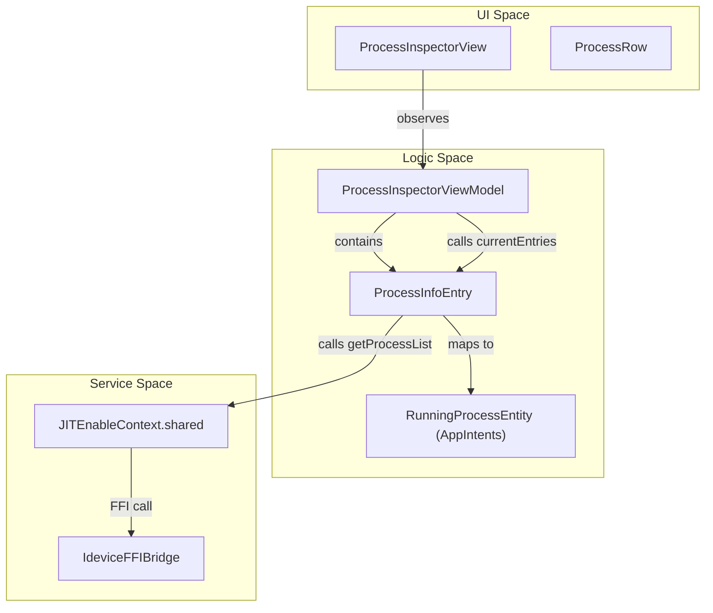
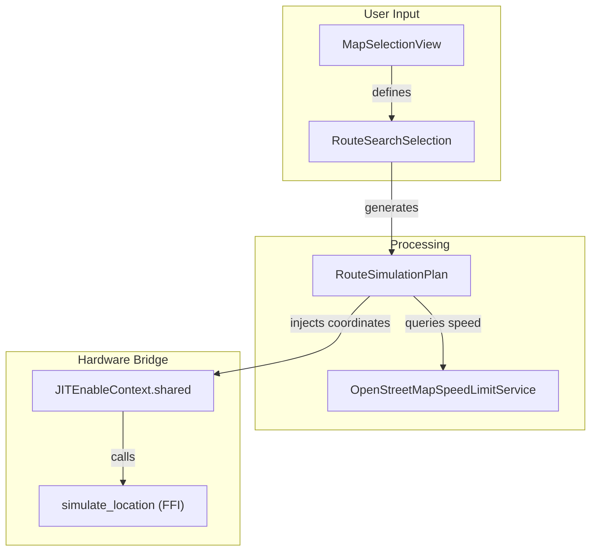

# Tools View and Auxiliary Interfaces

Relevant source files

The following files were used as context for generating this wiki page:

- [StikJIT/Utilities/DeviceInfoManager.swift](StikJIT/Utilities/DeviceInfoManager.swift)
- [StikJIT/Utilities/Intents.swift](StikJIT/Utilities/Intents.swift)
- [StikJIT/Views/MapSelectionView.swift](StikJIT/Views/MapSelectionView.swift)
- [StikJIT/Views/ProcessInspectorView.swift](StikJIT/Views/ProcessInspectorView.swift)
- [StikJIT/Views/ToolsView.swift](StikJIT/Views/ToolsView.swift)

The `ToolsView` serves as a central hub for secondary diagnostic and utility features within StikDebug. It aggregates several distinct interfaces: the **Process Inspector** for managing running tasks, **Location Simulation** for GPS spoofing, and **Device Info** for hardware/software metadata retrieval.

### Tools Hub Architecture

The `ToolsView` is implemented as a `NavigationStack` containing a list of `ToolItem` structures. Each item defines a destination view, a system icon, and descriptive text [StikJIT/Views/ToolsView.swift:10-28]().

| Tool | Purpose | Implementation Class |
| :--- | :--- | :--- |
| **Scripts** | JS execution management | `ScriptListView` |
| **Console** | Live device logs | `ConsoleLogsView` |
| **Device Info** | Lockdown metadata viewer | `DeviceInfoView` |
| **App Expiry** | Provisioning profile tracking | `ProfileView` |
| **Processes** | PID listing and termination | `ProcessInspectorView` |
| **Location** | GPS spoofing and bookmarks | `LocationSimulationView` |

**Sources:** [StikJIT/Views/ToolsView.swift:10-51]()

---

### Process Inspector

The Process Inspector provides a real-time view of all active processes on the target device. It allows developers to identify PIDs, view executable paths, and control process states (Pause, Resume, Kill) remotely.

#### Implementation Details
- **Data Fetching**: The `ProcessInspectorViewModel` calls `ProcessInfoEntry.currentEntries(&err)` [StikJIT/Views/ProcessInspectorView.swift:11-12](), which bridges to the `idevice` FFI through the `JITEnableContext` singleton [StikJIT/Utilities/Intents.swift:115-129]().
- **Process Control**: Supports sending signals to remote processes: `SIGSTOP` (17) for pausing, `SIGCONT` (19) for resuming, and `SIGKILL` (9) for termination [StikJIT/Views/ProcessInspectorView.swift:106-120]().
- **Safety Mechanism**: Killing a process requires a two-step confirmation in the UI; a 3-second `killConfirmTask` handles the state reset if the second tap is not received [StikJIT/Views/ProcessInspectorView.swift:82-102]().
- **Auto-Refresh**: The view maintains a polling interval while active via `startAutoRefresh()` to keep the process list current [StikJIT/Views/ProcessInspectorView.swift:29-34]().

#### Process Management Entity Mapping
The following diagram maps the UI concepts to the underlying data entities and FFI bridge.

**Process Entity Mapping**

**Sources:** [StikJIT/Views/ProcessInspectorView.swift:10-157](), [StikJIT/Utilities/Intents.swift:48-130]()

---

### Location Simulation

The `LocationSimulationView` enables GPS spoofing by interacting with the device's location simulation service. It features an interactive map, search capabilities, and advanced route simulation with speed limit detection.

#### Key Components
- **Map Interaction**: Uses `MapKit` to allow users to select coordinates. The `MapSelectionView` handles the visual selection of points and routes [StikJIT/Views/MapSelectionView.swift:8-24]().
- **Route Simulation**: Supports complex path sampling using `sampledRouteCoordinates` [StikJIT/Views/MapSelectionView.swift:101-125]() and interpolation [StikJIT/Views/MapSelectionView.swift:90-99]().
- **Speed Limit Integration**: Fetches real-world speed data from the OpenStreetMap Overpass API [StikJIT/Views/MapSelectionView.swift:58-63](). It parses various speed formats (mph, knots, km/h) to adjust simulation velocity [StikJIT/Views/MapSelectionView.swift:154-180]().
- **Overpass Querying**: Dynamically generates bounding box queries to retrieve road geometry and `maxspeed` tags [StikJIT/Views/MapSelectionView.swift:199-231]().

#### Location Simulation Data Flow
The simulation logic bridges high-level route planning to the device-level coordinate injection.

**Location Simulation Flow**

**Sources:** [StikJIT/Views/MapSelectionView.swift:26-56](), [StikJIT/Views/MapSelectionView.swift:154-231]()

---

### Device Info Viewer

The `DeviceInfoView` retrieves and displays low-level system metadata from the device's `lockdownd` service via the `DeviceInfoManager`.

#### Data Acquisition Pipeline
1. **Initialization**: `DeviceInfoManager` calls `ideviceInfoInit()` via `JITEnableContext` to obtain a `LockdownClientSendable` wrapper around the raw OpaquePointer [StikJIT/Utilities/DeviceInfoManager.swift:29-58]().
2. **XML Retrieval**: The manager requests the full device information tree as an XML string using `ideviceInfoGetXML(withLockdownClient:)` [StikJIT/Utilities/DeviceInfoManager.swift:60-74]().
3. **Parsing**: The XML is converted to a Swift `Dictionary` via `PropertyListSerialization.propertyList(from:options:format:)` [StikJIT/Utilities/DeviceInfoManager.swift:84-90]().
4. **Formatting**: Keys are sorted and values are converted to strings via `convertToString(_:)` for display in the `List` [StikJIT/Utilities/DeviceInfoManager.swift:90-94]().
5. **Export**: Users can export the gathered metadata to a CSV file using `exportToCSV()` [StikJIT/Utilities/DeviceInfoManager.swift:121-130]().

**Sources:** [StikJIT/Utilities/DeviceInfoManager.swift:15-131](), [StikJIT/Views/ToolsView.swift:23]()

---

### App Intents Integration

Secondary tools are also exposed via the `AppIntents` framework, allowing automation through the Shortcuts app and Siri.

- **`InstalledAppEntity`**: Provides a queryable list of apps for JIT enablement [StikJIT/Utilities/Intents.swift:6-46]().
- **`RunningProcessEntity`**: Represents a remote process with a stable identifier to survive PID changes during restarts [StikJIT/Utilities/Intents.swift:50-88]().
- **`EnableJITIntent`**: Programmatically triggers the JIT enablement lifecycle, including script execution if a preferred script is mapped to the bundle ID [StikJIT/Utilities/Intents.swift:134-187]().

**Sources:** [StikJIT/Utilities/Intents.swift:1-195]()