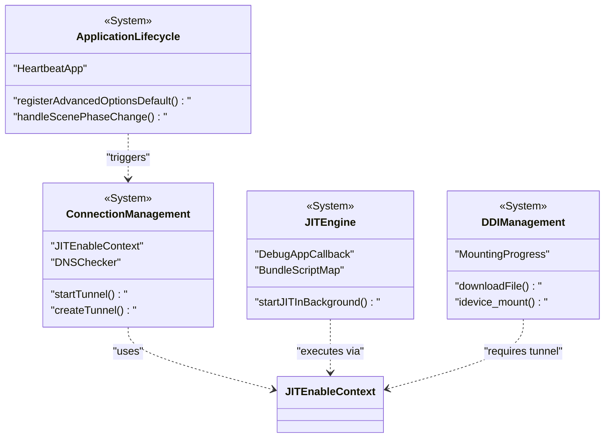

# Core Systems

<details>
<summary>Relevant source files</summary>

The following files were used as context for generating this wiki page:

- [StikJIT/StikJITApp.swift](StikJIT/StikJITApp.swift)
- [StikJIT/Utilities/JITEnableContext.swift](StikJIT/Utilities/JITEnableContext.swift)

</details>


## Purpose and Scope

This document provides an overview of the internal architecture and core subsystems that power StikDebug. It serves as the primary reference for how the application orchestrates JIT enablement, manages device connectivity via heartbeats, and handles the Developer Disk Image (DDI) lifecycle. The core systems layer bridges the [User Interface](#2) with the low-level [Device Communication](#4) protocols.

For implementation details, refer to the child pages:
- [Application Lifecycle](#3.1)
- [Heartbeat and Connection Management](#3.2)
- [JIT Enablement Engine](#3.3)
- [Developer Disk Image Management](#3.4)
- [State Management and Persistence](#3.5)
- [JavaScript Execution Environment](#3.6)

---

## System Architecture

The application is built on a set of reactive subsystems that respond to user actions, network events, and iOS scene phase changes.

### Core Logic Flow
The following diagram illustrates the relationship between the high-level Swift entities and the underlying system logic.

**Diagram: "SystemComponentMap"**
```mermaid
graph TB
    subgraph "AppEntryLifecycle"
        ["HeartbeatApp"]
        ["handleScenePhaseChange()"]
    end

    subgraph "ConnectionLogic"
        ["startTunnelInBackground()"]
        ["FunctionGuard"]
        ["DeviceConnectionContext"]
    end

    subgraph "JITExecution"
        ["startJITInBackground()"]
        ["BundleScriptMap"]
        ["RunJSViewModel"]
    end

    subgraph "ResourceManagement"
        ["MountingProgress"]
        ["downloadFile()"]
    end

    ["HeartbeatApp"] --> ["handleScenePhaseChange()"]
    ["handleScenePhaseChange()"] --> ["startTunnelInBackground()"]
    ["startTunnelInBackground()"] --> ["FunctionGuard"]
    ["startJITInBackground()"] --> ["startTunnelInBackground()"]
    ["startJITInBackground()"] --> ["BundleScriptMap"]
    ["startJITInBackground()"] --> ["RunJSViewModel"]
    ["startTunnelInBackground()"] --> ["MountingProgress"]
    ["MountingProgress"] --> ["downloadFile()"]
```
**Sources:** [StikJIT/StikJITApp.swift:127-186](), [StikJIT/Utilities/JITEnableContext.swift:184-220]()

---

## Core Subsystems

### 1. Application Lifecycle and Scene Management
The `HeartbeatApp` manages the initial configuration of the app environment, including default `UserDefaults` registration via `registerAdvancedOptionsDefault`. It performs method swizzling for `UIDocumentPickerViewController` to handle content types correctly. It monitors `scenePhase` to ensure the device tunnel is re-established via `startTunnelInBackground` when the app returns to the `.active` state.

For details, see [Application Lifecycle](#3.1).

**Sources:** [StikJIT/StikJITApp.swift:12-21](), [StikJIT/StikJITApp.swift:132-156](), [StikJIT/StikJITApp.swift:127-130]()

### 2. Heartbeat and Connection Management
StikDebug maintains a persistent connection to the target device using a heartbeat mechanism and an RSD (Remote Service Discovery) tunnel. Connectivity is managed through `JITEnableContext`, which encapsulates `adapter` and `handshake` handles. The `startTunnelInBackground` function utilizes a `FunctionGuard` actor to prevent race conditions. The system also includes a `DNSChecker` to verify network health and Apple service reachability.

For details, see [Heartbeat and Connection Management](#3.2).

**Sources:** [StikJIT/StikJITApp.swift:25-116](), [StikJIT/StikJITApp.swift:191-203](), [StikJIT/Utilities/JITEnableContext.swift:20-34]()

### 3. JIT Enablement Engine
The JIT Engine is the primary functional unit, orchestrated by `JITEnableContext`. Triggered by `startJITInBackground`, it resolves scripts via `BundleScriptMap`, checks for TXM (Trusted Execution Monitor) capabilities, and invokes native FFI calls. The engine handles the transition from a "Waiting" state to "Success" or "Error" based on the response from the device's debug proxy.

For details, see [JIT Enablement Engine](#3.3).

**Sources:** [StikJIT/Utilities/JITEnableContext.swift:13-13](), [StikJIT/StikJITApp.swift:265-325]()

### 4. Developer Disk Image (DDI) Management
To enable debugging features, the app must mount a DDI. The `MountingProgress` singleton tracks this state. On first launch, `HeartbeatApp` checks for required files (`Image.dmg`, `Image.dmg.trustcache`) and triggers downloads if missing. The mounting pipeline interacts with `JITEnableContext` to perform the actual mount operation on the target device.

For details, see [Developer Disk Image Management](#3.4).

**Sources:** [StikJIT/StikJITApp.swift:128-128](), [StikJIT/StikJITApp.swift:161-180](), [StikJIT/StikJITApp.swift:488-511]()

### 5. State Management and Persistence
StikDebug uses `UserDefaults` and `@AppStorage` for UI-bound settings and a shared App Group (`group.com.stik.sj`) for data shared with widgets. Persistence for device pairing is handled by `PairingFileStore`, which manages the `rp_pairing_file.plist`. `DeviceConnectionContext` maintains the target IP address used for all tunnel establishments.

For details, see [State Management and Persistence](#3.5).

**Sources:** [StikJIT/Utilities/JITEnableContext.swift:117-137](), [StikJIT/Utilities/JITEnableContext.swift:147-151](), [StikJIT/StikJITApp.swift:13-21]()

### 6. JavaScript Execution Environment
For complex JIT activation scenarios, StikDebug provides a `JSContext` sandbox. Native functions such as `send_command`, `get_pid`, and `prepare_memory_region` are injected into the environment. The `RunJSViewModel` manages script execution and uses `DispatchSemaphore` to synchronize asynchronous native callbacks with the JS execution thread.

For details, see [JavaScript Execution Environment](#3.6).

**Sources:** [StikJIT/Utilities/JITEnableContext.swift:13-13](), [StikJIT/StikJITApp.swift:246-263]()

---

## Code Entity Mapping

The following diagram bridges the natural language concepts of the system to specific classes and functions found in the codebase.

**Diagram: "EntityAssociationMap"**

**Sources:** [StikJIT/StikJITApp.swift:25-116](), [StikJIT/StikJITApp.swift:127-142](), [StikJIT/Utilities/JITEnableContext.swift:17-51]()