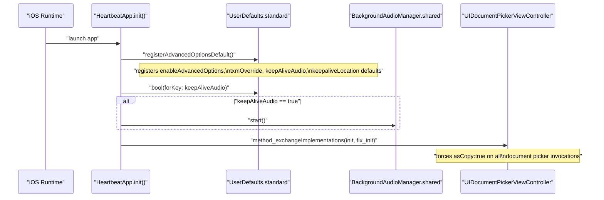
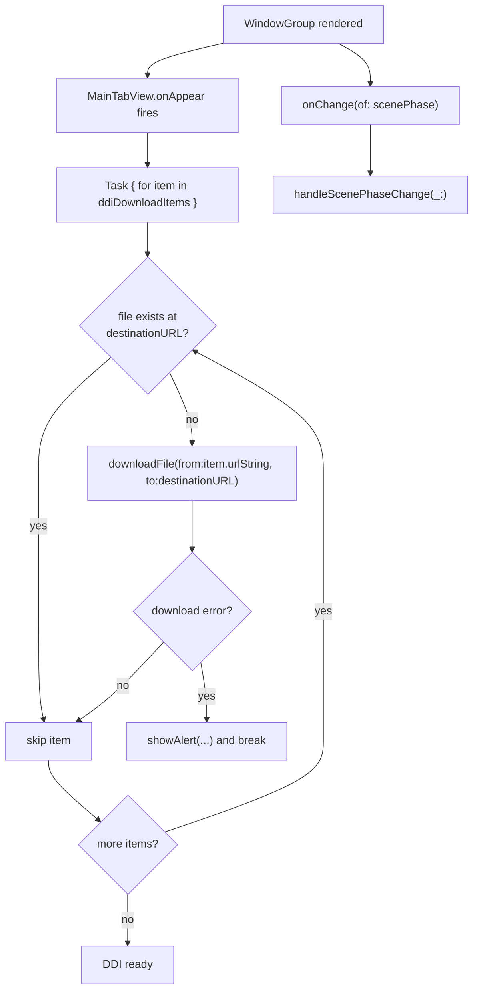
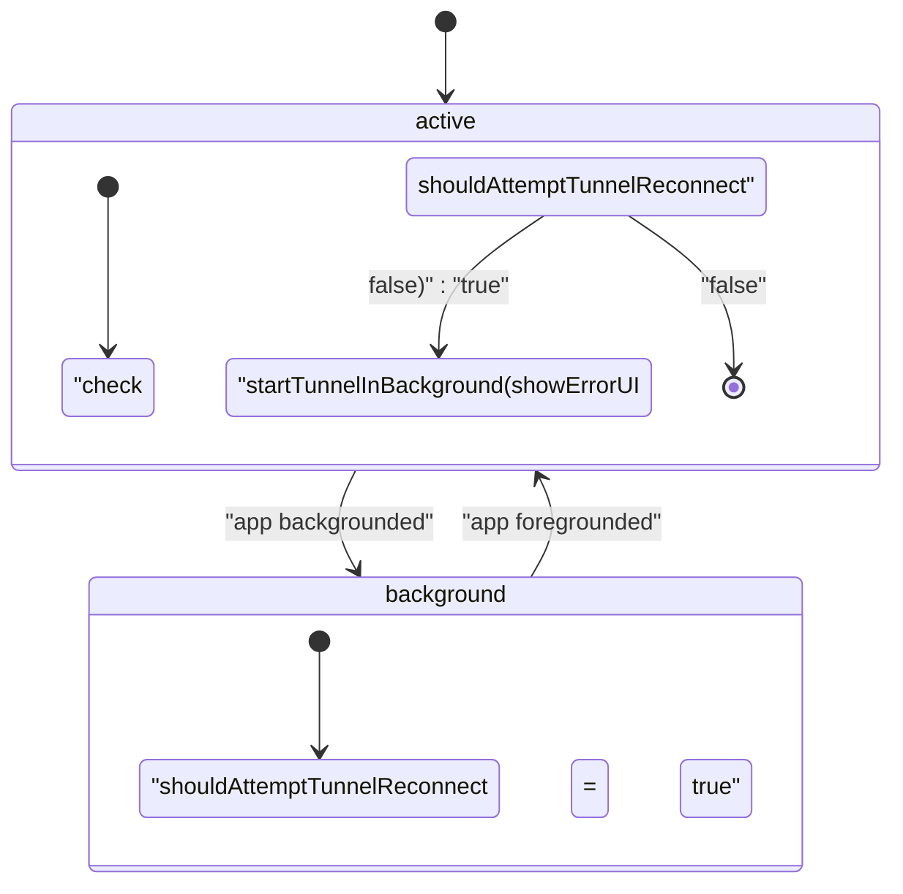
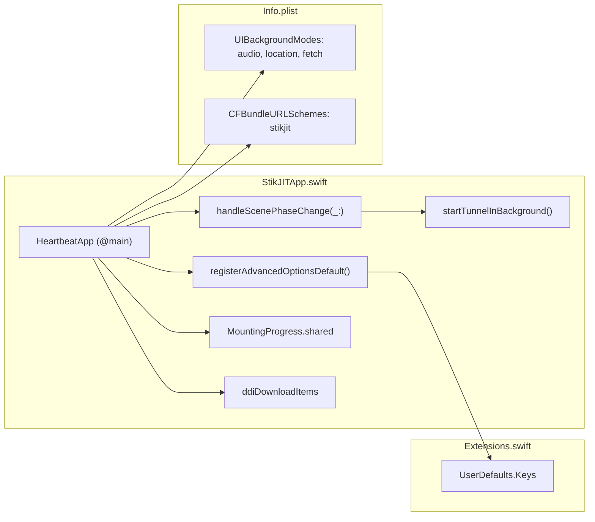

# Application Lifecycle

Relevant source files

The following files were used as context for generating this wiki page:

- [StikJIT/Info.plist](StikJIT/Info.plist)
- [StikJIT/JSSupport/RunJSView.swift](StikJIT/JSSupport/RunJSView.swift)
- [StikJIT/StikJITApp.swift](StikJIT/StikJITApp.swift)
- [StikJIT/Utilities/Extensions.swift](StikJIT/Utilities/Extensions.swift)

## Purpose and Scope

This page documents the startup sequence and lifecycle management of StikDebug, centered on the `HeartbeatApp` struct in [StikJIT/StikJITApp.swift:127-187](). It covers `UserDefaults` registration, background keep-alive setup, a UIKit swizzle applied at launch, the first-run DDI download task, and scene phase observation that drives connection restarts.

This page focuses on *when* and *in what order* things are initialized. For the heartbeat protocol and connection management, see [3.2](). For DDI download details, see [3.4](). For background keep-alive strategies, see [5.5]().

---

## Entry Point

`HeartbeatApp` is the `@main` SwiftUI `App` type [StikJIT/StikJITApp.swift:127-187](). It owns top-level state objects and coordinates the two phases of startup: the synchronous `init()` and the asynchronous `onAppear` task.

**App-level global state**

| Symbol | Type | Purpose |
|---|---|---|
| `pubTunnelConnected` | `Bool` | Global flag indicating a live tunnel connection [StikJIT/StikJITApp.swift:121]() |
| `tunnelStartPending` | `Bool` (private) | Guards re-entrant tunnel scheduling [StikJIT/StikJITApp.swift:122]() |
| `tunnelStartInProgress` | `Bool` (private) | Prevents concurrent tunnel start calls [StikJIT/StikJITApp.swift:123]() |
| `tunnelPendingShowUI` | `Bool` (private) | Controls whether a failed tunnel attempt shows error UI [StikJIT/StikJITApp.swift:124]() |

Sources: [StikJIT/StikJITApp.swift:121-127]()

---

## Initialization Sequence (`init`)

The `HeartbeatApp.init()` runs several steps synchronously before any view is rendered [StikJIT/StikJITApp.swift:132-143]().

**Initialization sequence diagram**

Sources: [StikJIT/StikJITApp.swift:132-143](), [StikJIT/StikJITApp.swift:13-21]()

### Step 1 — Default Registration (`registerAdvancedOptionsDefault`)

`registerAdvancedOptionsDefault()` [StikJIT/StikJITApp.swift:13-21]() registers four `UserDefaults` keys. Values set via `register(defaults:)` act as fallbacks and do not overwrite user-saved values.

| Key | Default value | Logic |
|---|---|---|
| `enableAdvancedOptions` | `true` on iOS 19+, `false` otherwise | Detects OS major version via `ProcessInfo` [StikJIT/StikJITApp.swift:16-17]() |
| `UserDefaults.Keys.txmOverride` | `false` | Defined in `UserDefaults.Keys` [StikJIT/StikJITApp.swift:18]() |
| `keepAliveAudio` | `true` | Default for silent audio background mode [StikJIT/StikJITApp.swift:19]() |
| `keepAliveLocation` | `true` | Default for background location mode [StikJIT/StikJITApp.swift:20]() |

### Step 2 — Background Manager Startup

If `keepAliveAudio` is enabled in settings, `BackgroundAudioManager.shared.start()` is called immediately [StikJIT/StikJITApp.swift:134-136](). This ensures the silent audio session is active before the first scene render, preventing iOS from suspending the process during early connection attempts.

### Step 3 — `UIDocumentPickerViewController` Swizzle

[StikJIT/StikJITApp.swift:137-141]() uses `method_exchangeImplementations` to swap `UIDocumentPickerViewController.init(forOpeningContentTypes:asCopy:)` with a fixed variant. The replacement method `fix_initForOpeningContentTypes:asCopy:` is looked up via `NSSelectorFromString` [StikJIT/StikJITApp.swift:137]().

This ensures that file imports (pairing files, profiles, scripts) are copied into the app sandbox, which is necessary for the app to maintain access to these files across sessions without specialized file-system entitlements.

---

## Body — View and Async Tasks

`HeartbeatApp.body` returns a `WindowGroup` containing `MainTabView` [StikJIT/StikJITApp.swift:160-186]().

**Startup task and lifecycle diagram**

Sources: [StikJIT/StikJITApp.swift:160-186]()

### DDI Download on First Appear

`onAppear` launches a Swift `Task` that iterates through `ddiDownloadItems` [StikJIT/StikJITApp.swift:163-180](). If a required DDI file (BuildManifest, Image, or TrustCache) is missing from the `Documents` directory, it is downloaded via `downloadFile` [StikJIT/StikJITApp.swift:169](). This ensures the JIT engine has the necessary images to mount when requested.

---

## Scene Phase Observation

`HeartbeatApp` observes `@Environment(\.scenePhase)` and delegates changes to `handleScenePhaseChange(_:)` [StikJIT/StikJITApp.swift:145-157]().

Sources: [StikJIT/StikJITApp.swift:145-157](), [StikJIT/StikJITApp.swift:181-183]()

The flag `shouldAttemptTunnelReconnect` is set to `true` when the app enters `.background` [StikJIT/StikJITApp.swift:147-148](). When the app returns to `.active`, `startTunnelInBackground(showErrorUI: false)` is called [StikJIT/StikJITApp.swift:149-153](). The `showErrorUI: false` parameter suppresses alerts during automatic reconnection to avoid interrupting the user if the network/VPN is still transitioning.

---

## `MountingProgress` Singleton

`HeartbeatApp` holds a `@StateObject` reference to `MountingProgress.shared` [StikJIT/StikJITApp.swift:128](). This singleton coordinates Developer Disk Image (DDI) mounting state across the application. It tracks progress percentages and provides the `pubMount()` entry point for the JIT engine.

Sources: [StikJIT/StikJITApp.swift:128]()

---

## Code Entity Mapping

**Code entity map for Application Lifecycle**

Sources: [StikJIT/StikJITApp.swift:127-187](), [StikJIT/Info.plist:1-54]()

---

## `Info.plist` Configuration

The `Info.plist` [StikJIT/Info.plist:1-54]() declares the system-level capabilities used during the lifecycle:

| Key | Value(s) | Purpose |
|---|---|---|
| `UIBackgroundModes` | `audio`, `location`, `fetch` | Permits background execution for keep-alive services [StikJIT/Info.plist:23-28]() |
| `CFBundleURLSchemes` | `stikjit` | Custom URL scheme for triggering JIT via `stikjit://enable-jit` [StikJIT/Info.plist:5-17]() |
| `NSBonjourServices` | `_stikdebug._tcp`, `_stikdebug._udp` | Bonjour advertising for device discovery [StikJIT/Info.plist:18-22]() |
| `UIFileSharingEnabled` | `true` | Enables access to the app's Documents folder via Files.app [StikJIT/Info.plist:29-30]() |

Sources: [StikJIT/Info.plist:1-54]()