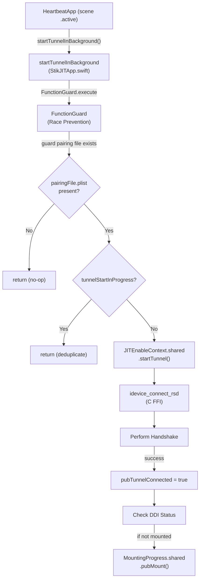
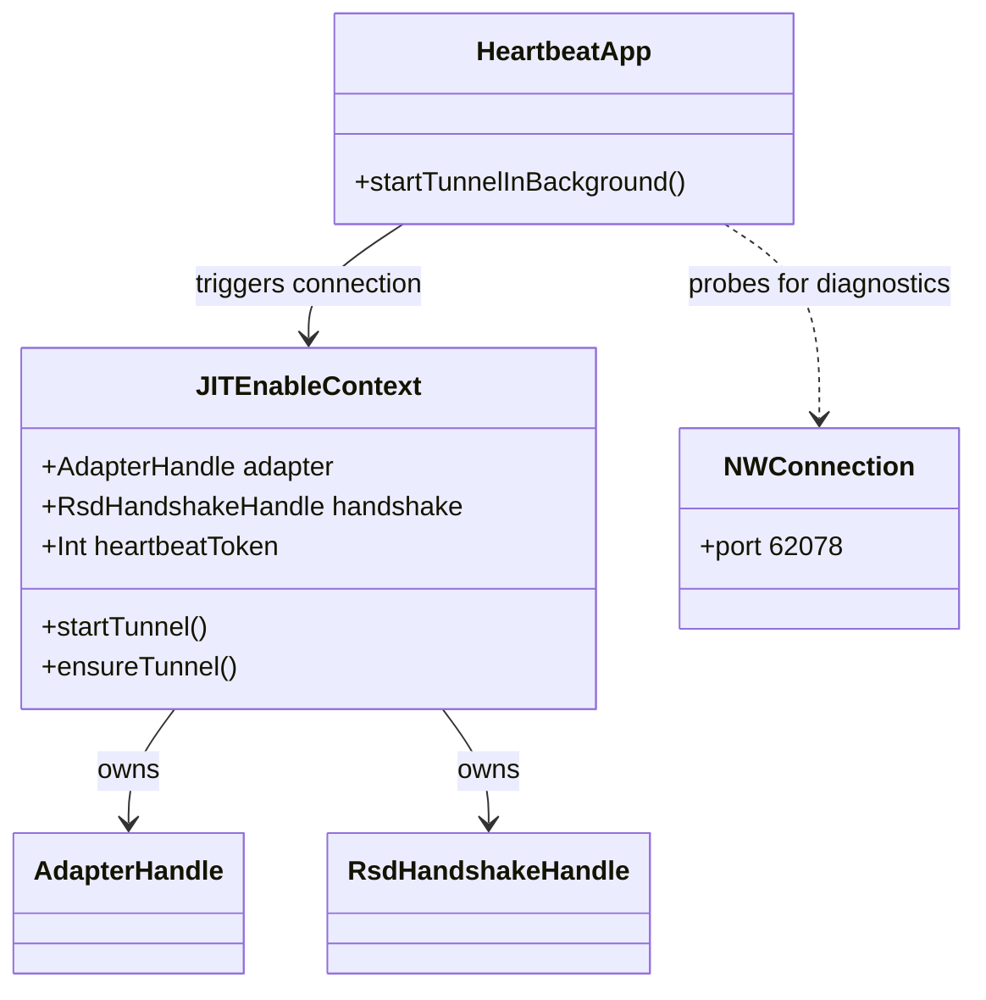

# Heartbeat and Connection Management

Relevant source files

The following files were used as context for generating this wiki page:

- [StikJIT/StikJITApp.swift](StikJIT/StikJITApp.swift)
- [StikJIT/Utilities/DeviceConnectionContext.swift](StikJIT/Utilities/DeviceConnectionContext.swift)

## Purpose and Scope

This page documents how StikDebug establishes and maintains its persistent connection to the iOS device over the loopback VPN. It covers the Swift-side `startTunnelInBackground` entry point, the generation-based token mechanism that serializes concurrent connection attempts, IP address resolution via `DeviceConnectionContext`, and the C-level handshake and heartbeat protocol implemented in the `idevice` module.

For how the app lifecycle triggers connection restarts on scene changes, see [Application Lifecycle and Initialization](3.1). For how `JITEnableContext` acts as the Swift singleton that owns the adapter handles and gates all device operations behind an active tunnel, see [JITEnableContext Singleton](4.2). For the low-level FFI types (`AdapterHandle`, `RsdHandshakeHandle`, etc.), see [Communication Architecture](4.1).

---

## Overview of the Connection Pipeline

The connection process (referred to in code as "starting the tunnel") serves two purposes:

1. **Establishing a Remote Service Discovery (RSD) session** so that subsequent device operations (JIT enable, app listing, DDI mount) can reuse the authenticated `AdapterHandle` and `RsdHandshakeHandle`.
2. **Signaling readiness** to the rest of the app via the global `pubTunnelConnected` flag [StikJIT/StikJITApp.swift:121]().

**Connection and Tunnel Pipeline**

Sources: [StikJIT/StikJITApp.swift:191-205](), [StikJIT/StikJITApp.swift:280-358](), [StikJIT/JITEnableContext.swift:214-250]()

---

## Swift Entry Point: `startTunnelInBackground`

[StikJIT/StikJITApp.swift:280-358]()

`startTunnelInBackground` is the primary Swift function for initiating a device connection. It uses a `FunctionGuard` to prevent race conditions during the asynchronous setup.

### Guards and Race Prevention

| Mechanism | File:Line | Purpose |
|---|---|---|
| `FunctionGuard` | [StikJIT/StikJITApp.swift:191-205]() | An actor-based wrapper that ensures only one connection task runs at a time, returning the existing task if one is already in flight. |
| `tunnelStartInProgress` | [StikJIT/StikJITApp.swift:123]() | A boolean flag used for immediate synchronous deduplication before entering the `Task` block. |
| Pairing File Check | [StikJIT/StikJITApp.swift:288-293]() | Verifies that a `.mobiledevicepairing` or `.plist` file exists in the Documents directory before attempting a connection. |

### Connection Logic

The function calls `JITEnableContext.shared.startTunnel()`, which performs the low-level RSD handshake [StikJIT/JITEnableContext.swift:214-250](). On success:
1. The global `pubTunnelConnected` is set to `true` [StikJIT/StikJITApp.swift:316]().
2. The app checks if the Developer Disk Image (DDI) is mounted using `isMounted()` [StikJIT/JITEnableContext.swift:273-285]().
3. If not mounted, it triggers `MountingProgress.shared.pubMount()` [StikJIT/StikJITApp.swift:320]().

### Error Recovery and UI

If the connection fails, the function handles specific error codes:
* **Error -9**: Indicates an invalid or expired pairing file. The app deletes the local pairing file and posts a `ShowPairingFilePicker` notification to prompt the user for a new one [StikJIT/StikJITApp.swift:335-342]().
* **General Errors**: If `showErrorUI` is true, it presents a "Connection Error" alert with a "Try Again" option [StikJIT/StikJITApp.swift:344-353]().

Sources: [StikJIT/StikJITApp.swift:280-358](), [StikJIT/JITEnableContext.swift:214-250]()

---

## IP Address Resolution and Network Diagnostics

### `DeviceConnectionContext`
[StikJIT/Utilities/DeviceConnectionContext.swift:10-18]()

This utility resolves the target IP address for the device. By default, it uses `10.7.0.1` (the standard LocalDevVPN gateway), but allows a user-defined override via `UserDefaults` key `customTargetIP` [StikJIT/Utilities/DeviceConnectionContext.swift:12]().

### `DNSChecker`
[StikJIT/StikJITApp.swift:25-116]()

A diagnostic class that performs POSIX `getaddrinfo` lookups for `gs.apple.com` and `google.com` [StikJIT/StikJITApp.swift:81-96](). It is used to detect if the local network is filtering Apple traffic or if there is no internet connectivity, which can interfere with DDI downloads or pairing validation.

### `checkDeviceConnection`
[StikJIT/StikJITApp.swift:360-403]()

This function probes the device's connectivity by attempting a raw TCP connection to port `62078` (lockdownd) [StikJIT/StikJITApp.swift:363](). It uses `NWConnection` with a 20-second timeout. If the port is unreachable, it provides the "Network Diagnostics" UI to help the user troubleshoot their VPN or Wi-Fi setup [StikJIT/StikJITApp.swift:383-401]().

Sources: [StikJIT/StikJITApp.swift:25-116](), [StikJIT/StikJITApp.swift:360-403](), [StikJIT/Utilities/DeviceConnectionContext.swift:10-18]()

---

## Heartbeat and Session Maintenance

While the initial connection establishes the tunnel, a "heartbeat" mechanism keeps the session alive.

### Token-Based Synchronization
To prevent multiple overlapping heartbeat loops, `JITEnableContext` manages a `heartbeatToken` [StikJIT/JITEnableContext.swift:45](). Each time a new connection is established via `startTunnel`, the token is incremented [StikJIT/JITEnableContext.swift:245](). Existing loops check this token; if it doesn't match the token they were started with, they terminate cleanly to avoid resource contention.

### Handle Management
The connection process populates several opaque handles within `JITEnableContext`:
* `adapter`: The base network adapter for the device [StikJIT/JITEnableContext.swift:43]().
* `handshake`: The authenticated RSD session handle [StikJIT/JITEnableContext.swift:44]().

These handles are used by services like `Misagent` for profile management and the `InstallationProxy` for app listing. If a service call fails due to a lost connection, `JITEnableContext` provides an `ensureTunnel()` method to transparently attempt a reconnection [StikJIT/JITEnableContext.swift:195-212]().

**Entity Association Diagram**

Sources: [StikJIT/JITEnableContext.swift:38-50](), [StikJIT/JITEnableContext.swift:195-250](), [StikJIT/StikJITApp.swift:360-380]()