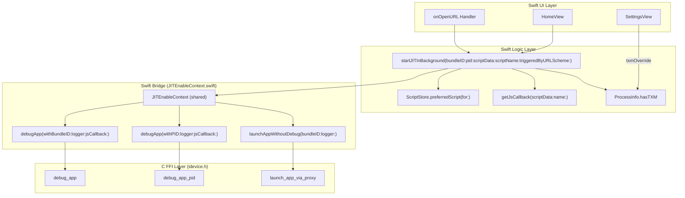
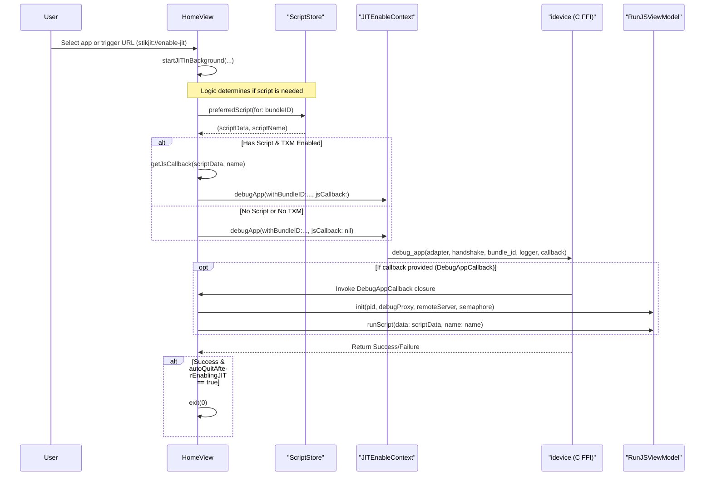
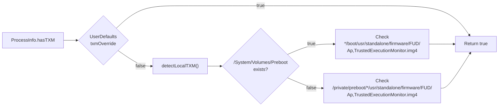

# JIT Enablement Engine

<details>
<summary>Relevant source files</summary>

The following files were used as context for generating this wiki page:

- [StikJIT/Utilities/JITEnableContext.swift](StikJIT/Utilities/JITEnableContext.swift)
- [StikJIT/Views/HomeView.swift](StikJIT/Views/HomeView.swift)
- [StikJIT/Views/SettingsView.swift](StikJIT/Views/SettingsView.swift)

</details>


The JIT Enablement Engine is the core system responsible for enabling Just-In-Time compilation on target iOS applications. This engine orchestrates the entire debug attachment process, manages script selection for advanced JIT configurations, handles both bundle-ID-based and PID-based debugging, and provides URL scheme integration for external automation.

This document focuses on the decision logic, execution flow, and callback mechanisms within the JIT enablement process. For device connection establishment, see [Heartbeat and Connection Management](). For JavaScript execution internals, see [JavaScript Execution Environment](). For DDI mounting operations, see [Developer Disk Image Management]().

---

## Architecture Overview

The JIT Enablement Engine operates as a multi-layer system with decision points for script selection, TXM capability detection, and execution path routing.

### Code Entity Mapping: UI to Native Bridge

The following diagram bridges the high-level UI triggers to the low-level native FFI calls used for JIT enablement.



**Sources:** [StikJIT/Views/HomeView.swift:93-97](), [StikJIT/Views/HomeView.swift:120-177](), [StikJIT/Utilities/JITEnableContext.swift:184-240](), [StikJIT/Views/SettingsView.swift:128-136]()

---

## JIT Enablement Flow

The complete flow from user action to JIT enablement follows a decision tree based on script availability, TXM capability, and execution context.



**Sources:** [StikJIT/Views/HomeView.swift:141-145](), [StikJIT/Views/HomeView.swift:273-333](), [StikJIT/Utilities/JITEnableContext.swift:13-13](), [StikJIT/Utilities/JITEnableContext.swift:184-240]()

---

## Script Selection System

The script selection system implements a priority-based fallback mechanism to determine which JavaScript should execute during JIT enablement. The selection occurs in `HomeView` before calling into `JITEnableContext`.

### Selection Priority

| Priority | Method | Description | Condition |
|----------|--------|-------------|-----------|
| 1 | `assignedScript(for:)` | User-assigned script via `BundleScriptMap` | Script file exists in documents/scripts |
| 2 | `autoScript(for:)` | Auto-detected script for known apps | `ProcessInfo.hasTXM == true` AND app matches known list |
| 3 | None | Direct JIT enablement without script | Fallback when no script available |

**Sources:** [StikJIT/Views/HomeView.swift:224-252](), [StikJIT/Views/HomeView.swift:192-211](), [StikJIT/Views/HomeView.swift:213-222]()

### Auto-Script Mapping

The `autoScriptResource(for:)` function maps known application names to bundled scripts:

| App Name | Script Resource | Script File |
|----------|----------------|-------------|
| maciOS | maciOS | maciOS.js |
| Amethyst, MeloNX, XeniOS, MeloCafe | universal | universal.js |
| Geode | Geode | Geode.js |
| Manic EMU | manic | manic.js |
| UTM, DolphiniOS, Flycast | UTM-Dolphin | UTM-Dolphin.js |

**Sources:** [StikJIT/Views/HomeView.swift:213-222]()

---

## TXM Detection and Override

The TXM (Trusted Execution Monitor) detection determines whether advanced script-based JIT enablement is available. This capability is required for executing JavaScript callbacks during debug attachment.

### Detection Logic

The `ProcessInfo.hasTXM` computed property implements a two-stage check:

1.  **User Override**: Checks `UserDefaults.Keys.txmOverride` (Settings -> "Always Run Scripts"). [StikJIT/Views/HomeView.swift:348-350]()
2.  **Filesystem Probing**: Searches `/System/Volumes/Preboot` or `/private/preboot` for `Ap,TrustedExecutionMonitor.img4` firmware files. [StikJIT/Views/HomeView.swift:352-369]()

### Code Entity: TXM Detection Flow



**Sources:** [StikJIT/Views/HomeView.swift:347-369](), [StikJIT/Views/SettingsView.swift:15-15]()

---

## Debug Entry Points

The `JITEnableContext` singleton provides three distinct entry points for JIT operations, replacing the legacy Objective-C implementation with Swift-native wrappers.

### Entry Point Signatures

*   **Bundle-ID Debugging**: `func debugApp(withBundleID bundleID: String, logger: LogFunc?, jsCallback: DebugAppCallback?) throws` [StikJIT/Utilities/JITEnableContext.swift:184-240]()
*   **PID Debugging**: `func debugApp(withPID pid: Int32, logger: LogFunc?, jsCallback: DebugAppCallback?) throws` [StikJIT/Utilities/JITEnableContext.swift:242-298]()
*   **Launch Only**: `func launchAppWithoutDebug(_ bundleID: String, logger: LogFunc?) throws` [StikJIT/Utilities/JITEnableContext.swift:300-344]()

### Implementation Detail

These methods wrap the C FFI functions from the `idevice` xcframework. For example, `debugApp(withBundleID:...)` calls `debug_app`, passing the `adapter` and `handshake` handles managed by the singleton. [StikJIT/Utilities/JITEnableContext.swift:222-228]()

---

## JavaScript Callback Mechanism

When TXM is available and a script is selected, the JIT engine creates a callback closure that bridges the native debug session to JavaScript execution.

### DebugAppCallback Type

The `DebugAppCallback` is defined as a closure receiving raw pointers to the debug proxy and remote server handles:

```swift
typealias DebugAppCallback = (
    _ pid: Int32, 
    _ debugProxy: OpaquePointer?, 
    _ remoteServer: OpaquePointer?, 
    _ semaphore: DispatchSemaphore
) -> Void
```
[StikJIT/Utilities/JITEnableContext.swift:13-13]()

### Lifecycle in startJITInBackground

1.  **Creation**: `getJsCallback` creates the closure. [StikJIT/Views/HomeView.swift:254-271]()
2.  **UI Notification**: Inside the closure, a `RunJSViewModel` is initialized and a notification `.intentJSScriptReady` is posted to trigger the Script View UI. [StikJIT/Views/HomeView.swift:260-265]()
3.  **Execution**: The script is executed in a global background queue using `model.runScript(data: scriptData, name: name)`. [StikJIT/Views/HomeView.swift:266-269]()

---

## URL Scheme Integration

The JIT engine supports automation via `onOpenURL` in `HomeView`.

### Supported Commands

| Command | Parameters | Action |
|---------|------------|--------|
| `enable-jit` | `bundle-id`, `pid`, `script-data`, `script-name` | Triggers `startJITInBackground`. If `script-data` is missing, it attempts to resolve via `ScriptStore.preferredScript`. [StikJIT/Views/HomeView.swift:124-150]() |
| `kill-process` | `pid` | Calls `JITEnableContext.shared.killProcess(withPID:)`. [StikJIT/Views/HomeView.swift:151-168]() |
| `launch-app` | `bundle-id` | Calls `JITEnableContext.shared.launchAppWithoutDebug`. [StikJIT/Views/HomeView.swift:169-175]() |

### Auto-Quit Behavior

If `@AppStorage("autoQuitAfterEnablingJIT")` is enabled, the application will call `exit(0)` immediately after a successful JIT enablement triggered by any method. [StikJIT/Views/HomeView.swift:77-77](), [StikJIT/Views/HomeView.swift:322-324]()

**Sources:** [StikJIT/Views/HomeView.swift:120-177](), [StikJIT/Views/HomeView.swift:322-324]()