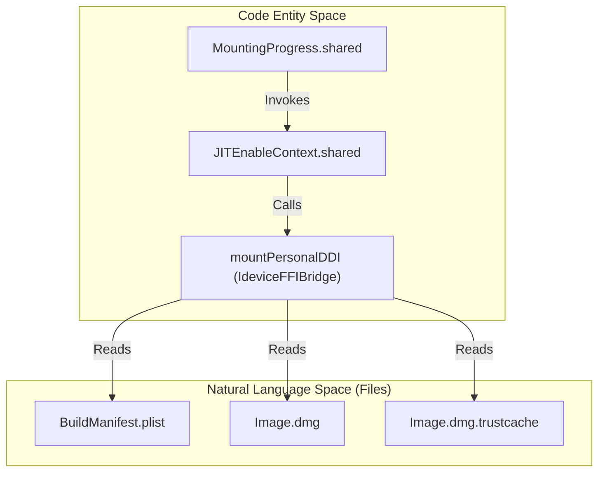
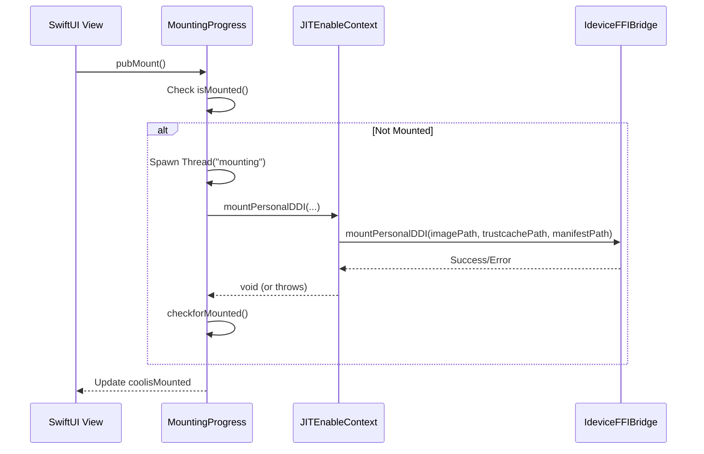

# Developer Disk Image Management

Relevant source files

The following files were used as context for generating this wiki page:

- [StikJIT/StikJITApp.swift](StikJIT/StikJITApp.swift)
- [StikJIT/Utilities/mountDDI.swift](StikJIT/Utilities/mountDDI.swift)

This document describes the Developer Disk Image (DDI) download, storage, mounting, and lifecycle management system in StikDebug. DDI files are required to enable advanced debugging capabilities on iOS devices and must be mounted before JIT or debug operations can proceed.

---

## Purpose and Architecture

The DDI management system handles three primary responsibilities:

1.  **Initial Download**: Automatically downloads required DDI files from GitHub on first launch [StikJIT/StikJITApp.swift:162-180]().
2.  **Mounting**: Mounts the DDI to the connected device via the Remote Service Discovery (RSD) protocol [StikJIT/Utilities/mountDDI.swift:39-47]().
3.  **Manual Refresh**: Allows users to redownload DDI files via the Settings interface [StikJIT/StikJITApp.swift:488-511]().

The system uses a singleton `MountingProgress` class to coordinate mounting operations and expose state to the UI layer [StikJIT/StikJITApp.swift:205-269]().

Sources: [StikJIT/StikJITApp.swift:162-180](), [StikJIT/StikJITApp.swift:205-269](), [StikJIT/Utilities/mountDDI.swift:39-47]()

---

## DDI File Structure

### Required Files
The system manages three essential files for DDI mounting, sourced from the `doronz88/DeveloperDiskImage` repository [StikJIT/StikJITApp.swift:445-461]():

| File Name | Purpose |
| :--- | :--- |
| `BuildManifest.plist` | Metadata and signing information for the DDI. |
| `Image.dmg` | The disk image containing developer tools. |
| `Image.dmg.trustcache` | Cryptographic cache for image validation. |

### Storage Layout
All files are stored in the application's Documents directory within a `DDI/` subdirectory [StikJIT/StikJITApp.swift:448-460]().

**Entity Association Map**

Sources: [StikJIT/StikJITApp.swift:445-461](), [StikJIT/Utilities/mountDDI.swift:39-47]()

---

## Initial Download System

The `HeartbeatApp` performs an automatic check for DDI files during `.onAppear` [StikJIT/StikJITApp.swift:162-163](). If files are missing, it triggers an asynchronous download [StikJIT/StikJITApp.swift:169-170]().

### Download Pipeline
1.  **Check**: Iterates through `ddiDownloadItems` [StikJIT/StikJITApp.swift:165-167]().
2.  **Fetch**: Uses `downloadFile(from:to:)` to retrieve assets from GitHub [StikJIT/StikJITApp.swift:169-170]().
3.  **Error Handling**: If a download fails, a main-thread alert is displayed using `showAlert` [StikJIT/StikJITApp.swift:171-176]().

Sources: [StikJIT/StikJITApp.swift:162-180](), [StikJIT/StikJITApp.swift:439-461]()

---

## Mounting Pipeline

### MountingProgress Singleton
The `MountingProgress` class (defined in [StikJIT/StikJITApp.swift:205]()) acts as the central state machine for DDI status.

| Property | Role |
| :--- | :--- |
| `mountProgress` | Tracks the percentage of data transferred during mounting [StikJIT/StikJITApp.swift:206](). |
| `coolisMounted` | A `@Published` boolean indicating if the device currently has a DDI attached [StikJIT/StikJITApp.swift:208](). |
| `mountingThread` | Holds a reference to the active background thread to prevent race conditions [StikJIT/StikJITApp.swift:207](). |

### Mounting Logic Flow
The mounting process is triggered via `pubMount()` [StikJIT/StikJITApp.swift:220](). It spawns a background thread named `"mounting"` [StikJIT/StikJITApp.swift:240]().

**Mounting Implementation Detail**

Sources: [StikJIT/StikJITApp.swift:220-269](), [StikJIT/Utilities/mountDDI.swift:39-47]()

---

## Progress Tracking

The system tracks mounting progress using a C-style callback mechanism bridged to Swift.

1.  **Callback**: `progressCallback(progress:total:context:)` is defined in [StikJIT/Utilities/mountDDI.swift:16-18]().
2.  **Update**: It calls `MountingProgress.shared.progressCallback` [StikJIT/StikJITApp.swift:211-218]().
3.  **UI Sync**: The progress is calculated as `(Double(progress) / Double(total)) * 100.0` and published on the main thread [StikJIT/StikJITApp.swift:215-217]().

Sources: [StikJIT/Utilities/mountDDI.swift:16-18](), [StikJIT/StikJITApp.swift:211-218]()

---

## Redownload System

Users can force a refresh of DDI files via `redownloadDDI()` [StikJIT/StikJITApp.swift:488]().

### Redownload Steps
1.  **Cleanup**: Deletes existing DDI files from the Documents directory [StikJIT/StikJITApp.swift:494-499]().
2.  **Sequential Download**: Downloads the Manifest, Image, and Trustcache in order [StikJIT/StikJITApp.swift:501-508]().
3.  **Progress Updates**: Provides granular status messages (e.g., "Downloading Image.dmg...") to the caller via a completion handler [StikJIT/StikJITApp.swift:502]().

Sources: [StikJIT/StikJITApp.swift:488-511](), [StikJIT/StikJITApp.swift:474-486]()

---

## Status Verification

The system provides methods to verify the current mount state without re-triggering a mount.

- `isMounted()`: A helper function that calls `checkMountStatus()` [StikJIT/Utilities/mountDDI.swift:26-28]().
- `checkMountStatus()`: Queries `JITEnableContext.shared.getMountedDeviceCount()` [StikJIT/Utilities/mountDDI.swift:30-37]().
- **Mount Count**: The underlying bridge returns the number of developer images currently attached to the device; if count > 0, the state is considered `.mounted` [StikJIT/Utilities/mountDDI.swift:32-33]().

Sources: [StikJIT/Utilities/mountDDI.swift:26-37]()