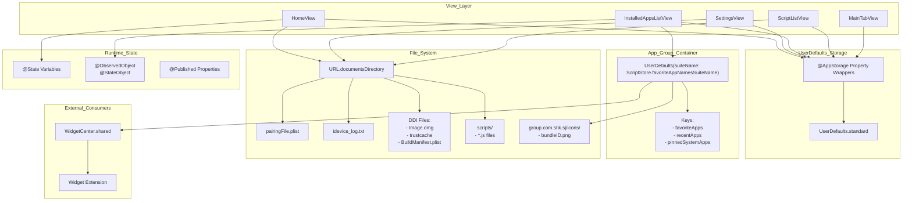
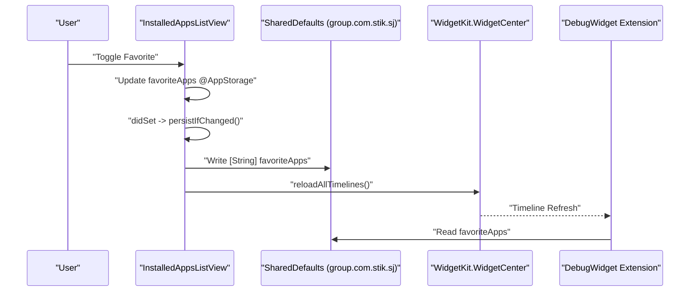

# State Management and Persistence

<details>
<summary>Relevant source files</summary>

The following files were used as context for generating this wiki page:

- [StikJIT/JSSupport/ScriptListView.swift](StikJIT/JSSupport/ScriptListView.swift)
- [StikJIT/Utilities/DeviceConnectionContext.swift](StikJIT/Utilities/DeviceConnectionContext.swift)
- [StikJIT/Views/InstalledAppsListView.swift](StikJIT/Views/InstalledAppsListView.swift)

</details>


This page documents the state management and data persistence architecture in StikDebug. It covers how the application stores user preferences, shares data with widgets, persists files to disk, and manages runtime state across views. The system uses multiple storage layers: `UserDefaults` for user preferences, app group containers for widget synchronization, file system storage for device-specific data, and SwiftUI state management for reactive UI updates.

For information about the centralized logging system, see [5.1 Logging System](). For details on device connection state, see [3.2 Heartbeat and Connection Management]().

---

## Persistence Architecture Overview

StikDebug employs a four-tier persistence strategy to handle different types of data with varying lifetime and sharing requirements.

**Diagram: Persistence Layer Architecture**



**Sources:** [StikJIT/Views/InstalledAppsListView.swift:18-39](), [StikJIT/JSSupport/ScriptListView.swift:12-17](), [StikJIT/Utilities/DeviceConnectionContext.swift:11-17]()

---

## UserDefaults and @AppStorage

The application uses SwiftUI's `@AppStorage` property wrapper extensively to bind UI state directly to `UserDefaults.standard`. This provides automatic persistence and two-way binding between views and stored values.

### Key Storage Keys

| Key | Type | Default | Purpose | Used In |
|-----|------|---------|---------|---------|
| `autoQuitAfterEnablingJIT` | `Bool` | `false` | Auto-exit after JIT enable | `HomeView` |
| `bundleID` | `String` | `""` | Last selected bundle ID | `HomeView` |
| `defaultScriptName` | `String` | `"attachDetach.js"` | Default script for execution | `HomeView`, `ScriptListView` |
| `enabledTabIdentifiers` | `String` | `TabConfiguration.defaultRawValue` | Comma-separated list of visible tabs | `MainTabView`, `TabConfiguration` |
| `primaryTabSelection` | `String` | `"home"` | Last active tab ID | `MainTabView` |
| `loadAppIconsOnJIT` | `Bool` | `true` | Enable app icon loading | `InstalledAppsListView` |
| `recentApps` | `[String]` | `[]` | Recently enabled apps (max 3) | `InstalledAppsListView` |
| `favoriteApps` | `[String]` | `[]` | Favorite apps (max 4) | `InstalledAppsListView` |
| `pinnedSystemApps` | `[String]` | `[]` | Pinned system apps for Home | `InstalledAppsListView` |
| `pinnedSystemAppNames` | `[String: String]` | `[:]` | Custom names for pinned system apps | `InstalledAppsListView` |
| `customTargetIP` | `String` | `"10.7.0.1"` | Target device IP override | `DeviceConnectionContext` |

**Sources:** [StikJIT/Views/InstalledAppsListView.swift:20-39](), [StikJIT/JSSupport/ScriptListView.swift:17-17](), [StikJIT/Utilities/DeviceConnectionContext.swift:11-17]()

---

## App Group Shared Storage

The app group container `group.com.stik.sj` enables data sharing between the main app and the widget extension. This is critical for displaying favorite apps and recent apps in the widget.

### Shared Container Initialization

The shared defaults instance is created with the app group suite name, defined via `ScriptStore.favoriteAppNamesSuiteName`.

```swift
// StikJIT/Views/InstalledAppsListView.swift:18
private let sharedDefaults = UserDefaults(suiteName: ScriptStore.favoriteAppNamesSuiteName) ?? .standard
```

### Widget Synchronization Flow

When favorites or recent apps are modified in `InstalledAppsListView`, the changes are synced to the shared container and the widget timeline is refreshed. The `favoriteApps` array is capped at a maximum of 4 entries to fit widget constraints [StikJIT/Views/InstalledAppsListView.swift:23-25]().

**Diagram: Widget State Sync**



**Sources:** [StikJIT/Views/InstalledAppsListView.swift:10-10](), [StikJIT/Views/InstalledAppsListView.swift:18-28]()

---

## Device Connection Context

Configuration for the target device connection, specifically the IP address for network-based debugging, is managed through the `DeviceConnectionContext` enum.

- **Target IP Logic**: The system checks `UserDefaults.standard` for the key `customTargetIP`. If a value exists and is not empty, it is returned. Otherwise, it defaults to the hardcoded `10.7.0.1` [StikJIT/Utilities/DeviceConnectionContext.swift:11-17]().

**Sources:** [StikJIT/Utilities/DeviceConnectionContext.swift:10-18]()

---

## Runtime State Management

### @StateObject and View Models

Complex view state is encapsulated in `ObservableObject` classes. For example, `InstalledAppsListView` uses `InstalledAppsViewModel` to manage the loading and categorization of installed applications (debuggable vs system apps) [StikJIT/Views/InstalledAppsListView.swift:16-16]().

### Search and Filtering State

Search state is managed locally within views to ensure responsive UI updates. In `InstalledAppsListView`, separate search strings are maintained for the JIT (`debuggable`) and "Other" (`launch`) tabs [StikJIT/Views/InstalledAppsListView.swift:34-35]().

A computed property `currentSearchBinding` dynamically routes the search bar input to the correct state variable based on the `selectedTab` [StikJIT/Views/InstalledAppsListView.swift:47-55]().

**Sources:** [StikJIT/Views/InstalledAppsListView.swift:16-16](), [StikJIT/Views/InstalledAppsListView.swift:34-35](), [StikJIT/Views/InstalledAppsListView.swift:47-55]()

### Script Selection State

The `ScriptListView` manages script persistence and selection. It tracks the list of available `.js` files in the app's script directory and allows setting a "Default" script via `UserDefaults` [StikJIT/JSSupport/ScriptListView.swift:13-17](). It supports a "Picker Mode" where selecting a script calls the `onSelectScript` closure [StikJIT/JSSupport/ScriptListView.swift:30-32]().

**Sources:** [StikJIT/JSSupport/ScriptListView.swift:12-32](), [StikJIT/JSSupport/ScriptListView.swift:87-89]()

---

## Summary of Persistence Keys

| Scope | Key Name | Purpose |
|-------|----------|---------|
| Standard | `customTargetIP` | Override for device connection IP [StikJIT/Utilities/DeviceConnectionContext.swift:12-12]() |
| Standard | `defaultScriptName` | Default script for JIT activation [StikJIT/JSSupport/ScriptListView.swift:17-17]() |
| App Group | `favoriteApps` | List of bundle IDs for the widget [StikJIT/Views/InstalledAppsListView.swift:21-21]() |
| App Group | `recentApps` | Recently used apps for quick access [StikJIT/Views/InstalledAppsListView.swift:20-20]() |
| App Group | `pinnedSystemApps` | System apps pinned to the top of the list [StikJIT/Views/InstalledAppsListView.swift:38-38]() |

**Sources:** [StikJIT/Views/InstalledAppsListView.swift:18-39](), [StikJIT/Utilities/DeviceConnectionContext.swift:11-17](), [StikJIT/JSSupport/ScriptListView.swift:17-17]()