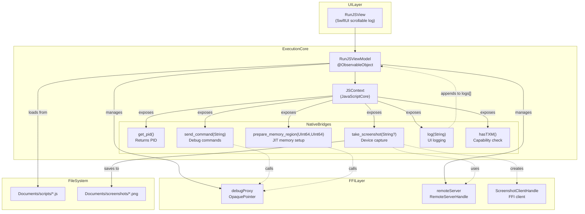
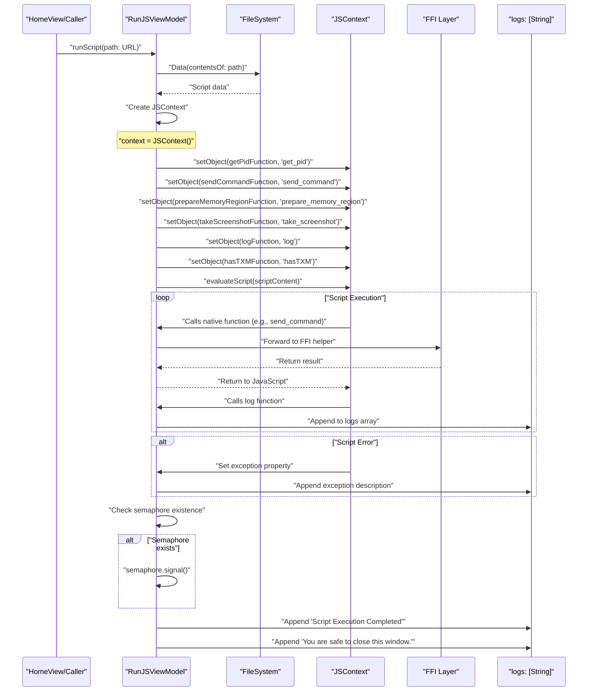

# JavaScript Execution Environment

<details>
<summary>Relevant source files</summary>

The following files were used as context for generating this wiki page:

- [StikJIT/Info.plist](StikJIT/Info.plist)
- [StikJIT/JSSupport/RunJSView.swift](StikJIT/JSSupport/RunJSView.swift)
- [StikJIT/JSSupport/ScriptEditorView.swift](StikJIT/JSSupport/ScriptEditorView.swift)
- [StikJIT/Utilities/Extensions.swift](StikJIT/Utilities/Extensions.swift)

</details>


## Purpose and Scope

The JavaScript Execution Environment enables execution of debugging scripts during JIT enablement sessions. This system exposes native device control functions to JavaScript code running in a sandboxed `JSContext`, allowing advanced debugging scenarios such as sending debug commands, manipulating memory regions, and capturing screenshots. The environment bridges Swift native capabilities with JavaScript execution through JavaScriptCore.

For information about the JIT enablement process that triggers script execution, see **3.3 JIT Enablement Engine**. For details on the script management UI, see **2.5 Script Management**.

---

## Architecture Overview

The JavaScript execution environment consists of three primary components: the `RunJSViewModel` orchestrator, the JavaScriptCore `JSContext` engine, and a collection of native function bridges that expose device control capabilities to JavaScript code.

**Native Language to Code Entity Space Mapping**


**Sources:** [StikJIT/JSSupport/RunJSView.swift:15-145](), [StikJIT/JSSupport/JSDebugSupport.swift:24-161]()

---

## RunJSViewModel

The `RunJSViewModel` class orchestrates JavaScript execution and manages the communication between the JavaScript environment and native device control systems.

### Class Structure

| Property | Type | Purpose |
|----------|------|---------|
| `context` | `JSContext?` | JavaScriptCore execution context [StikJIT/JSSupport/RunJSView.swift:16]() |
| `logs` | `[String]` | Published array of execution logs [StikJIT/JSSupport/RunJSView.swift:17]() |
| `scriptName` | `String` | Published display name of current script [StikJIT/JSSupport/RunJSView.swift:18]() |
| `executionInterrupted` | `Bool` | Published flag for manual interruption [StikJIT/JSSupport/RunJSView.swift:19]() |
| `pid` | `Int` | Process ID of debugged application [StikJIT/JSSupport/RunJSView.swift:20]() |
| `debugProxy` | `OpaquePointer?` | Handle to debug server connection [StikJIT/JSSupport/RunJSView.swift:21]() |
| `remoteServer` | `OpaquePointer?` | Handle to remote server for screenshots [StikJIT/JSSupport/RunJSView.swift:22]() |
| `semaphore` | `DispatchSemaphore?` | Synchronization primitive for script completion [StikJIT/JSSupport/RunJSView.swift:23]() |

The view model is initialized with handles obtained during the JIT enablement process [StikJIT/JSSupport/RunJSView.swift:25-30]().

### Script Execution Methods

The view model provides two methods for script execution:

- `runScript(path: URL, scriptName: String?)` - Loads and executes a script file from disk [StikJIT/JSSupport/RunJSView.swift:32-34]()
- `runScript(data: Data, name: String?)` - Executes a script from in-memory data [StikJIT/JSSupport/RunJSView.swift:36-95]()

Both methods delegate to the data-based implementation, which handles `JSContext` setup, native function registration, and script evaluation.

**Sources:** [StikJIT/JSSupport/RunJSView.swift:15-95]()

---

## Native Function Bridges

The JavaScript environment exposes six native functions through Swift closures registered as `JSContext` properties. Each function is implemented as a `@convention(block)` closure to ensure proper ABI compatibility with JavaScriptCore.

### Exposed Functions Table

| JavaScript Function | Implementation | Return Type | Purpose |
|---------------------|----------------|-------------|---------|
| `get_pid()` | [StikJIT/JSSupport/RunJSView.swift:40-42]() | `Int` | Returns the process ID of the debugged application |
| `send_command(String?)` | [StikJIT/JSSupport/RunJSView.swift:44-55]() | `String?` | Sends a debug command to the debugserver via FFI |
| `prepare_memory_region(UInt64, UInt64)` | [StikJIT/JSSupport/RunJSView.swift:63-65]() | `String` | Prepares a memory region for JIT page writes |
| `take_screenshot(String?)` | [StikJIT/JSSupport/RunJSView.swift:67-69]() | `String?` | Captures device screenshot and returns file path |
| `log(String)` | [StikJIT/JSSupport/RunJSView.swift:57-61]() | `Void` | Appends message to the UI log display |
| `hasTXM()` | [StikJIT/JSSupport/RunJSView.swift:71-73]() | `Bool` | Checks if device has TXM capability |

### Function Registration

Functions are registered to the `JSContext` in [StikJIT/JSSupport/RunJSView.swift:75-81]() using `setObject(_:forKeyedSubscript:)`:

```swift
context = JSContext()
context?.setObject(hasTXMFunction, forKeyedSubscript: "hasTXM" as NSString)
context?.setObject(getPidFunction, forKeyedSubscript: "get_pid" as NSString)
context?.setObject(sendCommandFunction, forKeyedSubscript: "send_command" as NSString)
context?.setObject(prepareMemoryRegionFunction, forKeyedSubscript: "prepare_memory_region" as NSString)
context?.setObject(takeScreenshotFunction, forKeyedSubscript: "take_screenshot" as NSString)
context?.setObject(logFunction, forKeyedSubscript: "log" as NSString)
```

### Debug Command Execution

The `send_command` function delegates to the Swift helper `handleJSContextSendDebugCommand` [StikJIT/JSSupport/JSDebugSupport.swift:24-56](). This helper uses `debugserver_command_new` to create a command handle and `debug_proxy_send_command` to transmit it [StikJIT/JSSupport/JSDebugSupport.swift:30-36]().

### Memory Region Preparation

The `prepare_memory_region` function calls `handleJITPageWrite` [StikJIT/JSSupport/JSDebugSupport.swift:120-161](). This function generates bulk memory write commands using `makeBulkWriteCommands` [StikJIT/JSSupport/JSDebugSupport.swift:97-118]() and sends them in batches of 128 via `debug_proxy_send_raw` [StikJIT/JSSupport/JSDebugSupport.swift:130-138]().

**Sources:** [StikJIT/JSSupport/RunJSView.swift:40-81](), [StikJIT/JSSupport/JSDebugSupport.swift:24-161]()

---

## Script Execution Lifecycle

**Data Flow: Script Trigger to Completion**


### Lifecycle Stages

1. **Script Loading** - The script file is read from disk as UTF-8 data [StikJIT/JSSupport/RunJSView.swift:32-37]().
2. **Context Initialization** - A fresh `JSContext` is created for each script execution [StikJIT/JSSupport/RunJSView.swift:75]().
3. **Function Registration** - Native bridges are registered as JavaScript global functions [StikJIT/JSSupport/RunJSView.swift:76-81]().
4. **Script Evaluation** - The script content is evaluated synchronously [StikJIT/JSSupport/RunJSView.swift:83]().
5. **Completion Signaling** - If a semaphore was provided, it is signaled using `semaphore.signal()` to notify the caller [StikJIT/JSSupport/RunJSView.swift:84-86]().
6. **Exception Handling** - Any JavaScript exceptions are logged to the UI [StikJIT/JSSupport/RunJSView.swift:89-91]().

**Sources:** [StikJIT/JSSupport/RunJSView.swift:32-95]()

---

## Screenshot Capture System

The screenshot capture functionality provides JavaScript scripts with the ability to capture device screen contents during debugging sessions.

### Capture Flow

1. **Client Creation**: Uses `screenshot_client_new` with the `remoteServer` handle [StikJIT/JSSupport/RunJSView.swift:108]().
2. **Data Acquisition**: Calls `screenshot_client_take_screenshot` to retrieve raw image buffer and length [StikJIT/JSSupport/RunJSView.swift:123]().
3. **Storage**: Saves the resulting `Data` to the `Documents/screenshots/` directory [StikJIT/JSSupport/RunJSView.swift:138-140]().
4. **Cleanup**: Frees the FFI buffer using `idevice_data_free` [StikJIT/JSSupport/RunJSView.swift:134]() and the client using `screenshot_client_free` [StikJIT/JSSupport/RunJSView.swift:119]().

### Filename Management

The system implements automatic filename collision handling in `screenshotFileURL(preferredName:)` [StikJIT/JSSupport/RunJSView.swift:147-166](). If a file already exists, it appends a counter suffix (e.g., `-1`, `-2`) [StikJIT/JSSupport/RunJSView.swift:159-164]().

**Sources:** [StikJIT/JSSupport/RunJSView.swift:97-166]()

---

## Error Handling and Exception Management

The JavaScript execution environment implements a strategy that bridges JavaScript exceptions with native error conditions.

### Exception Raising

The `raiseException(_:)` private method sets the `JSContext.exception` property to communicate errors back to JavaScript code [StikJIT/JSSupport/RunJSView.swift:201-204](). This pattern is used for:
- Invalid command strings [StikJIT/JSSupport/RunJSView.swift:45-47]().
- Execution interruption via `executionInterrupted` [StikJIT/JSSupport/RunJSView.swift:49-52](), [StikJIT/JSSupport/RunJSView.swift:98-101]().
- FFI failures, where `describeIdeviceError` is used to format the error message [StikJIT/JSSupport/RunJSView.swift:109-113]().

### Script Interruption

The `executionInterrupted` flag allows external code to halt script execution. When set to `true`, native functions like `send_command` and `take_screenshot` will raise exceptions instead of proceeding [StikJIT/JSSupport/RunJSView.swift:49-52](), [StikJIT/JSSupport/RunJSView.swift:98-101]().

**Sources:** [StikJIT/JSSupport/RunJSView.swift:44-55](), [StikJIT/JSSupport/RunJSView.swift:97-106](), [StikJIT/JSSupport/RunJSView.swift:201-204]()