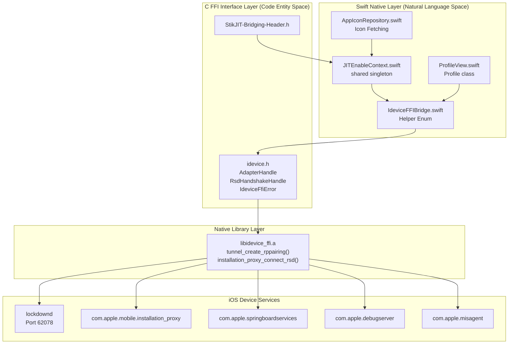
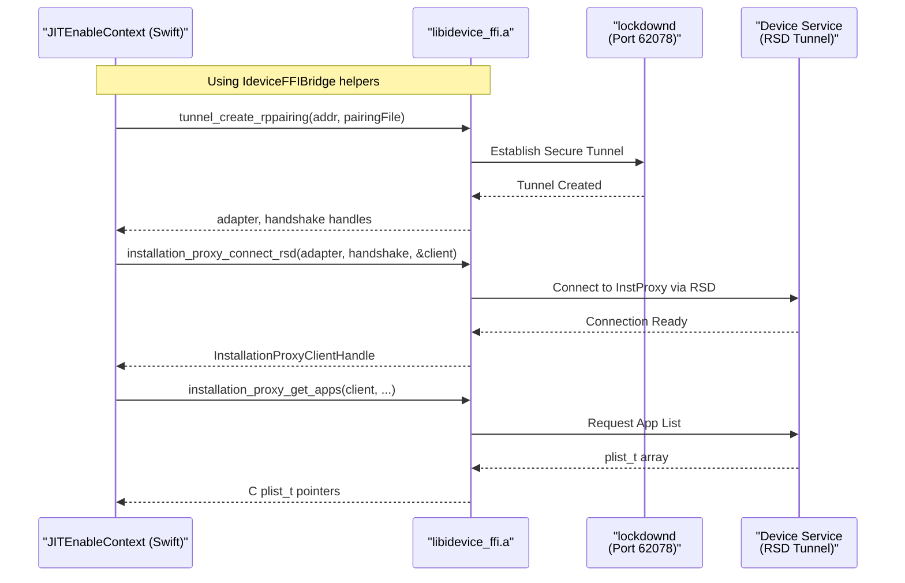

# Device Communication

<details>
<summary>Relevant source files</summary>

The following files were used as context for generating this wiki page:

- [StikJIT/Utilities/IdeviceFFIBridge.swift](StikJIT/Utilities/IdeviceFFIBridge.swift)
- [StikJIT/Views/ProfileView.swift](StikJIT/Views/ProfileView.swift)
- [StikJIT/idevice/idevice.h](StikJIT/idevice/idevice.h)
- [StikJIT/idevice/libidevice_ffi.a](StikJIT/idevice/libidevice_ffi.a)

</details>


## Purpose and Scope

This section provides an overview of the device communication stack that enables StikDebug to interact with iOS devices. The architecture has transitioned from an Objective-C based implementation to a Swift-native bridge using a layered approach: a Swift interface layer, a C FFI (Foreign Function Interface) boundary, and a native library (`libidevice_ffi.a`) that implements the underlying iOS device protocols.

This page covers the overall architecture and component relationships. For detailed information about specific subsystems, see:
- Layered architecture and service multiplexing: [Communication Architecture](#4.1)
- Central coordinator implementation: [JITEnableContext Singleton](#4.2)
- App querying and icon retrieval: [Application Management API](#4.3)
- Device pairing and trust: [Device Authentication and Pairing](#4.4)
- Swift-to-C bridging mechanics: [Native Bridging and FFI](#4.5)
- Provisioning profile operations: [Profile Management Backend](#4.6)

Sources: [StikJIT/Utilities/JITEnableContext.swift:1-17](), [StikJIT/Utilities/IdeviceFFIBridge.swift:1-12](), [StikJIT/idevice/idevice.h:1-212]()

---

## Three-Layer Architecture

The device communication system employs a layered architecture that separates concerns and provides type-safe interfaces at each level while leveraging battle-tested C/Rust implementations for iOS device protocols.

### Overall System Architecture



Sources: [StikJIT/Utilities/JITEnableContext.swift:17-52](), [StikJIT/Utilities/IdeviceFFIBridge.swift:12-118](), [StikJIT/idevice/idevice.h:63-212](), [StikJIT/StikJIT-Bridging-Header.h:1-12](), [StikJIT/Views/ProfileView.swift:10-45]()

---

## Communication Layers

### Layer 1: Swift Interface

The top layer provides high-level, asynchronous interfaces for the SwiftUI frontend. The modern implementation utilizes `JITEnableContext.swift` as the primary entry point, replacing the legacy Objective-C version.

| Component | Type | Purpose |
|-----------|------|---------|
| `JITEnableContext` | Swift Singleton | Central coordinator for tunnels, JIT, and device state [StikJIT/Utilities/JITEnableContext.swift:17-18]|
| `IdeviceFFIBridge` | Swift Enum | Internal helper for FFI calls, error consumption, and plist conversion [StikJIT/Utilities/IdeviceFFIBridge.swift:12-15]|
| `AppIconRepository` | Swift Actor | Manages icon retrieval via the `JITEnableContext` bridge [StikJIT/Utilities/AppIconRepository.swift:14-20]|
| `Profile` | Swift Class | Model for `.mobileprovision` data decoded via `CMSDecoderHelper` [StikJIT/Views/ProfileView.swift:10-25]|

`JITEnableContext` manages the lifecycle of communication handles:
- `adapterHandle`: Opaque pointer to the network transport [StikJIT/Utilities/JITEnableContext.swift:50]().
- `handshakeHandle`: Opaque pointer to the RSD session [StikJIT/Utilities/JITEnableContext.swift:51]().
- `syslogQueue`: Dedicated serial queue for streaming logs [StikJIT/Utilities/JITEnableContext.swift:44]().

Sources: [StikJIT/Utilities/JITEnableContext.swift:17-52](), [StikJIT/Utilities/IdeviceFFIBridge.swift:12-45](), [StikJIT/Views/ProfileView.swift:25-35]()

### Layer 2: C FFI Interface

The middle layer defines the contract between Swift and native implementations through C headers. All functions return `IdeviceFfiError*` for error handling, which the Swift layer consumes and converts into `NSError` [StikJIT/Utilities/IdeviceFFIBridge.swift:32-45]().

```c
typedef struct IdeviceFfiError {
  int32_t code;
  int32_t sub_code;
  const char *message;
} IdeviceFfiError;
```

Key headers included in the bridge [StikJIT/StikJIT-Bridging-Header.h:5-11]():
- `idevice.h`: Core device communication types like `AdapterHandle` and `RsdHandshakeHandle`.
- `jit.h`: Debug attachment and launching.
- `mount.h`: DDI mounting interfaces.
- `profiles.h`: Misagent protocol bindings.

Sources: [StikJIT/idevice/idevice.h:208-212](), [StikJIT/StikJIT-Bridging-Header.h:5-11]()

### Layer 3: Native Library

The `libidevice_ffi.a` static library implements all device protocols and exposes C-compatible interfaces. This layer handles:

- TCP socket management (Port 62078 for Lockdown [StikJIT/idevice/idevice.h:28]()).
- Remote Service Discovery (RSD) protocol handshakes.
- Protocol-specific message framing and encryption.
- Service multiplexing over established tunnels via `tunnel_create_rppairing` [StikJIT/Utilities/JITEnableContext.swift:157]().

Sources: [StikJIT/idevice/idevice.h:63-206](), [StikJIT/Utilities/JITEnableContext.swift:139-182]()

---

## iOS Device Services

The Swift layer communicates with multiple iOS device services by establishing an RSD (Remote Service Discovery) tunnel first.

### Service Communication Flow



Sources: [StikJIT/Utilities/JITEnableContext.swift:139-182](), [StikJIT/Utilities/IdeviceFFIBridge.swift:120-131]()

---

## Key Handle Types

The FFI layer uses opaque handle types to maintain type safety across the boundary. These handles represent resources allocated in the native library and are stored within the `JITEnableContext.TunnelHandles` struct [StikJIT/Utilities/JITEnableContext.swift:20-34]().

### Core Handles

| Handle Type | Code Identifier | Purpose |
|-------------|-----------------|---------|
| Pairing File | `IdevicePairingFile` | Opaque handle to a loaded `.mobiledevicepairing` file [StikJIT/idevice/idevice.h:113]() |
| Adapter | `AdapterHandle` | Represents the underlying network transport/tunnel [StikJIT/idevice/idevice.h:63]() |
| RSD Handshake | `RsdHandshakeHandle` | Maintains the session state for Remote Service Discovery [StikJIT/idevice/idevice.h:176]() |
| Service Client | `OpaquePointer` | Specific client for services (e.g., `InstallationProxyClientHandle`) [StikJIT/Utilities/IdeviceFFIBridge.swift:90]() |

Sources: [StikJIT/Utilities/JITEnableContext.swift:20-34](), [StikJIT/Utilities/IdeviceFFIBridge.swift:84-100](), [StikJIT/idevice/idevice.h:63-176]()

---

## Memory Management and Error Handling

### Memory Management
The Swift bridge uses `defer` blocks to ensure C-allocated memory is freed correctly, even when errors occur. Plists and raw data arrays require manual cleanup using `plist_free` and `idevice_data_free` [StikJIT/Utilities/IdeviceFFIBridge.swift:136-144]():

```swift
defer {
    for index in 0..<count {
        plist_free(apps[index])
    }
    idevice_data_free(
        rawApps.assumingMemoryBound(to: UInt8.self),
        UInt(count * MemoryLayout<plist_t?>.stride)
    )
}
```

### Error Handling
The `IdeviceFFIBridge` provides a `consumeFFIError` method that extracts the message from the C `IdeviceFfiError` struct, frees the C-side error memory using `idevice_error_free`, and returns a native Swift `NSError` [StikJIT/Utilities/IdeviceFFIBridge.swift:32-45]().

Sources: [StikJIT/Utilities/IdeviceFFIBridge.swift:32-45](), [StikJIT/Utilities/IdeviceFFIBridge.swift:136-144]()