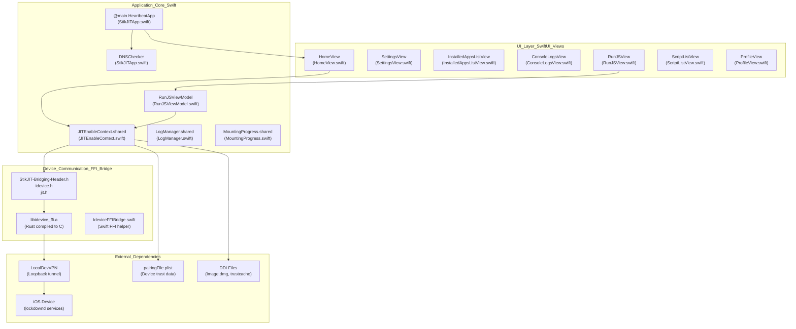
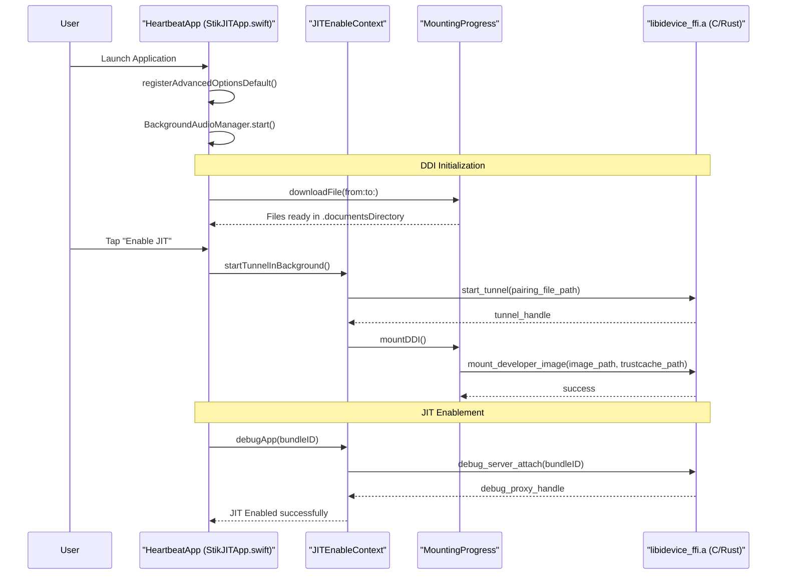

# Overview

Relevant source files

The following files were used as context for generating this wiki page:

- [README.md](README.md)
- [StikJIT/StikJITApp.swift](StikJIT/StikJITApp.swift)
- [info.md](info.md)

This document introduces **StikDebug** (formerly StikJIT), its architecture, feature set, and system requirements. For detailed installation and setup procedures, see [Getting Started](#1.1). For in-depth component documentation, see [Core Systems](#3) and [Device Communication](#4).

## What is StikDebug

StikDebug is an on-device debugger and JIT enabler for iOS 17.4+ that allows users to enable Just-In-Time compilation for sideloaded applications without requiring a connected computer after initial pairing setup. The application leverages the [idevice](https://github.com/jkcoxson/idevice) Rust library (compiled to C FFI) to communicate with iOS device services over a loopback connection established via LocalDevVPN.

The primary use case is enabling the `get-task-allow` entitlement for sideloaded applications (installed via AltStore, SideStore, or similar tools) to unlock JIT compilation, which is required for emulators, virtual machines, and other performance-critical applications. On devices with TXM (Trusted Execution Monitor) hardware support and iOS 26+, StikDebug can also execute JavaScript automation scripts during the debug attach process.

**Sources:** [README.md:1-11](), [README.md:27-28](), [README.md:59-60]()

## Application Architecture

StikDebug follows a layered architecture with clear separation between UI, application logic, device communication, and native FFI boundaries. The following diagram maps the conceptual layers to their concrete code implementations:

### System Architecture and Code Entities

**Key Components:**

| Component | Type | File Path | Responsibility |
|-----------|------|-----------|----------------|
| `HeartbeatApp` | SwiftUI App | [StikJIT/StikJITApp.swift:127-187]() | Application entry point, lifecycle management, and background service initialization. |
| `DNSChecker` | ObservableObject | [StikJIT/StikJITApp.swift:25-116]() | Validates network connectivity and detects Apple DNS blocking via `getaddrinfo` lookups for `gs.apple.com`. |
| `JITEnableContext` | Singleton | `StikJIT/JITEnableContext.swift` | Central device manager, FFI coordinator, and service multiplexer. |
| `MountingProgress` | Singleton | [StikJIT/StikJITApp.swift:128]() | DDI mounting state tracker and progress reporting. |
| `BackgroundAudioManager` | Singleton | [StikJIT/StikJITApp.swift:134-136]() | Maintains app execution in background via silent audio playback. |

**Sources:** [StikJIT/StikJITApp.swift:12-187](), [README.md:62-87](), [StikJIT/StikJITApp.swift:30-60]()

## Core Features and Code Mapping

The application provides primary feature areas implemented through specific UI views and backend systems:

| Feature | Description | Key Code Symbols |
|---------|-------------|------------------|
| **JIT Enablement** | Enable Just In Time compilation for sideloaded apps. | `startJITInBackground`, `debugApp` |
| **App Launching** | Launch every app installed on the device. | `launchAppWithoutDebug`, `getAppList` |
| **Console** | Live app and system logs. | `LogManager`, `streamSyslog` |
| **Scripts** | Manage automation scripts for iOS 26 JIT. | `RunJSViewModel`, `JSContext`, `BundleScriptMap` |
| **App Expiry** | Monitor profile expiration and manage profiles. | `fetchAllProfiles`, `addProfile`, `removeProfile` |
| **Device Info** | View detailed device metadata. | `get_device_values`, `DeviceInfoView` |
| **Processes** | Inspect and terminate running processes. | `killProcess`, `get_pids` |
| **Location Simulator** | Simulate GPS location. | `setLocation`, `clearLocation` |

**Sources:** [README.md:26-34](), [StikJIT/StikJITApp.swift:13-21]()

## System Requirements

### Hardware and Software

| Requirement | Specification | Notes |
|-------------|---------------|-------|
| **iOS Version** | 17.4 - 18.x | Fully supported and stable [README.md:54](). |
| **iOS Version** | 26.0+ | Supported with limited app availability [README.md:55](). |
| **Network** | Loopback VPN | Requires [LocalDevVPN](https://apps.apple.com/us/app/localdevvpn/id6755608044) [README.md:65](). |
| **Build Env** | Xcode 16+ | Required for building from source [README.md:101](). |

### Required External Components

1. **LocalDevVPN**: Establishes the loopback tunnel required for the device to connect to its own services.
2. **Pairing File**: A `.mobiledevicepairing` or `.plist` file containing trust records [README.md:63]().
3. **Developer Disk Image (DDI)**: Required for iOS 17+ debugging. StikDebug automatically downloads `Image.dmg`, `BuildManifest.plist`, and `Image.dmg.trustcache` [StikJIT/StikJITApp.swift:165-179]().

**Sources:** [README.md:51-66](), [StikJIT/StikJITApp.swift:164-179]()

## High-Level Operation Flow

The following diagram illustrates the end-to-end flow from application launch to successful JIT enablement, bridging the gap between natural language steps and code entities.

### JIT Activation Sequence

**Key Flow Details:**
- **Initialization**: `registerAdvancedOptionsDefault` sets default settings based on iOS version (e.g., enabling advanced options for iOS 19+) [StikJIT/StikJITApp.swift:13-21]().
- **DDI Pipeline**: The app iterates through `ddiDownloadItems` and downloads missing files to the documents directory [StikJIT/StikJITApp.swift:165-179]().
- **Lifecycle Management**: The app monitors `scenePhase`. When moving from background to active, it attempts to reconnect the tunnel via `startTunnelInBackground(showErrorUI: false)` [StikJIT/StikJITApp.swift:145-157]().

**Sources:** [StikJIT/StikJITApp.swift:13-21, 127-187]()

## Build and Distribution

StikDebug is an open-source Xcode project primarily written in Swift. It utilizes Swift Package Manager (SPM) for several dependencies:
- **CodeEditorView**: For the script editor interface.
- **Rearrange**: Supporting library for text manipulation.
- **LanguageSupport**: Syntax highlighting for scripts.

The project targets include the main app (`StikDebug`), unit tests (`StikDebugTests`), and UI tests (`StikDebugUITests`).

**Sources:** [README.md:97-128](), [StikJIT/StikJITApp.swift:1-10]()