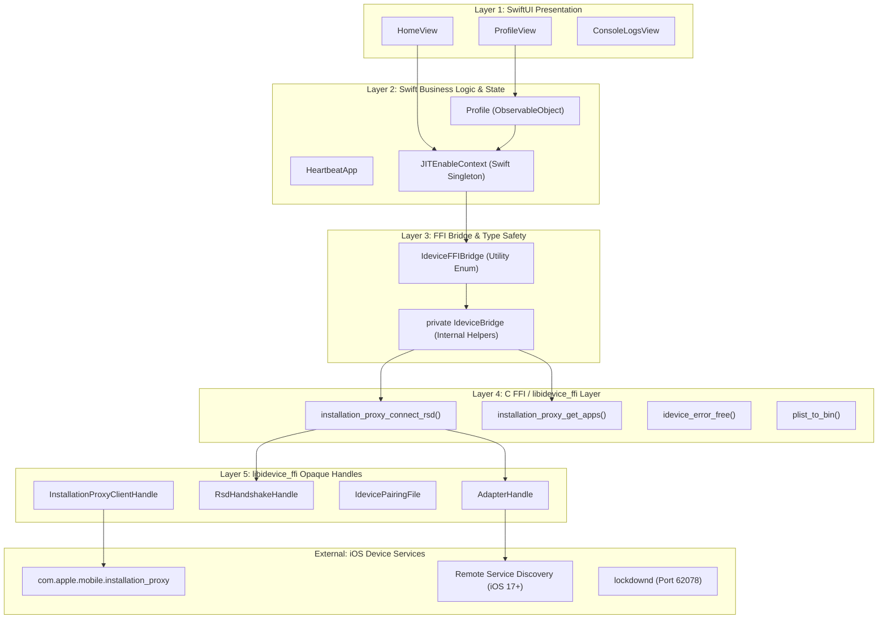
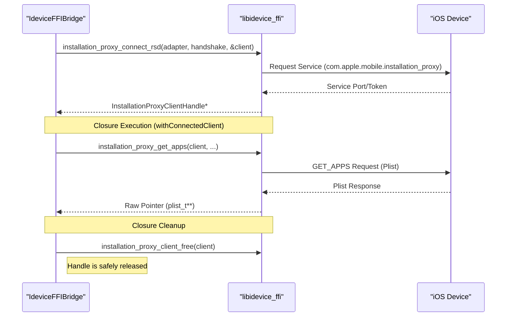

# Communication Architecture

Relevant source files

The following files were used as context for generating this wiki page:

- [StikJIT/Utilities/IdeviceFFIBridge.swift](StikJIT/Utilities/IdeviceFFIBridge.swift)
- [StikJIT/Views/ProfileView.swift](StikJIT/Views/ProfileView.swift)
- [StikJIT/idevice/idevice.h](StikJIT/idevice/idevice.h)
- [StikJIT/idevice/libidevice_ffi.a](StikJIT/idevice/libidevice_ffi.a)

## Purpose and Scope

This document describes the layered communication architecture that enables StikDebug to interact with iOS devices. The architecture is centered around a modern, Swift-native implementation using `JITEnableContext.swift` and `IdeviceFFIBridge.swift`. This bridge facilitates communication between SwiftUI views and the low-level `libidevice_ffi.a` library via a C Foreign Function Interface (FFI) layer, replacing older Objective-C implementations.

---

## Architectural Layers

The communication architecture follows a strict layered pattern, ensuring that low-level C memory management and FFI calls are abstracted away from the UI.

### Layer Diagram: SwiftUI to FFI

**Sources:** [StikJIT/Utilities/IdeviceFFIBridge.swift:12-118](), [StikJIT/Views/ProfileView.swift:10-45](), [StikJIT/idevice/idevice.h:63-202]()

---

## Opaque Handle Patterns

The architecture relies on opaque handles defined in `idevice.h`. These handles encapsulate complex Rust/C++ structures within `libidevice_ffi.a`, exposing only pointers to the Swift layer. This pattern ensures memory safety by preventing Swift from directly manipulating the internal state of the C library.

### Key Handles and Roles

| Handle Type | Definition | Purpose |
| :--- | :--- | :--- |
| `IdevicePairingFile` | [StikJIT/idevice/idevice.h:113]() | Opaque handle to a parsed pairing file required for device authentication. |
| `AdapterHandle` | [StikJIT/idevice/idevice.h:63]() | The primary network transport handle used to route traffic to the device. |
| `RsdHandshakeHandle` | [StikJIT/idevice/idevice.h:176]() | Represents an established Remote Service Discovery session for iOS 17+ protocols. |
| `InstallationProxyClientHandle` | [StikJIT/idevice/idevice.h:121]() | Handle for the service that lists and manages installed applications. |
| `IdeviceHandle` | [StikJIT/idevice/idevice.h:108]() | A top-level handle representing the active connection to an iOS device. |

**Sources:** [StikJIT/idevice/idevice.h:63-202]()

---

## Service Multiplexing and the FFI Bridge

StikDebug interacts with multiple iOS services (Installation Proxy, Debugserver, Misagent) over a shared tunnel. The `IdeviceFFIBridge` provides a safe wrapper for multiplexing these services, using `IdeviceBridge` internal helpers to manage the lifecycle of connections.

### Connection and Execution Pattern

The bridge uses a "with-style" closure pattern (`withConnectedClient`) to ensure that handles are always cleaned up, preventing memory leaks in the C heap even if an error occurs during execution.

**Sources:** [StikJIT/Utilities/IdeviceFFIBridge.swift:102-118](), [StikJIT/Utilities/IdeviceFFIBridge.swift:120-132]()

---

## Data Flow: C Plist to Swift Dictionary

A core responsibility of the communication architecture is converting low-level C data structures (plists) into Swift-native types for use in the UI and business logic.

### Plist Transformation Pipeline

1.  **FFI Fetch**: `installation_proxy_get_apps` returns a raw pointer to an array of `plist_t`. [StikJIT/Utilities/IdeviceFFIBridge.swift:129]()
2.  **Binary Conversion**: Each `plist_t` in the array is converted to a binary buffer using `plist_to_bin`. [StikJIT/Utilities/IdeviceFFIBridge.swift:154]()
3.  **Memory Management**: The C-allocated binary buffer is wrapped in a Swift `Data` object, and the original buffer is immediately freed via `plist_mem_free`. [StikJIT/Utilities/IdeviceFFIBridge.swift:160-161]()
4.  **Serialization**: `PropertyListSerialization` parses the `Data` into a Swift `[String: Any]` dictionary. [StikJIT/Utilities/IdeviceFFIBridge.swift:163-164]()
5.  **Final Cleanup**: The bridge iterates through the array, calling `plist_free` on each element and `idevice_data_free` on the container to release the FFI-allocated memory. [StikJIT/Utilities/IdeviceFFIBridge.swift:136-144]()

**Sources:** [StikJIT/Utilities/IdeviceFFIBridge.swift:120-172]()

---

## The em_proxy xcframework Role

The `libidevice_ffi.a` library (contained within the `idevice` xcframework) serves as the "em_proxy" layer, translating high-level Swift requests into the specific wire protocols required by Apple devices.

-   **RSD Protocol Support**: Implements the Remote Service Discovery handshake required for iOS 17.4+ over the `AdapterHandle`. [StikJIT/idevice/idevice.h:176]()
-   **Error Handling**: Returns `IdeviceFfiError` structs containing error codes and messages. The Swift layer consumes these via `consumeFFIError`, which calls `idevice_error_free` to prevent leaks. [StikJIT/Utilities/IdeviceFFIBridge.swift:32-45]()
-   **Service Abstraction**: Provides unified functions like `installation_proxy_get_apps` that abstract away the underlying `lockdownd` or `RSD` dispatch logic. [StikJIT/Utilities/IdeviceFFIBridge.swift:129]()

**Sources:** [StikJIT/idevice/libidevice_ffi.a:1-12](), [StikJIT/Utilities/IdeviceFFIBridge.swift:32-45](), [StikJIT/idevice/idevice.h:208-212]()