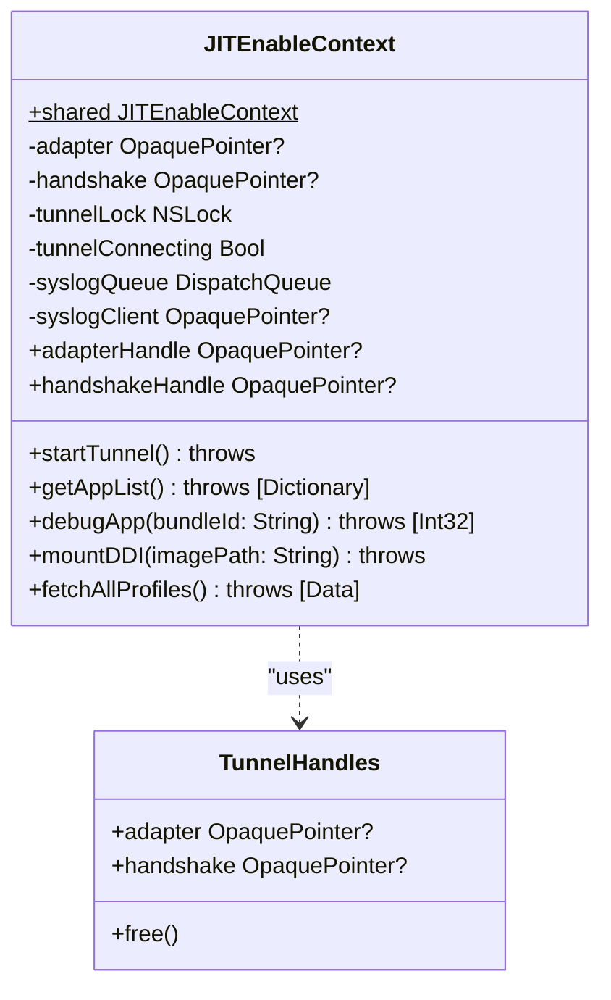
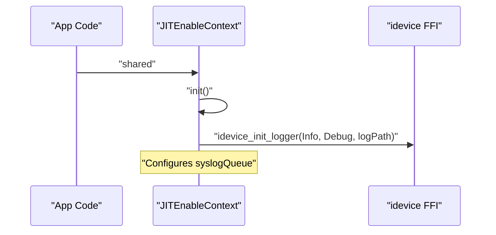
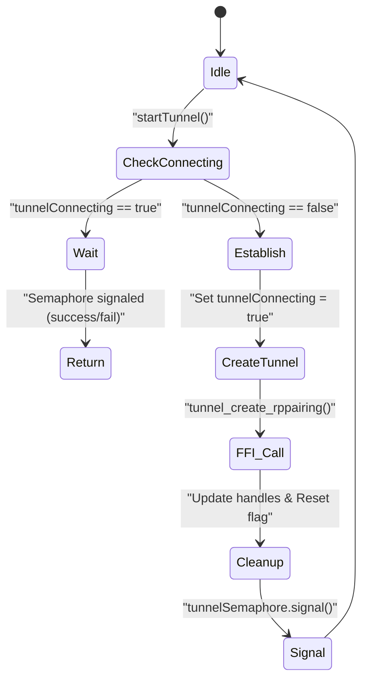
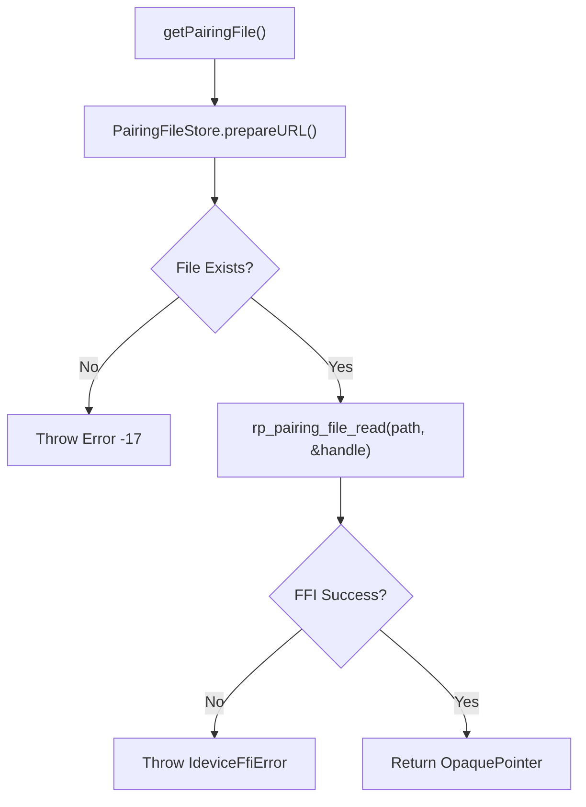

# JITEnableContext Singleton

Relevant source files

The following files were used as context for generating this wiki page:

- [StikJIT/Utilities/JITEnableContext.swift](StikJIT/Utilities/JITEnableContext.swift)

## Purpose and Scope

The `JITEnableContext` singleton serves as the central device manager and primary orchestration point for all iOS device interactions in StikDebug. It manages the lifecycle of device connections (tunnels), coordinates access to device services, and provides a unified interface for JIT enablement, app management, profile operations, process inspection, syslog streaming, and Developer Disk Image (DDI) mounting.

Following the migration to Swift, this singleton now directly interfaces with the `idevice` FFI layer, providing thread-safe access to low-level C functions while exposing a high-level API to the SwiftUI layer.

**Sources:** [StikJIT/Utilities/JITEnableContext.swift:17-18](), [StikJIT/Utilities/JITEnableContext.swift:184-185]()

---

## Singleton Architecture

### Core Structure and Internal Logic

The `JITEnableContext` class encapsulates the state of the active device tunnel and various service clients. It uses `NSLock` for concurrency control and `DispatchSemaphore` to synchronize asynchronous tunnel establishment across multiple calling threads.

**Functionality Groups:**

| Category | Purpose | Key Methods |
|----------|---------|-------------|
| **Tunneling** | Connection establishment via RSD | `startTunnel()`, `createTunnel(hostname:)` |
| **JIT** | JIT enablement and app launching | `debugApp(bundleId:)`, `debugApp(pid:)`, `launchAppWithoutDebug()` |
| **DDI** | Developer disk image mounting | `getMountedDeviceCount()`, `mountDDI(imagePath:)` |
| **Profile** | Provisioning profile management | `fetchAllProfiles()`, `removeProfile(uuid:)`, `addProfile(data:)` |
| **Process** | Process listing and control | `fetchProcessList()`, `killProcess(pid:)` |
| **App** | Application enumeration and icons | `getAppList()`, `getAllApps()`, `getAppIcon(withBundleId:)` |
| **Syslog** | System log streaming | `startSyslogRelay()`, `stopSyslogRelay()` |

**Sources:** [StikJIT/Utilities/JITEnableContext.swift:17-51](), [StikJIT/Utilities/JITEnableContext.swift:184-218]()

---

## Internal State Management

### Resource Lifecycle

The context maintains several `OpaquePointer` handles representing active device connections and background workers.

| Variable | Type | Purpose |
|----------|------|---------|
| `adapter` | `OpaquePointer?` | Handle to the established network adapter/tunnel (`AdapterHandle`) |
| `handshake` | `OpaquePointer?` | Handle for the RSD protocol session (`RsdHandshakeHandle`) |
| `tunnelLock` | `NSLock` | Prevents race conditions during tunnel creation |
| `syslogQueue` | `DispatchQueue` | Serial queue for syslog relay message processing |
| `syslogClient` | `OpaquePointer?` | Active syslog relay client handle |
| `tunnelConnecting` | `Bool` | Flag indicating if a connection attempt is in progress |

**Sources:** [StikJIT/Utilities/JITEnableContext.swift:36-48]()

### Initialization and Logging

Upon initialization, the singleton configures the native `idevice` logger to write to `idevice_log.txt` in the application's document directory.

The `init` method determines the log file path and passes it to `idevice_init_logger` using a `utf8CString` buffer [StikJIT/Utilities/JITEnableContext.swift:53-62]().

**Sources:** [StikJIT/Utilities/JITEnableContext.swift:53-62]()

---

## Concurrency and Tunnel Management

### Tunnel Synchronization

The `startTunnel()` method ensures that multiple simultaneous requests for a connection (e.g., from different UI components) do not trigger redundant tunnel creation attempts.

**Implementation Details:**
- **Locking**: Uses `tunnelLock` to safely read and write the `tunnelConnecting` flag [StikJIT/Utilities/JITEnableContext.swift:185-204]().
- **Waiting**: If a connection is already in progress, the caller waits on `tunnelSemaphore` [StikJIT/Utilities/JITEnableContext.swift:191-193]().
- **IP Configuration**: The target IP is retrieved from `DeviceConnectionContext.targetIPAddress` [StikJIT/Utilities/JITEnableContext.swift:147]().
- **FFI Integration**: Calls `tunnel_create_rppairing` with the device IP, port `49152`, and the pairing file [StikJIT/Utilities/JITEnableContext.swift:145-169]().

**Sources:** [StikJIT/Utilities/JITEnableContext.swift:139-182](), [StikJIT/Utilities/JITEnableContext.swift:184-218]()

---

## Resource Management

### Pairing File Retrieval

The context is responsible for locating and reading the `.mobiledevicepairing` file required for RSD authentication. It uses `PairingFileStore.prepareURL()` to locate the file and `rp_pairing_file_read` to load it into memory.

**Sources:** [StikJIT/Utilities/JITEnableContext.swift:116-137]()

### Memory Safety

Since the singleton interacts with C pointers, it must manually manage memory for FFI-allocated resources.
- **Tunnel Handles**: The `TunnelHandles` struct includes a `free()` method that calls `rsd_handshake_free` and `adapter_free` [StikJIT/Utilities/JITEnableContext.swift:24-33]().
- **Error Handling**: The `error(from:fallback:)` method extracts error messages from `IdeviceFfiError` pointers and ensures the pointer is freed via `idevice_error_free` [StikJIT/Utilities/JITEnableContext.swift:89-97]().
- **Deinitialization**: The `deinit` method ensures the syslog relay is stopped and connection handles are released [StikJIT/Utilities/JITEnableContext.swift:64-72]().

**Sources:** [StikJIT/Utilities/JITEnableContext.swift:24-33](), [StikJIT/Utilities/JITEnableContext.swift:89-97](), [StikJIT/Utilities/JITEnableContext.swift:64-72]()

---

## Log Routing

The context bridges native logs to the Swift `LogManager`. It categorizes messages based on string content and routes them to the appropriate `LogManager` severity level.

| Keyword | LogManager Method |
|---------|-------------------|
| "error" | `addErrorLog` |
| "warning" | `addWarningLog` |
| "debug" | `addDebugLog` |
| (other) | `addInfoLog` |

**Sources:** [StikJIT/Utilities/JITEnableContext.swift:99-109]()