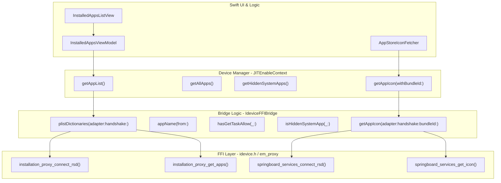
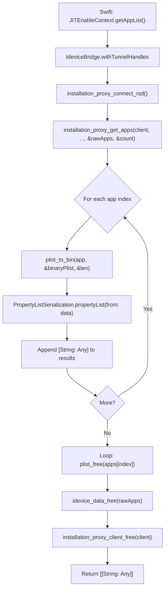

# Application Management API

Relevant source files

The following files were used as context for generating this wiki page:

- [StikJIT/JSSupport/ScriptListView.swift](StikJIT/JSSupport/ScriptListView.swift)
- [StikJIT/Utilities/AppStoreIconFetcher.swift](StikJIT/Utilities/AppStoreIconFetcher.swift)
- [StikJIT/Utilities/IdeviceFFIBridge.swift](StikJIT/Utilities/IdeviceFFIBridge.swift)
- [StikJIT/Views/InstalledAppsListView.swift](StikJIT/Views/InstalledAppsListView.swift)

## Overview

The Application Management API provides functionality for querying installed applications on iOS devices, filtering them by various criteria, and retrieving application icons. This API is implemented via the `IdeviceFFIBridge` utility and exposed through the `JITEnableContext` singleton, bridging Swift application code to iOS device services through the `InstallationProxy` and `SpringBoardServices` protocols over a Remote Service Discovery (RSD) tunnel.

**Key Capabilities:**
- Query debuggable apps (those with the `get-task-allow` entitlement) [StikJIT/Utilities/IdeviceFFIBridge.swift:185-199]()
- List all installed applications via `InstallationProxy` [StikJIT/Utilities/IdeviceFFIBridge.swift:120-173]()
- Filter and identify hidden system applications [StikJIT/Utilities/IdeviceFFIBridge.swift:201-219]()
- Retrieve application icons via `SpringBoardServices` [StikJIT/Utilities/IdeviceFFIBridge.swift:245-274]()
- Asynchronous icon fetching and caching for UI performance [StikJIT/Utilities/AppStoreIconFetcher.swift:15-30]()

**Related Systems:**
- **JIT enablement operations:** page 3.3 (JIT Enablement Engine)
- **Device connection management:** page 3.2 (Heartbeat and Connection Management)
- **Icon caching:** page 5.2 (Icon Caching System)
- **Native Bridging:** page 4.5 (Native Bridging and FFI)

## Architecture Overview

The Application Management API follows a layered architecture pattern that enables Swift code to query iOS device services through an FFI bridge that interacts with the `idevice` xcframework.

### Code Entity Mapping

This diagram maps the high-level application management concepts to the specific code entities that implement them.

**Sources:** [StikJIT/Utilities/IdeviceFFIBridge.swift:12-275](), [StikJIT/Utilities/AppStoreIconFetcher.swift:11-31](), [StikJIT/Utilities/IdeviceFFIBridge.swift:120-126](), [StikJIT/Views/InstalledAppsListView.swift:15-16]()

## Core Query Pipeline

### App List Query Data Flow

The `plistDictionaries` function in `IdeviceFFIBridge` is the central engine for fetching raw application data from the `InstallationProxy` service. It handles the connection lifecycle and memory management of the returned `plist_t` objects.

**Sources:** [StikJIT/Utilities/IdeviceFFIBridge.swift:120-173](), [StikJIT/Utilities/IdeviceFFIBridge.swift:76-82]()

### Application Filtering Logic

Once the raw dictionaries are retrieved, `JITEnableContext` applies specific filters to categorize the applications. The UI then consumes these categorized lists via `InstalledAppsViewModel` [StikJIT/Views/InstalledAppsListView.swift:16]().

| Feature | Logic Location | Implementation Detail |
| :--- | :--- | :--- |
| **Debuggable Apps** | `hasGetTaskAllow` | Checks `Entitlements` dictionary for `get-task-allow` key (boolean or NSNumber) [StikJIT/Utilities/IdeviceFFIBridge.swift:185-199](). |
| **Hidden System Apps** | `isHiddenSystemApp` | Validates `ApplicationType` is "System"/"HiddenSystemApp" OR `IsHidden` is true OR `SBAppTags` contains "hidden" [StikJIT/Utilities/IdeviceFFIBridge.swift:201-219](). |
| **Display Name** | `appName` | Falls back from `CFBundleDisplayName` to `CFBundleName`, then to "Unknown" [StikJIT/Utilities/IdeviceFFIBridge.swift:175-183](). |

**Sources:** [StikJIT/Utilities/IdeviceFFIBridge.swift:175-219](), [StikJIT/Views/InstalledAppsListView.swift:61-98]()

## Icon Retrieval and Caching

### Icon Fetching (SpringBoardServices)

Icons are retrieved using the `SpringBoardServices` protocol. The bridge function `getAppIcon` manages the connection to the service and handles the raw PNG data returned by the device.

1.  **Connection:** Connects via `springboard_services_connect_rsd` using active tunnel handles [StikJIT/Utilities/IdeviceFFIBridge.swift:252]().
2.  **Request:** Calls `springboard_services_get_icon` with the target `bundleId` [StikJIT/Utilities/IdeviceFFIBridge.swift:257]().
3.  **Conversion:** The resulting binary data is converted into a `UIImage` [StikJIT/Utilities/IdeviceFFIBridge.swift:268]().
4.  **Cleanup:** Ensures `springboard_services_client_free` is called via a `defer` block [StikJIT/Utilities/IdeviceFFIBridge.swift:254]().

**Sources:** [StikJIT/Utilities/IdeviceFFIBridge.swift:245-274]()

### AppStoreIconFetcher

To prevent UI blocking and redundant network/device calls, the `AppStoreIconFetcher` provides an asynchronous interface with an in-memory cache.

- **Caching:** Uses a static `Dictionary<String, UIImage>` to store fetched icons [StikJIT/Utilities/AppStoreIconFetcher.swift:12]().
- **Concurrency:** Uses a dedicated concurrent `DispatchQueue` ("com.stik.StikJIT.iconFetchQueue") for fetching to avoid blocking the Main Thread [StikJIT/Utilities/AppStoreIconFetcher.swift:13-21]().
- **Flow:** Checks cache -> Fetches via `JITEnableContext.shared.getAppIcon` on background queue -> Updates cache and calls completion on main queue [StikJIT/Utilities/AppStoreIconFetcher.swift:16-29]().

**Sources:** [StikJIT/Utilities/AppStoreIconFetcher.swift:11-31]()

## Memory Management and Safety

The bridge implementation includes strict memory management to prevent leaks when interacting with the C-based `idevice` FFI:

- **FFI Error Handling:** The `consumeFFIError` function extracts error messages from `IdeviceFfiError` pointers and ensures `idevice_error_free` is called [StikJIT/Utilities/IdeviceFFIBridge.swift:32-45]().
- **Plist Cleanup:** When fetching app lists, every `plist_t` in the returned array is explicitly freed with `plist_free` [StikJIT/Utilities/IdeviceFFIBridge.swift:136-139]().
- **Binary Plists:** Binary data buffers created by `plist_to_bin` are released using `plist_mem_free` immediately after conversion to Swift `Data` [StikJIT/Utilities/IdeviceFFIBridge.swift:161]().
- **Opaque Clients:** Service clients (Installation Proxy, SpringBoard) are wrapped in `withConnectedClient` patterns or use `defer` to ensure `_free` functions are always executed [StikJIT/Utilities/IdeviceFFIBridge.swift:102-118]().

**Sources:** [StikJIT/Utilities/IdeviceFFIBridge.swift:32-45](), [StikJIT/Utilities/IdeviceFFIBridge.swift:136-144](), [StikJIT/Utilities/IdeviceFFIBridge.swift:161]()