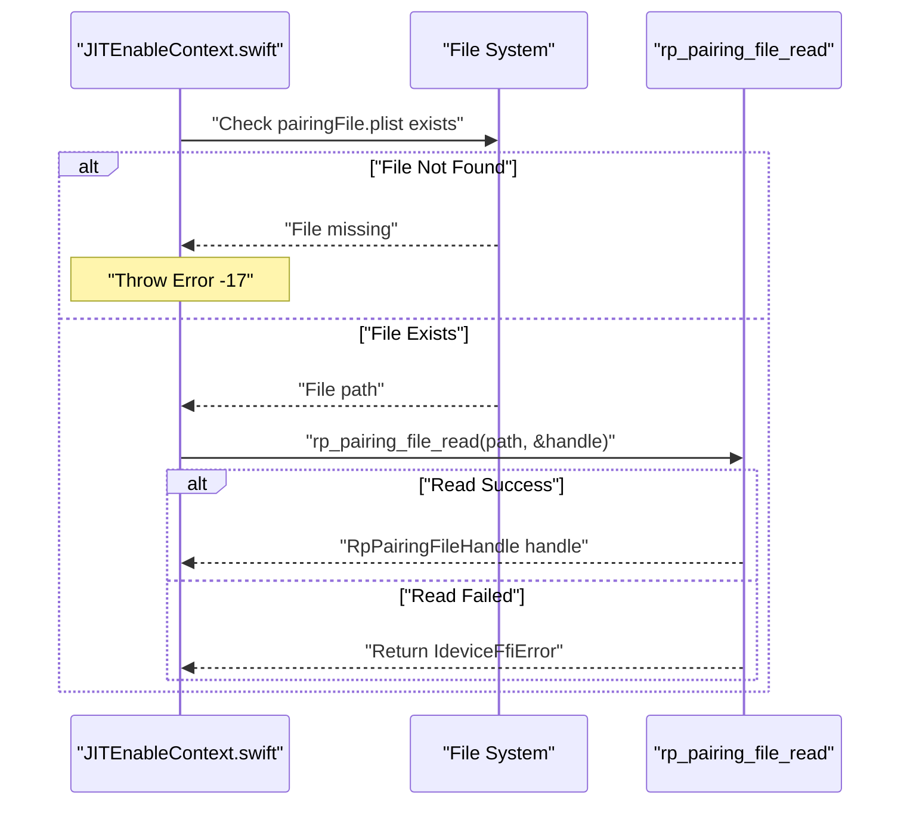
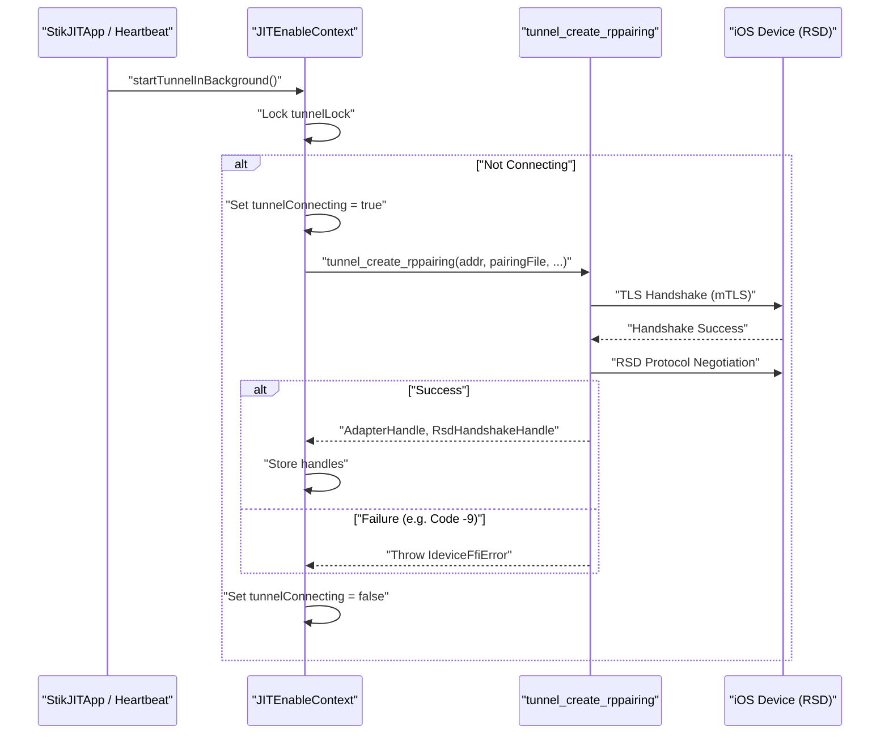
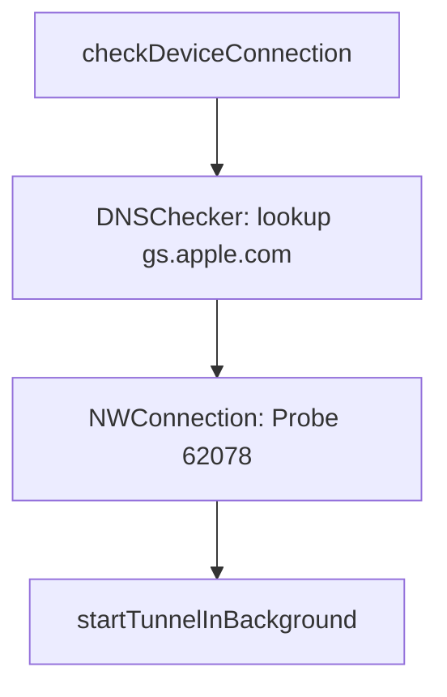

# Device Authentication and Pairing

<details>
<summary>Relevant source files</summary>

The following files were used as context for generating this wiki page:

- [StikJIT/StikJIT.entitlements](StikJIT/StikJIT.entitlements)
- [StikJIT/Utilities/mountDDI.swift](StikJIT/Utilities/mountDDI.swift)

</details>


This document describes the device authentication and pairing system used to establish trusted connections between StikDebug and iOS devices via the RSD (Remote Service Discovery) protocol. The pairing mechanism is the foundation for all device communication and must be successfully established before any other operations can occur.

## Overview

StikDebug requires a **pairing file** (`.mobiledevicepairing` or `.plist` format) to authenticate with the target iOS device. This pairing file contains cryptographic credentials (certificates and private keys) that establish a trusted relationship. The pairing file must be obtained externally (typically from a trusted computer's lockdown records) and imported by the user.

The pairing system handles:
- Reading and validating pairing file structure via `RpPairingFileHandle`.
- Establishing a TLS session using the `AdapterHandle` and `RsdHandshakeHandle`.
- Detecting and handling invalid or expired pairing files (Error code -9).
- Managing the lifecycle of the connection tunnel.

## Pairing File Structure and Types

### RpPairingFileHandle Opaque Handle

The Swift and C FFI layers represent pairing files using an opaque pointer type `RpPairingFileHandle`. This structure contains the necessary X.509 certificates and host private keys required for mutual TLS (mTLS) authentication with the iOS device.

**Sources:** [StikJIT/Utilities/mountDDI.swift:10-10]()

### File Storage and Store Management

The pairing file is managed by the `PairingFileStore` (if applicable) or stored at a fixed location in the app's Documents directory:

```
Documents/pairingFile.plist
```

This location is used consistently across the codebase for reading and validation. The file must be imported by the user through the system document picker.

## Authentication and Connection Flow

### Pairing File Reading

The `JITEnableContext` singleton provides the primary interface for reading pairing files. The method `getPairingFileWithError:` encapsulates the reading logic:



### RSD Protocol Handshake and Tunnel Establishment

The `startTunnel` process orchestrates the creation of the authenticated tunnel. Unlike older versions of iOS that used `lockdownd` on port 62078, iOS 17.4+ relies on the RSD protocol, typically established over a network interface (like LocalDevVPN).



**Key Synchronization Mechanisms:**
`JITEnableContext` uses internal locking to prevent concurrent tunnel creation attempts and state flags to track ongoing connection attempts.

**Sources:** [StikJIT/StikJITApp.swift:121-124](), [StikJIT/StikJITApp.swift:152-152]()

## RSD Protocol and TLS Session

The pairing file credentials are used to establish an **RSD (Remote Service Discovery)** protocol connection. The connection parameters are derived from user settings or defaults.

### Connection Parameters

| Parameter | Value | Source |
|-----------|-------|--------|
| **Target Host** | `customTargetIP` or `10.7.0.1` | `UserDefaults` |
| **Target Port** | `49152` (Default) | Internal FFI |
| **Transport** | TCP with TLS | Required for authentication |

### Handle Management

The authenticated session is represented by three primary opaque handles used throughout the mounting and JIT process:

1.  **`AdapterHandle`**: Represents the underlying network transport and TLS session.
2.  **`RsdHandshakeHandle`**: Represents the negotiated RSD session, used to discover services.
3.  **`RpPairingFileHandle`**: Represents the parsed pairing credentials.

**Sources:** [StikJIT/Utilities/mountDDI.swift:10-12]()

## Error Handling and Recovery

### Error Code -9 (Authentication Failed)

Error code `-9` specifically indicates that the pairing is invalid, expired, or the device has revoked trust. 

### Error Code -17 (Pairing File Missing)

Error code `-17` indicates that the application cannot find the `pairingFile.plist` in the expected directory. This typically triggers the "Pairing File Required" UI.

### Connection Diagnostics

The `DNSChecker` class and `checkDeviceConnection` flow provide auxiliary diagnostics when authentication fails due to network issues rather than credential issues.



**Sources:** [StikJIT/StikJITApp.swift:25-67](), [StikJIT/StikJITApp.swift:152-153]()

## Summary of Key Code Entities

| Entity | Type | Location | Purpose |
|--------|------|----------|---------|
| `RpPairingFileHandle` | OpaquePointer | `mountDDI.swift:10` | Represents parsed pairing credentials. |
| `AdapterHandle` | OpaquePointer | `mountDDI.swift:11` | Manages the authenticated network adapter. |
| `RsdHandshakeHandle` | OpaquePointer | `mountDDI.swift:12` | Manages the RSD protocol session. |
| `JITEnableContext` | Singleton | `JITEnableContext.swift` | High-level manager for tunnel and pairing state. |
| `DNSChecker` | ObservableObject | `StikJITApp.swift:25` | Validates network environment for pairing. |

**Sources:** [StikJIT/Utilities/mountDDI.swift:10-12](), [StikJIT/StikJITApp.swift:25-30]()