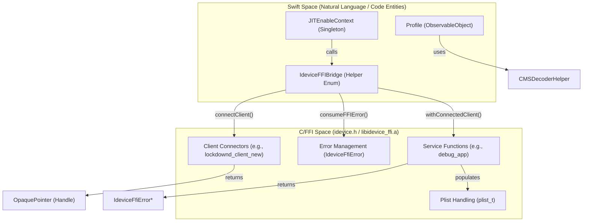
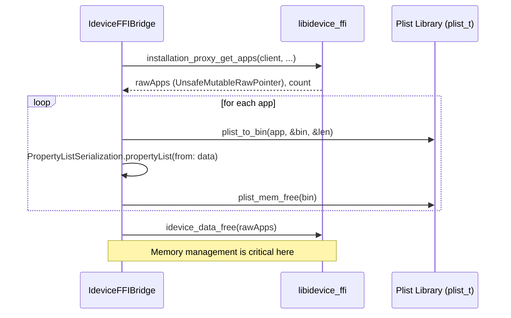

# Native Bridging and FFI

<details>
<summary>Relevant source files</summary>

The following files were used as context for generating this wiki page:

- [StikJIT/Utilities/IdeviceFFIBridge.swift](StikJIT/Utilities/IdeviceFFIBridge.swift)
- [StikJIT/Views/ProfileView.swift](StikJIT/Views/ProfileView.swift)
- [StikJIT/idevice/idevice.h](StikJIT/idevice/idevice.h)
- [StikJIT/idevice/libidevice_ffi.a](StikJIT/idevice/libidevice_ffi.a)
- [StikJIT/idevice/module.modulemap](StikJIT/idevice/module.modulemap)

</details>


## Purpose and Scope

This page documents the interface between StikDebug's Swift UI/Logic layer and the underlying C device communication stack provided by the `idevice` xcframework. It covers the `IdeviceFFIBridge` Swift helper, the `idevice.h` C function signatures for core services (JIT, mounting, app management, profiles, and location simulation), `IdeviceFfiError` handling, and the strict memory management patterns required when interacting with non-ARC C libraries.

For details on the high-level manager that utilizes these bridges, see [4.2](). For the JavaScript execution environment built atop this FFI, see [3.6]().

---

## The Idevice Module and Bridge

The application integrates with a native C library via the `idevice` module, defined in [StikJIT/idevice/module.modulemap:1-4](). This module exports the headers in `idevice.h`, making them available to Swift.

To simplify the interaction between Swift's safety and C's pointer-heavy API, the `IdeviceFFIBridge` private enum in [StikJIT/Utilities/IdeviceFFIBridge.swift:12-214]() provides static utility methods for error consumption, handle lifecycle management, and Plist conversion.

### Bridge Data Flow

The following diagram illustrates how Swift entities interact with the C-based FFI layer.



Sources: [StikJIT/Utilities/IdeviceFFIBridge.swift:12-118](), [StikJIT/idevice/idevice.h:108-212](), [StikJIT/Views/ProfileView.swift:10-45]()

---

## Core FFI Types and Handles

The communication layer uses opaque C handles to manage stateful connections to device services. These are forward-declared in `idevice.h` and implemented within the `libidevice_ffi.a` static library [StikJIT/idevice/libidevice_ffi.a:1-13]().

### Handle Hierarchy

| Handle Type | Code Entity | Purpose |
|---|---|---|
| **Base Connection** | `AdapterHandle` | Primary tunnel adapter for RSD (Remote Service Discovery) communication [StikJIT/idevice/idevice.h:63](). |
| **Handshake** | `RsdHandshakeHandle` | Represents a successful RSD handshake session [StikJIT/idevice/idevice.h:176](). |
| **App Service** | `InstallationProxyClientHandle` | Used for listing and inspecting installed applications [StikJIT/idevice/idevice.h:121](). |
| **Debug Service** | `DebugProxyHandle` | Facilitates GDB/LLDB-like debugging commands for JIT [StikJIT/idevice/idevice.h:92](). |
| **Mount Service** | `ImageMounterHandle` | Used to mount Developer Disk Images (DDI) [StikJIT/idevice/idevice.h:119](). |
| **Profile Service** | `MisagentClientHandle` | Manages provisioning profiles (fetch/add/remove) [StikJIT/idevice/idevice.h:134](). |
| **Location Service**| `LocationSimulationHandle` | Interfaces with the location simulation service [StikJIT/idevice/idevice.h:128](). |
| **Heartbeat** | `HeartbeatClientHandle` | Maintains the connection alive during JIT sessions [StikJIT/idevice/idevice.h:101](). |

Sources: [StikJIT/idevice/idevice.h:63-192]()

---

## Service Implementation Patterns

### JIT and Process Control
JIT enablement relies on the `debug_app` and `debug_app_pid` signatures. These functions utilize a `DebugAppCallback` to hand off control to the scripting engine once the debugger is attached [StikJIT/idevice/idevice.h:1080-1087]().

```c
typedef void (^DebugAppCallback)(int pid,
                                 struct DebugProxyHandle* debug_proxy,
                                 struct RemoteServerHandle* remote_server,
                                 dispatch_semaphore_t semaphore);

IdeviceFfiError *debug_app(AdapterHandle *adapter, 
                           RsdHandshakeHandle *handshake, 
                           const char *bundle_id, 
                           LogFuncC logger, 
                           DebugAppCallback callback);
```

### App Listing and Metadata
The `IdeviceFFIBridge` wraps `installation_proxy_get_apps` to retrieve application dictionaries. It converts raw Plist data into Swift `[String: Any]` dictionaries using `PropertyListSerialization` [StikJIT/Utilities/IdeviceFFIBridge.swift:120-173]().



Sources: [StikJIT/Utilities/IdeviceFFIBridge.swift:127-144](), [StikJIT/idevice/idevice.h:1200-1205]()

---

## Error Handling: IdeviceFfiError

The FFI layer uses a structured error type `IdeviceFfiError` containing a code, sub-code, and a message pointer [StikJIT/idevice/idevice.h:208-212](). Swift code must consume these pointers to prevent leaks using `idevice_error_free`.

```swift
static func consumeFFIError(
    _ ffiError: UnsafeMutablePointer<IdeviceFfiError>?,
    fallback: String,
    domain: String = "StikDebug"
) -> NSError {
    guard let ffiError else {
        return makeError(domain: domain, message: fallback)
    }

    let code = Int(ffiError.pointee.code)
    let message = string(from: ffiError.pointee.message) ?? fallback
    idevice_error_free(ffiError) // Free the native error struct
    return makeError(domain: domain, code: code, message: message)
}
```

Sources: [StikJIT/Utilities/IdeviceFFIBridge.swift:32-45]()

---

## Memory Management Patterns

Because the FFI layer interacts with memory allocated by the Rust/C core, manual deallocation is mandatory. The codebase follows a strict "free what you allocate" policy using specific library deallocators defined in the headers.

### Deallocation Table

| Type | Allocation Source | Deallocation Function |
|---|---|---|
| `IdeviceFfiError*` | Any fallible FFI call | `idevice_error_free()` [StikJIT/Utilities/IdeviceFFIBridge.swift:43]() |
| `plist_t` | `lockdownd_get_value`, `installation_proxy_get_apps` | `plist_free()` [StikJIT/Utilities/IdeviceFFIBridge.swift:138]() |
| `char*` (Binary Plist) | `plist_to_bin` | `plist_mem_free()` [StikJIT/Utilities/IdeviceFFIBridge.swift:161]() |
| `void*` (Raw Array) | `installation_proxy_get_apps` | `idevice_data_free()` [StikJIT/Utilities/IdeviceFFIBridge.swift:140]() |
| `ClientHandle*` | `_connect_rsd` functions | `_client_free()` (e.g., `installation_proxy_client_free`) [StikJIT/Utilities/IdeviceFFIBridge.swift:125]() |

### Safe Handle Pattern
The `withConnectedClient` helper ensures that handles are always freed using a `defer` block, even if the closure body throws an error [StikJIT/Utilities/IdeviceFFIBridge.swift:102-118]().

Sources: [StikJIT/Utilities/IdeviceFFIBridge.swift:120-173](), [StikJIT/idevice/idevice.h:1200-1210]()