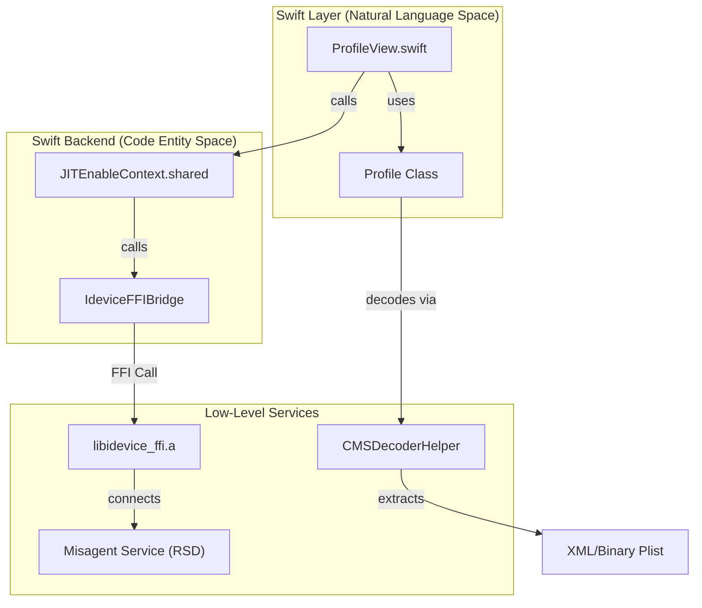
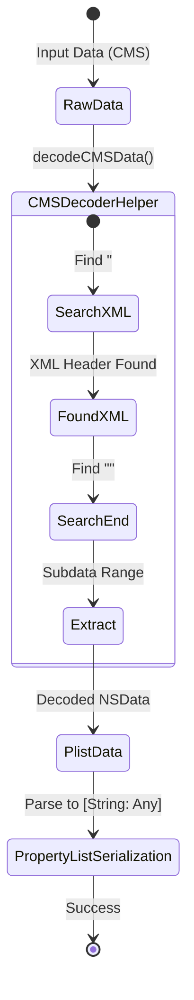
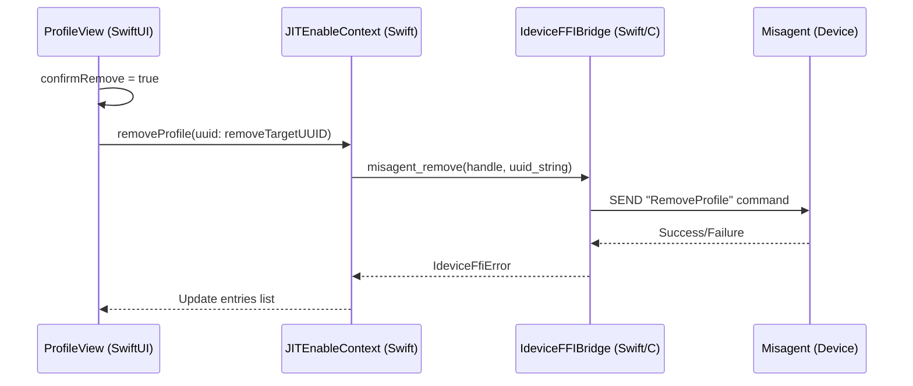

# Profile Management Backend

Relevant source files

The following files were used as context for generating this wiki page:

- [StikJIT/Utilities/mountDDI.swift](StikJIT/Utilities/mountDDI.swift)
- [StikJIT/Views/ProfileView.swift](StikJIT/Views/ProfileView.swift)
- [StikJIT/idevice/idevice.h](StikJIT/idevice/idevice.h)
- [StikJIT/idevice/libidevice_ffi.a](StikJIT/idevice/libidevice_ffi.a)

## Purpose and Scope

This document describes the backend implementation for managing provisioning profiles on iOS devices within the StikDebug ecosystem. The profile management system utilizes the `Misagent` service to fetch, install, and remove `.mobileprovision` files. This backend facilitates profile viewing, CMS-signed decoding, entitlement extraction, and app-to-profile matching.

For information about the central device manager coordinating these operations, see [JITEnableContext Singleton](#4.2).

## Architecture Overview

The profile management backend is implemented as a functional extension of the `JITEnableContext` ecosystem. It bridges high-level SwiftUI requests to low-level C FFI functions that interact with the `Misagent` service over a Remote Service Discovery (RSD) tunnel.

### Profile Management Flow

The following diagram illustrates the relationship between the UI, the `JITEnableContext` singleton, and the underlying C FFI layer.

**Title: Profile Management Entity Mapping**

**Sources:** [StikJIT/Views/ProfileView.swift:10-45](), [StikJIT/idevice/idevice.h:134-134](), [StikJIT/idevice/libidevice_ffi.a:1-13]()

## Misagent Service Usage

StikDebug interacts with the device's `Misagent` (Managed Installation Service Agent) to perform profile operations. All operations require an established tunnel via `AdapterHandle` and `RsdHandshakeHandle`.

### Core Backend Functions

| Function | Implementation Method | Description |
| :--- | :--- | :--- |
| **Fetch All** | `fetchAllProfiles` | Retrieves all installed profiles from the device via `misagent_copy_all`. |
| **Add Profile** | `addProfile` | Installs a new `.mobileprovision` file to the device using `misagent_install`. |
| **Remove Profile** | `removeProfileWithUUID` | Uninstalls a profile by its string UUID using `misagent_remove`. |

### Implementation Detail: Fetching and Management
The `JITEnableContext` ensures the tunnel is active before invoking the FFI implementation.

1. **Connection**: The system uses `MisagentClientHandle` [StikJIT/idevice/idevice.h:134]() to establish a session.
2. **Data Handling**: Raw profile data is retrieved as a collection of byte arrays which are then converted to `Data` objects in Swift for processing.
3. **Cleanup**: Handles are released using the appropriate FFI free functions (e.g., `idevice_data_free`, `plist_mem_free`) to prevent memory leaks in the `idevice` stack.

**Sources:** [StikJIT/idevice/idevice.h:134-134](), [StikJIT/idevice/libidevice_ffi.a:1-13](), [StikJIT/idevice/idevice.h:214-216]()

## CMS-Signed Decoding

Provisioning profiles (`.mobileprovision`) are Cryptographic Message Syntax (CMS) signed blobs. To extract the underlying configuration, StikDebug must strip the CMS wrapper to reach the inner Property List (Plist).

### CMSDecoderHelper Algorithm
The `CMSDecoderHelper` (invoked within the `Profile` class initializer [StikJIT/Views/ProfileView.swift:28]()) performs signature stripping to extract the inner payload.

**Title: CMS to Plist Extraction Logic**

**Implementation Details:**
- **Initialization**: The `Profile` class takes raw `Data` and immediately attempts decoding [StikJIT/Views/ProfileView.swift:25-29]().
- **Extraction**: The `plistDict` is populated with keys such as `AppIDName`, `Entitlements`, `ExpirationDate`, and `UUID` [StikJIT/Views/ProfileView.swift:30-37]().
- **Error Handling**: If decoding fails, the error is captured in `decodeError` for UI display [StikJIT/Views/ProfileView.swift:41-44]().

**Sources:** [StikJIT/Views/ProfileView.swift:10-45]()

## Entitlement Extraction and Comparison

Once decoded, the profile data is parsed into a dictionary. The backend focuses on specific keys required for JIT and app validation.

### Key Entitlements
The system extracts the following from the `Entitlements` sub-dictionary [StikJIT/Views/ProfileView.swift:33]():
- `application-identifier`: Used to match the profile to a specific App Bundle ID [StikJIT/Views/ProfileView.swift:34]().
- `get-task-allow`: A boolean indicating if the app is debuggable (critical for JIT activation).
- `com.apple.developer.team-identifier`: Used for team-level verification.

### Comparison Algorithm
The `ProfileView` uses an `AppProfileStatus` structure to manage the relationship between installed apps and available profiles.

1. **Bundle ID Matching**: The algorithm compares the app's `bundleIdentifier` against the profile's `application-identifier`. It handles wildcard identifiers (e.g., `*` or `TEAMID.*`).
2. **Expiry Validation**: Profiles are sorted by `expirationDate` [StikJIT/Views/ProfileView.swift:21](). The UI uses `dateColor` logic to highlight profiles nearing expiry:
    - **Red**: < 2 days [StikJIT/Views/ProfileView.swift:70-70]()
    - **Orange**: 2-3 days [StikJIT/Views/ProfileView.swift:67-67]()
    - **Yellow**: 4-5 days [StikJIT/Views/ProfileView.swift:68-68]()
    - **Green**: 6+ days [StikJIT/Views/ProfileView.swift:69-69]()
3. **Best Match Selection**: The backend identifies the "Best Matching Profile" based on the most specific entitlement match and the furthest expiration date [StikJIT/Views/ProfileView.swift:158-163]().

**Sources:** [StikJIT/Views/ProfileView.swift:18-37](), [StikJIT/Views/ProfileView.swift:58-73](), [StikJIT/Views/ProfileView.swift:154-173]()

## Data Flow: Profile Removal

When a user triggers a profile removal, the request flows from the SwiftUI `List` through the `JITEnableContext` to the `Misagent` service.

**Title: removeProfileWithUUID Sequence**

**Sources:** [StikJIT/Views/ProfileView.swift:131-134](), [StikJIT/idevice/idevice.h:134-134](), [StikJIT/idevice/libidevice_ffi.a:1-13]()