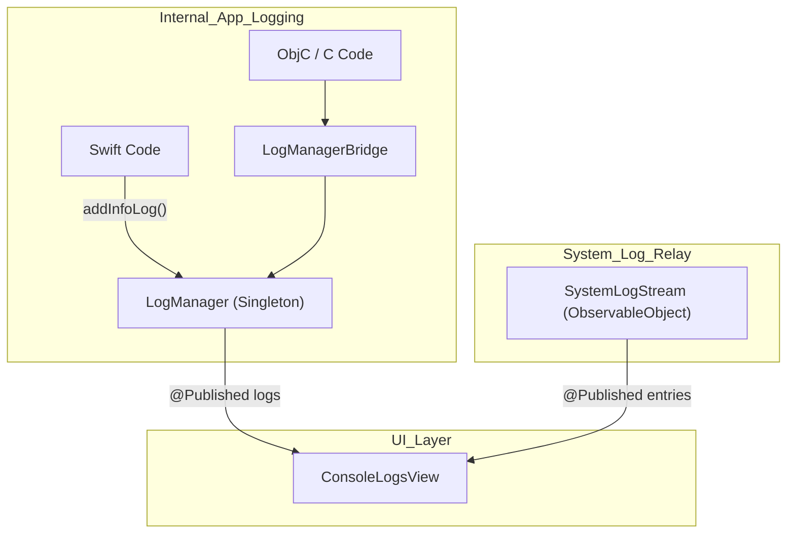
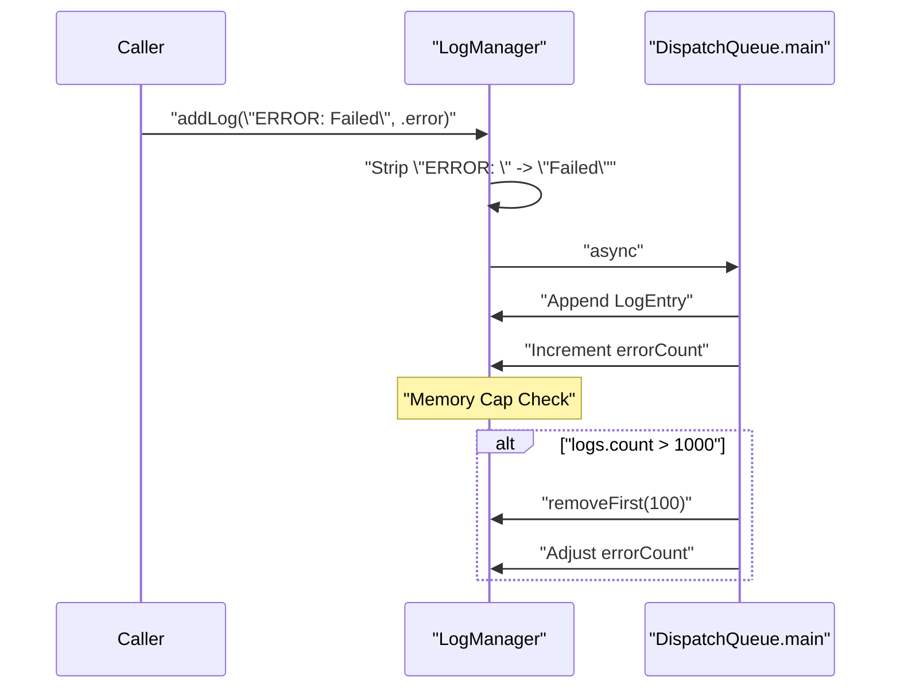

# Logging System

<details>
<summary>Relevant source files</summary>

The following files were used as context for generating this wiki page:

- [StikJIT/Utilities/LogManager.swift](StikJIT/Utilities/LogManager.swift)
- [StikJIT/Utilities/LogManagerBridge.swift](StikJIT/Utilities/LogManagerBridge.swift)
- [StikJIT/Views/ConsoleLogsView.swift](StikJIT/Views/ConsoleLogsView.swift)

</details>


## Purpose and Scope

The Logging System provides centralized diagnostic logging for StikDebug/StikJIT operations. It captures messages from Swift, Objective-C, and C code into unified in-memory and system-level log streams. The system categorizes log entries by severity (`INFO`, `ERROR`, `DEBUG`, `WARNING`) and provides redundant prefix stripping, memory capping (1000 entries), and real-time system log (syslog) relay capabilities.

For the UI layer that presents these logs, see page 2.6 (Console and Logging Interface).

---

## System Architecture

The logging system consists of two primary tracks: the **App Log Track** (internal application events and C FFI output) and the **System Log Track** (real-time device syslog relay).

**Logging System — Component Relationships**



Sources: [StikJIT/Utilities/LogManager.swift:10-12](), [StikJIT/Utilities/LogManagerBridge.swift:10-11](), [StikJIT/Views/ConsoleLogsView.swift:13-14]()

---

## LogManager (App Logs)

`LogManager` is a Swift singleton implementing `ObservableObject`. It serves as the central repository for application-level events.

### Log Entry Processing
When a message is added via `addLog(message:type:)`, the manager performs **redundant prefix stripping**. This removes strings like `"Info: "` or `"ERROR: "` from the start of the message to prevent duplicate severity indicators in the UI.

**`LogManager` — Data Flow and Pruning**



Sources: [StikJIT/Utilities/LogManager.swift:37-59](), [StikJIT/Utilities/LogManager.swift:73-85]()

### Memory Management
- **Capacity**: The manager caps the log array at 1000 entries [StikJIT/Utilities/LogManager.swift:57-57]().
- **Pruning**: When the limit is reached, it removes the oldest 100 entries [StikJIT/Utilities/LogManager.swift:57-57]().
- **Error Tracking**: The `errorCount` property is updated during both addition and pruning to ensure the UI "Error" badge remains accurate [StikJIT/Utilities/LogManager.swift:56-56](), [StikJIT/Utilities/LogManager.swift:98-99]().

---

## SystemLogStream (Syslog Relay)

`SystemLogStream` handles the real-time relay of device system logs. Unlike app logs, these are high-volume and require batching and speed control.

### Streaming Controls
- **Update Intervals**: Users can select intervals from 0.0s (live) to 2.0s [StikJIT/Views/ConsoleLogsView.swift:31-31]().
- **Interval Options**: The system provides predefined steps: 0.0, 0.2, 0.5, 1.0, 1.5, 2.0 seconds [StikJIT/Views/ConsoleLogsView.swift:31-31]().

### UI Integration
The `ConsoleLogsView` manages the display of these entries, allowing for filtering and speed adjustments via a confirmation dialog [StikJIT/Views/ConsoleLogsView.swift:34-40](), [StikJIT/Views/ConsoleLogsView.swift:99-108]().

Sources: [StikJIT/Views/ConsoleLogsView.swift:14-14](), [StikJIT/Views/ConsoleLogsView.swift:31-31](), [StikJIT/Views/ConsoleLogsView.swift:102-102]()

---

## Native Bridging (LogManagerBridge)

Because core JIT and communication logic may involve Objective-C or C components, a bridge is required to pipe those logs into the Swift `LogManager`.

`LogManagerBridge` is an `@objc` class that provides static accessors for the singleton, allowing non-Swift callers to submit logs.

```mermaid
graph LR
    subgraph "Native_Layer_ObjC_C"
        JITContext["JITEnableContext"]
        C_FFI["libem_proxy.a"]
    end
    
    subgraph "Bridge"
        Bridge["LogManagerBridge"]
    end
    
    subgraph "Swift_Layer"
        LM["LogManager.shared"]
    end

    JITContext --> Bridge
    C_FFI --> Bridge
    Bridge -->|"addErrorLog()"| LM
    Bridge -->|"addInfoLog()"| LM
```

Sources: [StikJIT/Utilities/LogManagerBridge.swift:10-32]()

---

## Persistence and UI Rendering

The application processes logs for display with specific formatting and provides persistence mechanisms.

### Log Rendering
The `ConsoleLogsView` uses `createLogAttributedString` to color-code entries based on their `LogType`:
- **INFO**: Standard text color.
- **ERROR**: Red.
- **DEBUG**: Blue.
- **WARNING**: Orange.

### File Persistence
The system supports exporting logs and interacts with `idevice_log.txt` for persistent storage of session information. The `ConsoleLogsView` includes logic to refresh these logs asynchronously [StikJIT/Views/ConsoleLogsView.swift:65-67]().

Sources: [StikJIT/Views/ConsoleLogsView.swift:13-14](), [StikJIT/Views/ConsoleLogsView.swift:65-67]()

---

## Summary of Log Types

| Type | Prefix Stripped | Source |
|------|-----------------|--------|
| `INFO` | "Info: ", "Information: " | App Logic, Heartbeat |
| `ERROR` | "Error: ", "ERR: " | Connection failures, JIT errors |
| `DEBUG` | "Debug: ", "DBG: " | FFI calls, verbose state |
| `WARNING` | "Warning: ", "WARN: " | Timeouts, non-critical retries |

Sources: [StikJIT/Utilities/LogManager.swift:22-27](), [StikJIT/Utilities/LogManager.swift:37-42]()