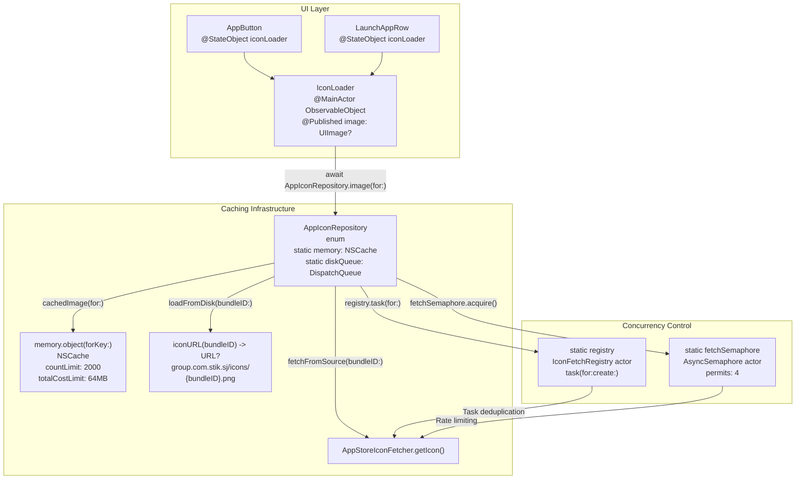
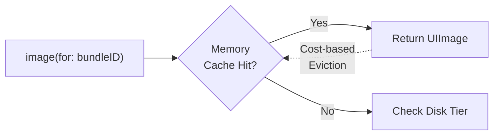
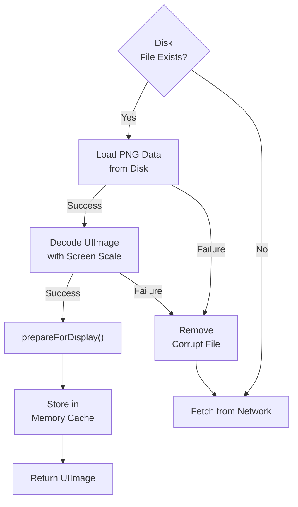
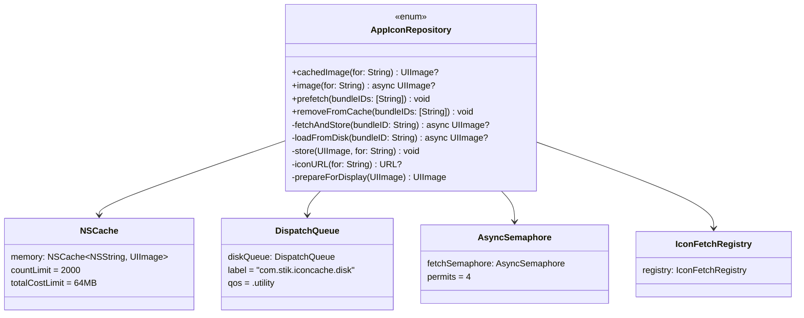
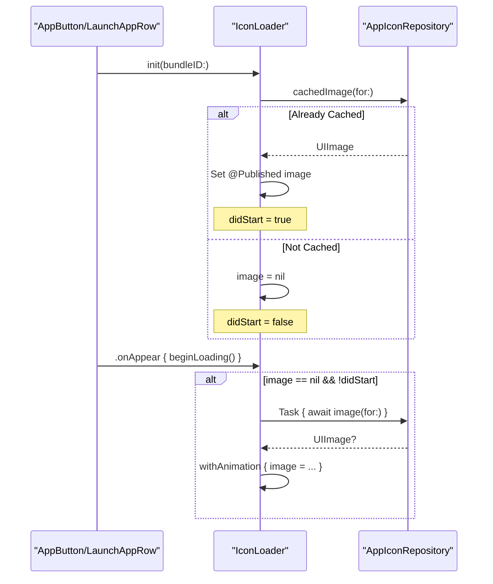
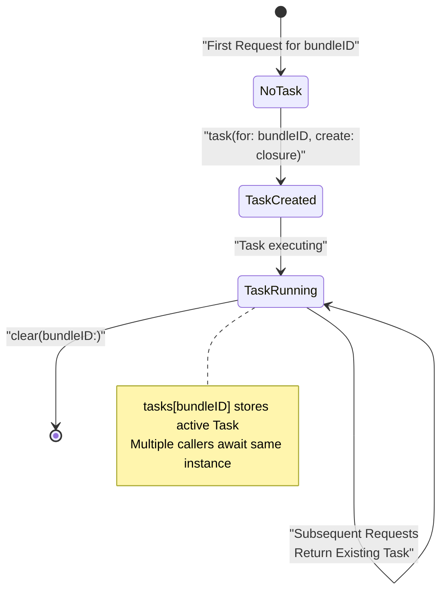
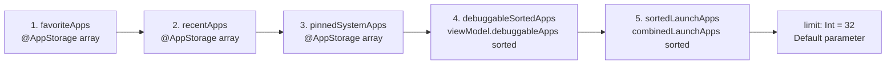
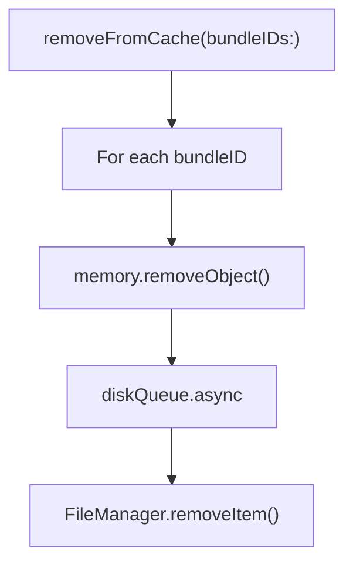

# Icon Caching System

<details>
<summary>Relevant source files</summary>

The following files were used as context for generating this wiki page:

- [StikJIT/JSSupport/ScriptListView.swift](StikJIT/JSSupport/ScriptListView.swift)
- [StikJIT/Utilities/AppStoreIconFetcher.swift](StikJIT/Utilities/AppStoreIconFetcher.swift)
- [StikJIT/Views/InstalledAppsListView.swift](StikJIT/Views/InstalledAppsListView.swift)

</details>


## Purpose and Scope

The Icon Caching System implements a three-tier caching strategy for application icons displayed in the application browser. It optimizes icon loading performance through memory caching, disk persistence, and network fetching with concurrency control and intelligent prefetching. This system ensures smooth scrolling in app lists while minimizing redundant network requests and memory overhead.

For application list management and filtering logic, see [Application Browser](2.4). For the underlying application management API that retrieves app metadata, see [Application Management API](4.3).

---

## Architecture Overview

The icon caching system consists of four primary components that work together to provide efficient icon retrieval and display.



**Sources:** [StikJIT/Views/InstalledAppsListView.swift:887-1038](), [StikJIT/Views/InstalledAppsListView.swift:1040-1075](), [StikJIT/Views/InstalledAppsListView.swift:842-857](), [StikJIT/Views/InstalledAppsListView.swift:859-885]()

---

## Three-Tier Caching Strategy

The system employs a hierarchical caching approach with increasing latency at each tier.

### Tier 1: Memory Cache (NSCache)

The first tier uses `NSCache` for fast in-memory lookups with automatic eviction under memory pressure.

| Property | Value |
|----------|-------|
| Type | `NSCache<NSString, UIImage>` |
| Count Limit | 2000 icons |
| Total Cost Limit | 64 MB |
| Cost Calculation | `width * height * 4` bytes per pixel |



**Implementation:** [StikJIT/Views/InstalledAppsListView.swift:888-893]()

**Sources:** [StikJIT/Views/InstalledAppsListView.swift:888-893](), [StikJIT/Views/InstalledAppsListView.swift:900-902](), [StikJIT/Views/InstalledAppsListView.swift:1026-1030]()

### Tier 2: Disk Storage

Icons are persisted to the shared app group container at `group.com.stik.sj/icons/{bundleID}.png`.



**Disk Operations:** All disk I/O occurs on a dedicated serial queue (`com.stik.iconcache.disk`) with QoS `.utility` to avoid blocking the main thread.

**Sources:** [StikJIT/Views/InstalledAppsListView.swift:969-990](), [StikJIT/Views/InstalledAppsListView.swift:1001-1011](), [StikJIT/Views/InstalledAppsListView.swift:1013-1024]()

### Tier 3: Network Fetch

When no cached icon exists, the system fetches from `AppStoreIconFetcher` with concurrency controls. Note that `AppStoreIconFetcher` internally uses `JITEnableContext.shared.getAppIcon(withBundleId:)` to interface with the native device management layer.

| Control Mechanism | Implementation | Limit |
|-------------------|----------------|-------|
| Rate Limiting | `AsyncSemaphore` | 4 concurrent fetches |
| Deduplication | `IconFetchRegistry` | 1 task per bundle ID |
| Priority | `Task.detached(priority:)` | `.utility` |

**Sources:** [StikJIT/Views/InstalledAppsListView.swift:939-959](), [StikJIT/Views/InstalledAppsListView.swift:961-967](), [StikJIT/Views/InstalledAppsListView.swift:896](), [StikJIT/Utilities/AppStoreIconFetcher.swift:11-31]()

---

## Core Components

### AppIconRepository

A static enum providing the primary API for icon retrieval and cache management.



**Key Methods:**

- `cachedImage(for:)` - Synchronous memory-only lookup [StikJIT/Views/InstalledAppsListView.swift:900-902]()
- `image(for:)` - Async retrieval through all tiers [StikJIT/Views/InstalledAppsListView.swift:904-915]()
- `prefetch(bundleIDs:)` - Background loading for anticipated icons [StikJIT/Views/InstalledAppsListView.swift:917-924]()
- `removeFromCache(bundleIDs:)` - Eviction from both memory and disk [StikJIT/Views/InstalledAppsListView.swift:926-937]()

**Sources:** [StikJIT/Views/InstalledAppsListView.swift:887-1038]()

### IconLoader

A `@MainActor` `ObservableObject` that integrates with SwiftUI views to reactively load and display icons.



**Properties:**
- `@Published image: UIImage?` - Observed by SwiftUI for view updates [StikJIT/Views/InstalledAppsListView.swift:1042]()
- `bundleID: String` - Identifier for the target icon [StikJIT/Views/InstalledAppsListView.swift:1044]()
- `didStart: Bool` - Prevents redundant fetch attempts [StikJIT/Views/InstalledAppsListView.swift:1045]()

**Sources:** [StikJIT/Views/InstalledAppsListView.swift:1040-1075]()

### IconFetchRegistry

An `actor` that deduplicates concurrent fetch requests for the same bundle ID.



**Implementation Details:**

| Property | Type | Purpose |
|----------|------|---------|
| `tasks` | `[String: Task<UIImage?, Never>]` | Stores active fetch tasks by bundle ID [StikJIT/Views/InstalledAppsListView.swift:843]() |
| `task(for:create:)` | `func` | Returns existing task or creates new one [StikJIT/Views/InstalledAppsListView.swift:845-852]() |
| `clear(bundleID:)` | `func` | Removes task entry after completion [StikJIT/Views/InstalledAppsListView.swift:854-856]() |

**Sources:** [StikJIT/Views/InstalledAppsListView.swift:842-857](), [StikJIT/Views/InstalledAppsListView.swift:940-958]()

### AsyncSemaphore

An `actor` implementing a counting semaphore to limit concurrent network fetches.

| Property/Operation | Type/Behavior |
|-------------------|---------------|
| `permits` | `Int` - Available permits count [StikJIT/Views/InstalledAppsListView.swift:860]() |
| `waiters` | `[CheckedContinuation<Void, Never>]` - Queue of suspended tasks [StikJIT/Views/InstalledAppsListView.swift:861]() |
| `acquire()` | Decrements permits; suspends via continuation if none available [StikJIT/Views/InstalledAppsListView.swift:868-877]() |
| `release()` | Resumes first waiter or increments permits [StikJIT/Views/InstalledAppsListView.swift:879-884]() |
| Initial Permits | `4` |

**Sources:** [StikJIT/Views/InstalledAppsListView.swift:859-885](), [StikJIT/Views/InstalledAppsListView.swift:896](), [StikJIT/Views/InstalledAppsListView.swift:942](), [StikJIT/Views/InstalledAppsListView.swift:953]()

---

## Prefetching Mechanism

The system implements intelligent prefetching to preload icons for apps likely to be viewed.

### Priority Order

Icons are prefetched in the following order with a default limit of 32 bundles:



**Sources:** [StikJIT/Views/InstalledAppsListView.swift:252-278]()

### Trigger Points

Prefetching occurs automatically when:

| Event | Code Location |
|-------|---------------|
| View appears | `.onAppear { prefetchPriorityIcons() }` [StikJIT/Views/InstalledAppsListView.swift:229]() |
| Favorites change | `.onChange(of: favoriteApps)` [StikJIT/Views/InstalledAppsListView.swift:233]() |
| Recents change | `.onChange(of: recentApps)` [StikJIT/Views/InstalledAppsListView.swift:236]() |
| Loading completes | `.onChange(of: viewModel.isLoading) { _, false }` [StikJIT/Views/InstalledAppsListView.swift:239-241]() |
| Tab switches | `.onChange(of: selectedTab)` [StikJIT/Views/InstalledAppsListView.swift:243]() |
| Pinned apps change | `.onChange(of: pinnedSystemApps)` [StikJIT/Views/InstalledAppsListView.swift:246]() |

**Sources:** [StikJIT/Views/InstalledAppsListView.swift:228-247]()

---

## Integration with UI Components

### AppButton Integration

The `AppButton` view displays debuggable apps with JIT enablement functionality.

**Icon Rendering Logic:**

| Condition | Rendered Output |
|-----------|----------------|
| `loadAppIconsOnJIT == true && iconLoader.image != nil` | `Image(uiImage:)` 54×54 with `RoundedRectangle(cornerRadius: 12)` and shadow [StikJIT/Views/InstalledAppsListView.swift:650-657]() |
| Otherwise | `RoundedRectangle` gray placeholder with `Image(systemName: "app")` [StikJIT/Views/InstalledAppsListView.swift:659-668]() |

**Sources:** [StikJIT/Views/InstalledAppsListView.swift:514-733](), [StikJIT/Views/InstalledAppsListView.swift:548](), [StikJIT/Views/InstalledAppsListView.swift:630-639](), [StikJIT/Views/InstalledAppsListView.swift:647-669]()

### LaunchAppRow Integration

The `LaunchAppRow` view displays non-debuggable apps for launching without debug attachment.

**Identical Loading Pattern:**

| Step | AppButton | LaunchAppRow | Line References |
|------|-----------|--------------|-----------------|
| Init IconLoader | `StateObject(wrappedValue: IconLoader(bundleID:))` | Identical | 548, 761 |
| Check Setting | `@AppStorage("loadAppIconsOnJIT")` | Identical | 521, 742 |
| Trigger Load | `.onAppear { iconLoader.beginLoading() }` | Identical | 631-638, 801-810 |
| Render | `iconView` computed property | Identical | 647-669, 816-838 |

**Sources:** [StikJIT/Views/InstalledAppsListView.swift:737-840](), [StikJIT/Views/InstalledAppsListView.swift:761](), [StikJIT/Views/InstalledAppsListView.swift:801-810](), [StikJIT/Views/InstalledAppsListView.swift:816-838]()

---

## Configuration and Tuning

### Cache Limits

| Parameter | Location | Value | Rationale |
|-----------|----------|-------|-----------|
| Memory Count Limit | `NSCache.countLimit` | 2000 | Covers large app libraries [StikJIT/Views/InstalledAppsListView.swift:890]() |
| Memory Cost Limit | `NSCache.totalCostLimit` | 64 MB | Balances memory usage [StikJIT/Views/InstalledAppsListView.swift:891]() |
| Concurrent Fetches | `AsyncSemaphore(permits:)` | 4 | Prevents network saturation [StikJIT/Views/InstalledAppsListView.swift:896]() |
| Prefetch Limit | `prefetchPriorityIcons(limit:)` | 32 | Balances preload vs memory [StikJIT/Views/InstalledAppsListView.swift:252]() |

**Sources:** [StikJIT/Views/InstalledAppsListView.swift:890-891](), [StikJIT/Views/InstalledAppsListView.swift:896](), [StikJIT/Views/InstalledAppsListView.swift:252]()

### Disk Storage Location

Icons are stored in the shared app group container for potential widget access:

```
group.com.stik.sj/icons/{bundleID}.png
```

| Property | Value | Location |
|----------|-------|----------|
| App Group ID | `"group.com.stik.sj"` | [StikJIT/Views/InstalledAppsListView.swift:898]() |
| Subdirectory | `"icons"` | [StikJIT/Views/InstalledAppsListView.swift:1017]() |
| File Format | PNG (lossless) | [StikJIT/Views/InstalledAppsListView.swift:1023]() |

**Sources:** [StikJIT/Views/InstalledAppsListView.swift:898](), [StikJIT/Views/InstalledAppsListView.swift:1013-1024]()

---

## Image Preparation

The system uses iOS 15+ `preparingForDisplay()` to decode images on a background thread before display, preventing main thread stalls during scrolling.

**Implementation:**

```swift
// Line 1032-1037: prepareForDisplay(_:) method
private static func prepareForDisplay(_ image: UIImage) -> UIImage {
    if #available(iOS 15.0, *) {
        return image.preparingForDisplay() ?? image
    }
    return image
}
```

**Call Sites:**

| Location | Context | Purpose |
|----------|---------|---------|
| [StikJIT/Views/InstalledAppsListView.swift:946]() | `fetchAndStore(bundleID:)` | Prepare fetched image before storage |
| [StikJIT/Views/InstalledAppsListView.swift:987]() | `loadFromDisk(bundleID:)` | Prepare disk-loaded image before return |

**Sources:** [StikJIT/Views/InstalledAppsListView.swift:946](), [StikJIT/Views/InstalledAppsListView.swift:987](), [StikJIT/Views/InstalledAppsListView.swift:1032-1037]()

---

## Cache Eviction

### Automatic Eviction

`NSCache` automatically evicts entries under memory pressure based on:
- Total cost exceeding `totalCostLimit` (64 MB)
- Count exceeding `countLimit` (2000 icons)

### Manual Eviction

The `removeFromCache(bundleIDs:)` method explicitly removes icons from both memory and disk:



**Use Case:** Called when apps are uninstalled or when clearing cache storage.

**Sources:** [StikJIT/Views/InstalledAppsListView.swift:926-937]()