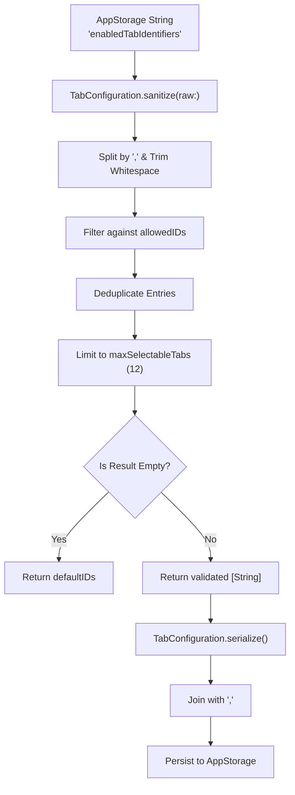
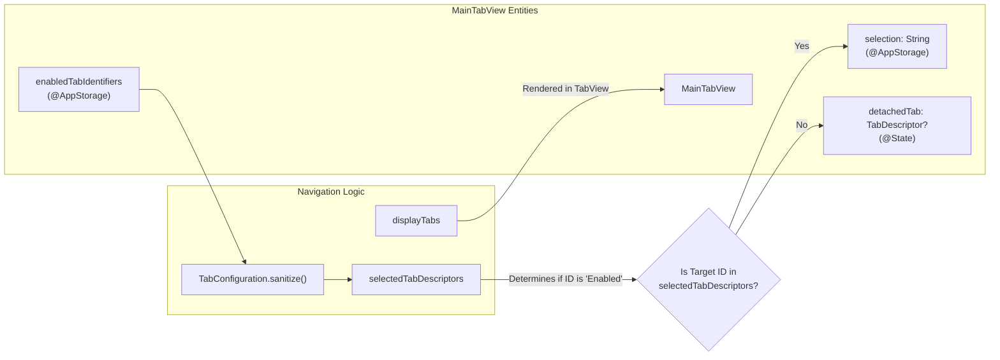

# Tab Configuration System

Relevant source files

The following files were used as context for generating this wiki page:

- [StikJIT/Utilities/TabConfiguration.swift](StikJIT/Utilities/TabConfiguration.swift)
- [StikJIT/Views/MainTabView.swift](StikJIT/Views/MainTabView.swift)

This page documents the `TabConfiguration` system and how `MainTabView` uses it to persist, validate, and route tab navigation. It covers the storage format, sanitization rules, and the logic that decides whether a navigation request switches the active tab or opens a detached sheet.

---

## TabConfiguration Utility

`TabConfiguration` is a caseless `enum` defined in [StikJIT/Utilities/TabConfiguration.swift:3-44]() that acts as a namespace for all tab identity constants and transformation logic. It handles the mapping between raw string storage and validated identifier lists.

### Constants and Properties

| Member | Kind | Value | Description |
|---|---|---|---|
| `storageKey` | `static let` | `"enabledTabIdentifiers"` | `UserDefaults`/`AppStorage` key used to persist the enabled tab list. |
| `maxSelectableTabs` | `static let` | `12` | Upper bound on how many tab IDs can be stored. |
| `coreIDs` | `private static let` | `["home", "scripts", "tools", "deviceinfo"]` | Internal base IDs used to build the allowed list. |
| `allowedIDs` | `static var` | Computed | `coreIDs` + `["profiles", "processes", "location"]`. |
| `defaultIDs` | `static let` | `[...]` | Fallback list containing all 7 standard IDs. |
| `defaultRawValue` | `static let` | Computed | `serialize(defaultIDs)` — the initial `AppStorage` value. |

Sources: [StikJIT/Utilities/TabConfiguration.swift:4-15]()

### Transformation Methods

**`sanitize(raw:)`** [StikJIT/Utilities/TabConfiguration.swift:17-22]()
Accepts a raw comma-separated string from `AppStorage`, splits on `,`, trims whitespace, and delegates to the array-based `sanitize(ids:)`.

**`sanitize(ids:)`** [StikJIT/Utilities/TabConfiguration.swift:24-39]()
Applies validation rules in order:
1. **Filtering**: Drops any ID not present in `allowedIDs` [StikJIT/Utilities/TabConfiguration.swift:27]().
2. **Deduplication**: Ensures each ID appears only once [StikJIT/Utilities/TabConfiguration.swift:28-30]().
3. **Truncation**: Stops after reaching `maxSelectableTabs` (12) [StikJIT/Utilities/TabConfiguration.swift:31-33]().
4. **Fallback**: If the resulting list is empty, it returns `defaultIDs` [StikJIT/Utilities/TabConfiguration.swift:35-37]().

**`serialize(_:)`** [StikJIT/Utilities/TabConfiguration.swift:41-43]()
Runs the input through `sanitize(ids:)` and joins the result with commas. This ensures that any string written back to storage is normalized.

**Data Sanitization Flow**

Sources: [StikJIT/Utilities/TabConfiguration.swift:17-43]()

---

## MainTabView Implementation

`MainTabView` [StikJIT/Views/MainTabView.swift:21-129]() serves as the root navigation controller, using `TabConfiguration` to manage the lifecycle of both the persistent `TabView` and temporary sheets.

### Tab Descriptors

The system uses a private `TabDescriptor` struct [StikJIT/Views/MainTabView.swift:10-15]() to map IDs to SwiftUI views.

*   **`configurableTabs`**: A list of all potential tabs (Apps, Scripts, Tools, Device Info, App Expiry, Processes, Location) [StikJIT/Views/MainTabView.swift:28-39]().
*   **`settingsTab`**: A static descriptor for the Settings view [StikJIT/Views/MainTabView.swift:45-47](), which is always visible and exempt from user configuration.
*   **`displayTabs`**: The subset of descriptors actually rendered in the bottom `TabView` [StikJIT/Views/MainTabView.swift:64-70](). Currently, this is hardcoded to show "Apps" (`home`), "Tools" (`tools`), and "Settings" (`settings`).

### Navigation Logic

`MainTabView` manages two types of navigation:
1.  **Selection**: Changing the active tab in the bottom bar [StikJIT/Views/MainTabView.swift:78]().
2.  **Detachment**: Opening a view in a modal `.sheet` if it is not currently in the primary `TabView` [StikJIT/Views/MainTabView.swift:114-125]().

**Tab Selection and Detachment Logic**

Sources: [StikJIT/Views/MainTabView.swift:22-25](), [StikJIT/Views/MainTabView.swift:49-70](), [StikJIT/Utilities/TabConfiguration.swift:17-39]()

### Notification Routing

The app uses `Notification.Name.switchToTab` [StikJIT/Views/MainTabView.swift:18]() to allow deep-linking or cross-tab navigation. When a notification is received:
*   If the ID is in `selectedTabDescriptors`, `selection` is updated [StikJIT/Views/MainTabView.swift:98-99]().
*   If the ID is valid (exists in `availableTabs`) but not currently "selected" (enabled), it is assigned to `detachedTab`, triggering a modal presentation [StikJIT/Views/MainTabView.swift:100-102]().

### Validation and Lifecycle

*   **`ensureSelectionIsValid()`**: Ensures the `selection` state variable always points to a valid ID within `displayTabs`. If the selection becomes invalid (e.g., after a settings change), it defaults to the first available tab or Settings [StikJIT/Views/MainTabView.swift:56-62]().
*   **`.onAppear`**: Normalizes the stored string via `TabConfiguration.serialize` [StikJIT/Views/MainTabView.swift:86](), validates the initial selection [StikJIT/Views/MainTabView.swift:87](), and sets up the notification observer [StikJIT/Views/MainTabView.swift:96-103]().
*   **`.onChange(of: enabledTabIdentifiers)`**: Re-validates the selection whenever the user modifies their enabled tabs in Settings [StikJIT/Views/MainTabView.swift:111-113]().

Sources: [StikJIT/Views/MainTabView.swift:56-113]()