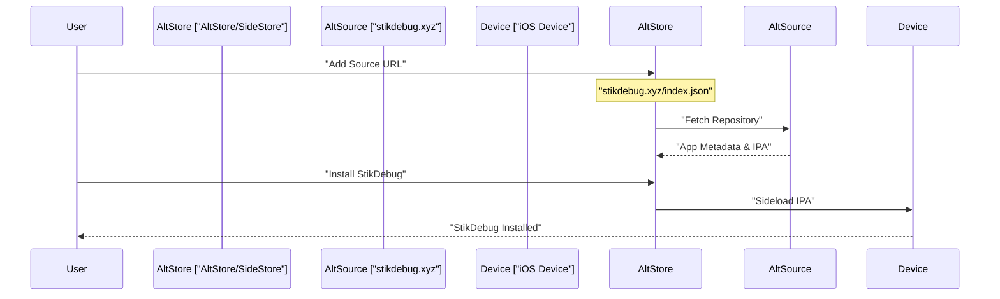
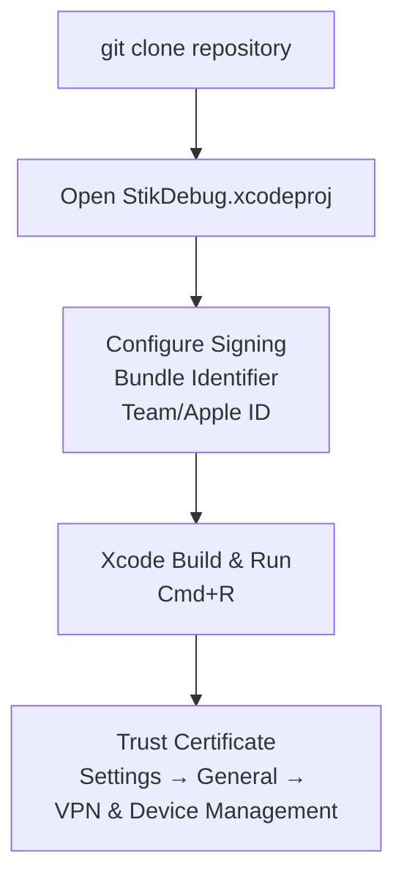
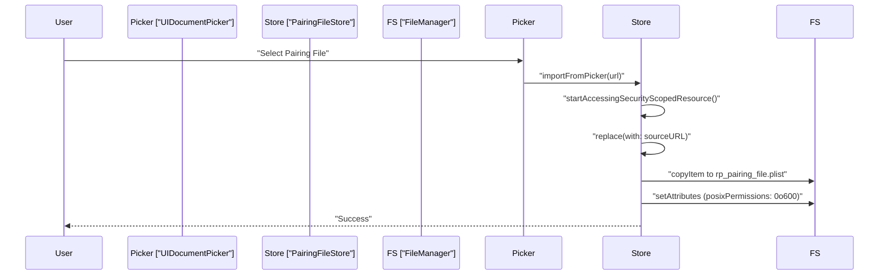
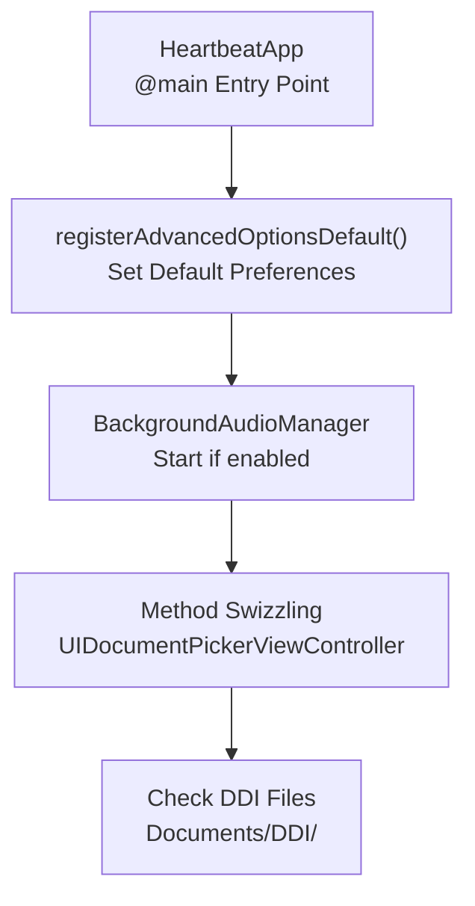

# Getting Started

<details>
<summary>Relevant source files</summary>

The following files were used as context for generating this wiki page:

- [README.md](README.md)
- [StikJIT/Info.plist](StikJIT/Info.plist)
- [StikJIT/JSSupport/RunJSView.swift](StikJIT/JSSupport/RunJSView.swift)
- [StikJIT/StikJITApp.swift](StikJIT/StikJITApp.swift)
- [StikJIT/Utilities/Extensions.swift](StikJIT/Utilities/Extensions.swift)
- [info.md](info.md)

</details>


This page guides you through the complete setup process for StikDebug, from installation to enabling JIT compilation for your first sideloaded application. It covers system requirements, pairing file acquisition, initial configuration, and your first successful JIT enablement.

---

## Prerequisites

Before installing StikDebug, ensure you meet the following requirements:

| Requirement | Description | Minimum Version |
|------------|-------------|-----------------|
| **iOS Device** | iPhone or iPad running iOS 17.4+ | iOS 17.4 |
| **Pairing File** | `.mobiledevicepairing` or `.plist` file for your device | N/A |
| **LocalDevVPN** | Loopback VPN for device-to-self communication | Latest |
| **Sideload Tool** | AltStore, SideStore, or similar | Any compatible |
| **Wi-Fi Connection** | Active wireless network connection | N/A |

**Compatibility Matrix:**

```mermaid
graph LR
    subgraph "Supported_Versions"
        ["iOS_17.4_-_18.x"] -- "Fully Supported" --> Stable["Stable"]
        ["iOS_26.0+"] -- "Supported" --> Limited["Limited App Availability"]
    end
    
    subgraph "Incompatible_Versions"
        ["iOS_1.0_-_17.3.X"] -- "Not Supported" --> Protocol["Different Connection Protocols"]
    end
    
    StikDebug["StikDebug"] --> ["iOS_17.4_-_18.x"]
    StikDebug --> ["iOS_26.0+"]
    StikDebug -.->|"Incompatible"| ["iOS_1.0_-_17.3.X"]
```

**Sources:** [README.md:51-65](), [README.md:102-102]()

---

## Installation

StikDebug can be installed through three primary methods:

### Method 1: AltSource Repository (Recommended)

The AltSource repository provides automatic updates and simplified installation through AltStore or SideStore.



**Steps:**
1. Open AltStore or SideStore on your device.
2. Navigate to **Browse** → **Sources**.
3. Add source: `https://stikdebug.xyz/index.json`.
4. Find **StikDebug** in the source listing and tap **Install**.

**Sources:** [README.md:40-47]()

### Method 2: Direct IPA Download

Download the `.ipa` file directly and install it manually through your sideloading tool.

**Steps:**
1. Download the latest release from GitHub: `https://github.com/StephenDev0/StikDebug/releases`.
2. Open the IPA with AltStore/SideStore to install.

**Sources:** [README.md:44-47]()

### Method 3: Build from Source

For developers who wish to modify the application or require custom builds.



**Requirements:**
- macOS (latest recommended).
- Xcode 16+ (Xcode 26+ preferred for iOS 26+ support).
- iOS device on iOS 17.4+.
- Git.

**Sources:** [README.md:99-127]()

---

## Pairing File Setup

The pairing file establishes trust between StikDebug and your iOS device. This is the most critical prerequisite for JIT enablement.

### Understanding Pairing Files

The pairing file contains cryptographic certificates and device identifiers that enable the device to communicate with itself over the loopback interface. StikDebug looks for a file named `rp_pairing_file.plist` in the application's documents directory [StikJIT/Utilities/Extensions.swift:12-12]().

**Sources:** [README.md:63-63](), [README.md:68-69](), [StikJIT/Utilities/Extensions.swift:11-22]()

### Importing the Pairing File

StikDebug supports several file extensions for pairing data: `.mobiledevicepairing`, `.mobiledevicepair`, and standard `.plist` files [StikJIT/Utilities/Extensions.swift:14-18]().



**Implementation Details:**
- **Legacy Migration**: The `PairingFileStore` automatically migrates older `pairingFile.plist` files to the new `rp_pairing_file.plist` format [StikJIT/Utilities/Extensions.swift:28-46]().
- **Security**: Imported files are restricted with POSIX permissions `0o600` to ensure only the application can read the sensitive pairing data [StikJIT/Utilities/Extensions.swift:57-57]().

**Sources:** [StikJIT/Utilities/Extensions.swift:11-84]()

---

## VPN Configuration

StikDebug requires a loopback VPN to enable the device to communicate with itself over TCP/IP.

### Network Diagnostics

The application includes a `DNSChecker` to verify network health. It performs lookups for `gs.apple.com` and `google.com` to detect if the network is filtering Apple traffic or if there is no internet connection at all [StikJIT/StikJITApp.swift:25-67]().

**Sources:** [StikJIT/StikJITApp.swift:25-67](), [README.md:65-65](), [README.md:71-72]()

### LocalDevVPN Setup

1. Download **LocalDevVPN** from the App Store.
2. Open the app and enable the VPN.
3. Verify the VPN shows as **Connected** in iOS Settings.

**Sources:** [README.md:71-72](), [README.md:80-80]()

---

## Initial Application Launch

Upon first launch, StikDebug performs several initialization tasks within the `HeartbeatApp` entry point:



**Initialization Sequence:**
1. **Default Registration**: `registerAdvancedOptionsDefault()` registers default values. On iOS 19/26+, advanced options are enabled by default [StikJIT/StikJITApp.swift:13-21]().
2. **Audio Keep-Alive**: If `keepAliveAudio` is true, the `BackgroundAudioManager` starts silent playback to prevent the app from being suspended [StikJIT/StikJITApp.swift:134-136]().
3. **UI Method Swizzling**: The app exchanges implementations for `UIDocumentPickerViewController` to fix specific initialization issues related to content types [StikJIT/StikJITApp.swift:137-141]().
4. **DDI Management**: The app iterates through `ddiDownloadItems` and downloads missing Developer Disk Image files (Image.dmg, BuildManifest.plist, etc.) to the local documents directory [StikJIT/StikJITApp.swift:163-180]().

**Sources:** [StikJIT/StikJITApp.swift:12-21](), [StikJIT/StikJITApp.swift:132-143](), [StikJIT/StikJITApp.swift:163-180]()

---

## Enabling JIT for the First Time

With the pairing file imported and VPN active, you are ready to enable JIT.

### Script Selection Logic

StikDebug uses a `ScriptStore` to determine which JIT enablement script to run for a specific application. It checks for:
1. **User Assignment**: A script manually mapped to a bundle ID in `UserDefaults` [StikJIT/Utilities/Extensions.swift:130-132]().
2. **Auto-Script**: A bundled script that matches the application's name (e.g., "Geode", "UTM", "DolphiniOS") [StikJIT/Utilities/Extensions.swift:153-168]().

**Sources:** [StikJIT/Utilities/Extensions.swift:91-168]()

### JIT Execution Environment

When JIT is triggered, a `RunJSViewModel` is initialized to execute the JavaScript payload. This environment injects native functions into the `JSContext` sandbox:
- `get_pid()`: Returns the process ID of the target app [StikJIT/JSSupport/RunJSView.swift:40-42]().
- `send_command(command)`: Sends a GDB/LLDB remote protocol command to the debug proxy [StikJIT/JSSupport/RunJSView.swift:44-55]().
- `prepare_memory_region(addr, size)`: Prepares JIT memory regions [StikJIT/JSSupport/RunJSView.swift:63-65]().
- `log(message)`: Appends output to the in-app console [StikJIT/JSSupport/RunJSView.swift:57-61]().

**Sources:** [StikJIT/JSSupport/RunJSView.swift:15-95]()

---

## Troubleshooting Common Issues

### Issue: Heartbeat/Connection Errors
**Solutions:**
1. **Verify VPN**: Ensure LocalDevVPN is active.
2. **Check Wi-Fi**: Device-to-self communication requires an active Wi-Fi interface [README.md:80-80]().
3. **DNS Check**: Look at the `dnsError` reported by the app. If `appleIP` is nil, your network is blocking Apple's servers [StikJIT/StikJITApp.swift:55-57]().

### Issue: Pairing File Issues
**Solutions:**
1. **Re-import**: Replace the pairing file with one generated while the device was unlocked and trusted [README.md:81-81]().
2. **Verify File**: Ensure the file is imported via the `PairingFileStore` which sets the correct POSIX permissions [StikJIT/Utilities/Extensions.swift:57-57]().

### Issue: Script Failures
**Solutions:**
1. **Check Logs**: The `RunJSViewModel` captures exceptions and logs them to the UI [StikJIT/JSSupport/RunJSView.swift:88-94]().
2. **TXM Check**: On newer iOS versions, ensure `hasTXM` is handled correctly in the script [StikJIT/JSSupport/RunJSView.swift:71-73]().

**Sources:** [README.md:78-82](), [StikJIT/StikJITApp.swift:52-60](), [StikJIT/JSSupport/RunJSView.swift:88-94]()