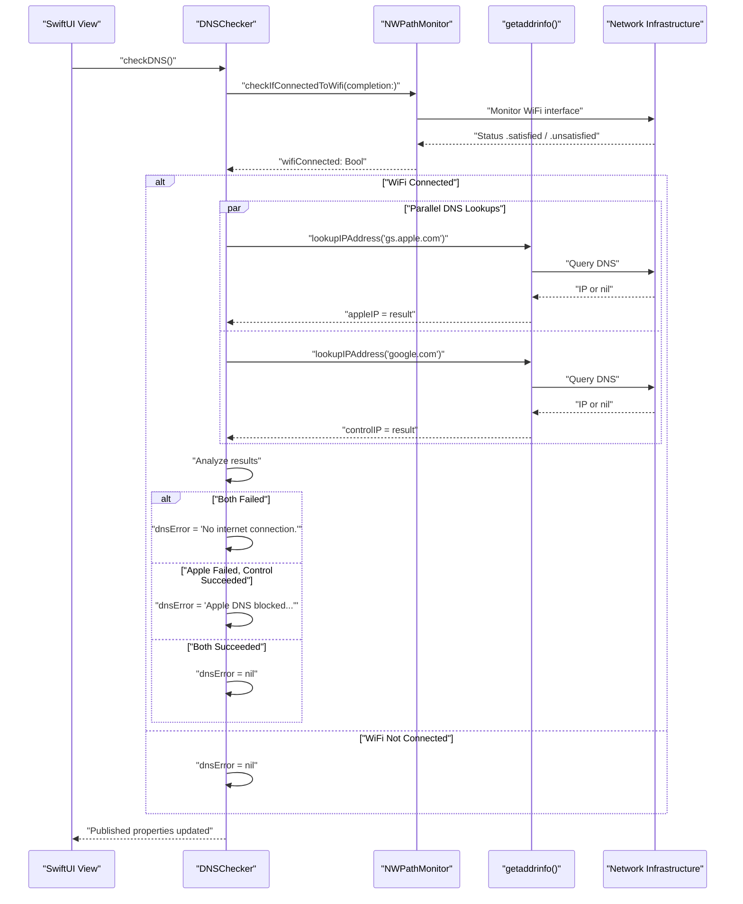
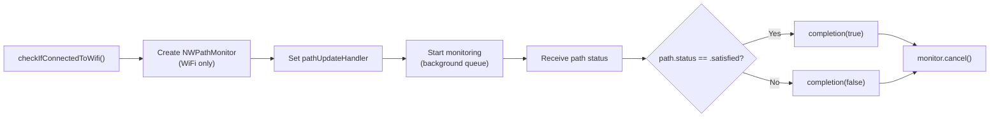
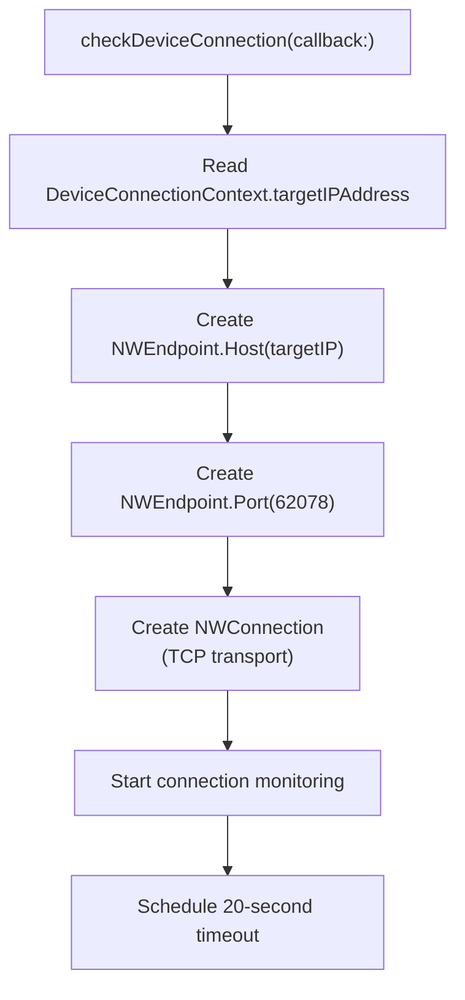
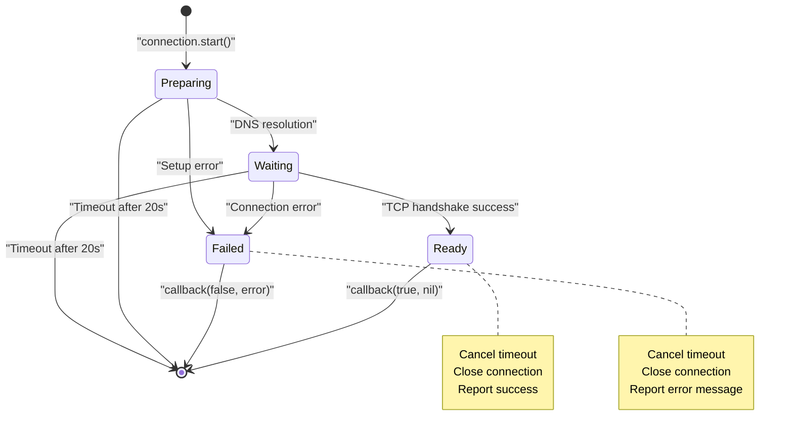
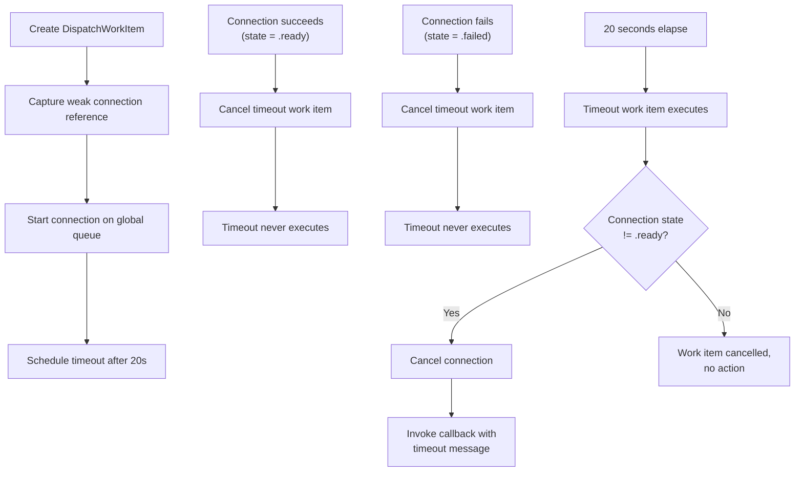
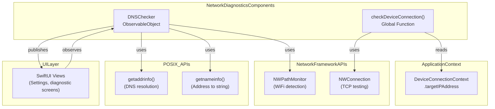

# Network Diagnostics

Relevant source files

The following files were used as context for generating this wiki page:

- [StikJIT/StikJITApp.swift](StikJIT/StikJITApp.swift)
- [StikJIT/Utilities/DeviceConnectionContext.swift](StikJIT/Utilities/DeviceConnectionContext.swift)

## Purpose and Scope

This document describes the network diagnostics subsystem in StikDebug, which validates network connectivity and detects DNS filtering that could interfere with device communication. The system performs two primary functions: DNS resolution testing to detect network-level filtering of Apple services, and TCP connection testing to verify device reachability.

For information about the heartbeat connection that maintains device communication, see [Heartbeat and Connection Management](). For device pairing and authentication, see [Device Authentication and Pairing]().

## Overview

The network diagnostics system provides real-time validation of network conditions required for JIT enablement. It detects common failure modes including WiFi disconnection, DNS-based traffic filtering, and device unreachability. The system operates asynchronously and publishes diagnostic results to SwiftUI views for user feedback.

The diagnostics consist of two independent components:
- **DNSChecker**: Validates DNS resolution for Apple and control domains using POSIX `getaddrinfo`.
- **checkDeviceConnection**: Tests TCP connectivity to the target iOS device (port 62078) with a 20-second timeout.

**Sources:** [StikJIT/StikJITApp.swift:23-116](), [StikJIT/StikJITApp.swift:360-403]()

## DNS Checking System

### DNSChecker Class

The `DNSChecker` class is an `ObservableObject` that performs DNS resolution tests to detect network filtering. It publishes three observable properties that SwiftUI views can bind to for diagnostic feedback.

| Property | Type | Purpose |
|----------|------|---------|
| `appleIP` | `String?` | Resolved IP address for `gs.apple.com` |
| `controlIP` | `String?` | Resolved IP address for `google.com` (control domain) |
| `dnsError` | `String?` | Diagnostic error message describing network issues |

The class uses a differential diagnostic approach: by testing both an Apple domain (`gs.apple.com`) and a non-Apple control domain (`google.com`), it can distinguish between complete internet outage and Apple-specific DNS filtering.

**Sources:** [StikJIT/StikJITApp.swift:25-29]()

### DNS Resolution Flow

**Diagnostic Decision Logic:**

1. **No WiFi**: Error cleared (assumes intentional disconnection). [StikJIT/StikJITApp.swift:61-65]()
2. **Control domain fails**: "No internet connection". [StikJIT/StikJITApp.swift:53-54]()
3. **Apple domain fails, control succeeds**: "Apple DNS blocked. Your network might be filtering Apple traffic." [StikJIT/StikJITApp.swift:55-56]()
4. **Both succeed**: No error. [StikJIT/StikJITApp.swift:57-59]()

**Sources:** [StikJIT/StikJITApp.swift:30-67]()

### WiFi Detection Implementation

The `checkIfConnectedToWifi` method uses Apple's Network framework to query the active network path. It creates an `NWPathMonitor` with `requiredInterfaceType: .wifi` to specifically test for WiFi connectivity.

The monitor is started on a background queue and immediately cancelled after the first path update to avoid resource leaks.

**Sources:** [StikJIT/StikJITApp.swift:69-77]()

### DNS Lookup Implementation

The `lookupIPAddress` method uses POSIX `getaddrinfo()` to resolve hostnames. This low-level API provides direct access to DNS resolution without higher-level URL loading abstractions.

#### DNS Resolution Process

| Step | API Call | Purpose |
|------|----------|---------|
| 1 | Configure `addrinfo` hints | Set `AF_UNSPEC` (IPv4/IPv6), `SOCK_STREAM` [StikJIT/StikJITApp.swift:81-90]() |
| 2 | `getaddrinfo(host, nil, &hints, &res)` | Perform DNS query [StikJIT/StikJITApp.swift:92]() |
| 3 | Check return value | Detect resolution failure [StikJIT/StikJITApp.swift:93-96]() |
| 4 | Iterate `res->ai_next` linked list | Find first valid address [StikJIT/StikJITApp.swift:99-111]() |
| 5 | `getnameinfo()` with `NI_NUMERICHOST` | Convert address to string representation [StikJIT/StikJITApp.swift:103-108]() |
| 6 | `freeaddrinfo(res)` | Release allocated memory [StikJIT/StikJITApp.swift:112]() |

**Sources:** [StikJIT/StikJITApp.swift:79-115]()

## Device Connection Testing

### checkDeviceConnection Function

The `checkDeviceConnection` function validates TCP connectivity to the iOS device's Remote Service Discovery (RSD) service on port 62078. This test confirms that the device is reachable over the network before attempting heartbeat or JIT operations.

#### Connection Test Parameters

| Parameter | Value | Description |
|-----------|-------|-------------|
| Target IP | `DeviceConnectionContext.targetIPAddress` | Device's network address [StikJIT/Utilities/DeviceConnectionContext.swift:11-17]() |
| Port | `62078` | Standard RSD service port [StikJIT/StikJITApp.swift:362]() |
| Protocol | TCP | Connection-oriented transport [StikJIT/StikJITApp.swift:364]() |
| Timeout | 20 seconds | Maximum connection attempt duration [StikJIT/StikJITApp.swift:377]() |

**Sources:** [StikJIT/StikJITApp.swift:360-364](), [StikJIT/Utilities/DeviceConnectionContext.swift:10-18]()

### Connection State Handling

The function uses `NWConnection.stateUpdateHandler` to monitor connection lifecycle events. The state machine handles terminal states to determine success or failure.

#### State Transition Logic

The state handler performs specific actions based on connection state:

1. **`.ready`**: Connection established successfully. [StikJIT/StikJITApp.swift:381-386]()
   - Cancel pending timeout task.
   - Close connection (diagnostic complete).
   - Invoke callback with success (`true`, nil).

2. **`.failed(let error)`**: Connection failed. [StikJIT/StikJITApp.swift:387-392]()
   - Cancel pending timeout task.
   - Close connection.
   - Invoke callback with failure message including `targetIP` and error description.

3. **Timeout (via DispatchWorkItem)**: No response within 20 seconds. [StikJIT/StikJITApp.swift:367-376]()
   - Check if connection is not ready.
   - Cancel connection.
   - Invoke callback with timeout message.

**Sources:** [StikJIT/StikJITApp.swift:365-403]()

### Timeout Mechanism

The timeout is implemented using a `DispatchWorkItem` that captures a weak reference to the connection. This pattern prevents retain cycles while allowing the timeout handler to safely check connection state.

The timeout message format is: `[TIMEOUT] Could not reach the device at {targetIP}. Make sure it's online and on the same network.` [StikJIT/StikJITApp.swift:373-374]()

**Sources:** [StikJIT/StikJITApp.swift:365-377](), [StikJIT/StikJITApp.swift:399-402]()

## Integration with Application

### Usage in Heartbeat Initialization

The `checkDeviceConnection` function is a critical part of the recovery flow. It is typically called before attempting complex device operations to provide early failure detection. If a connection test fails, the application presents a specific error message to the user rather than a generic timeout.

**Sources:** [StikJIT/StikJITApp.swift:127-186](), [StikJIT/StikJITApp.swift:360-403]()

### LocalDevVPN Detection

While the diagnostic system does not explicitly "detect" a VPN by name, the failure of `checkDeviceConnection` to reach the `targetIPAddress` on port 62078 is the primary indicator that the **LocalDevVPN** or network tunnel is not correctly established. The default target IP is set to `10.7.0.1`, which is the standard gateway for the LocalDevVPN tunnel.

**Sources:** [StikJIT/Utilities/DeviceConnectionContext.swift:11-17]()

### Component Relationship Diagram

**Sources:** [StikJIT/StikJITApp.swift:25-116](), [StikJIT/StikJITApp.swift:360-403](), [StikJIT/Utilities/DeviceConnectionContext.swift:10-18]()

## Implementation Details

### Thread Safety and Concurrency

Both diagnostic systems use explicit queue management for thread safety:

- **DNSChecker**: All DNS lookups occur on `DispatchQueue.global(qos: .background)` [StikJIT/StikJITApp.swift:80]() with results dispatched to the main queue for property updates [StikJIT/StikJITApp.swift:113]().
- **checkDeviceConnection**: Connection monitoring runs on a global queue, with the final callback invoked on the main queue to allow UI updates [StikJIT/StikJITApp.swift:399]().

### Memory Management

The `lookupIPAddress` method manages C API memory manually:
- Calls `freeaddrinfo(res)` to release the linked list allocated by `getaddrinfo()` [StikJIT/StikJITApp.swift:112]().
- Copies string data from the `hostBuffer` before the function returns [StikJIT/StikJITApp.swift:106]().

**Sources:** [StikJIT/StikJITApp.swift:80-115](), [StikJIT/StikJITApp.swift:365-403]()