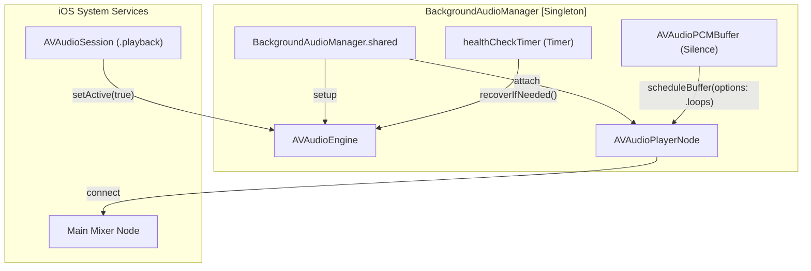
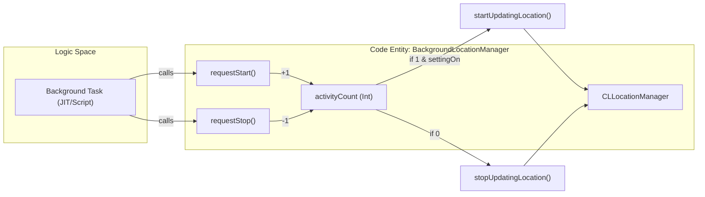

# Background Keep-Alive Services

Relevant source files

The following files were used as context for generating this wiki page:

- [StikJIT/Utilities/BackgroundAudioManager.swift](StikJIT/Utilities/BackgroundAudioManager.swift)
- [StikJIT/Utilities/BackgroundLocationManager.swift](StikJIT/Utilities/BackgroundLocationManager.swift)
- [StikJIT/Utilities/Security.swift](StikJIT/Utilities/Security.swift)

This page documents the background execution strategies used by StikDebug to prevent iOS from suspending the application during critical tasks such as JIT enablement, script execution, and heartbeat maintenance.

---

## Overview

StikDebug implements two independent background keep-alive strategies to maintain app execution when the user switches to another application or locks the device. These services are managed by the `BackgroundAudioManager` and `BackgroundLocationManager` singletons.

| Service | Strategy | Implementation | Persistence Type |
| :--- | :--- | :--- | :--- |
| `BackgroundAudioManager` | Audio Playback | `AVAudioEngine` silent PCM buffer | Continuous / On-demand |
| `BackgroundLocationManager` | Location Updates | `CLLocationManager` updates | Reference-counted |

**Sources:** [StikJIT/Utilities/BackgroundAudioManager.swift:8-15](), [StikJIT/Utilities/BackgroundLocationManager.swift:8-13]()

---

## Background Audio Manager

The `BackgroundAudioManager` prevents suspension by playing an inaudible audio stream. It uses the `AVAudioEngine` framework to generate a zero-initialized PCM buffer, representing pure silence, which satisfies the iOS "audio" background mode requirement.

### Implementation and Audio Pipeline

The manager initializes an `AVAudioSession` with the `.playback` category and `.mixWithOthers` option [StikJIT/Utilities/BackgroundAudioManager.swift:83](). This ensures that StikDebug's keep-alive silence does not interrupt music or other media playing on the device.

**Audio Keep-Alive Architecture**

**Sources:** [StikJIT/Utilities/BackgroundAudioManager.swift:75-96](), [StikJIT/Utilities/BackgroundAudioManager.swift:109-115]()

### Resilience and Interruption Handling

The manager includes several mechanisms to reclaim the audio session if it is lost to other apps or system events:

1.  **Health Check Timer**: A `Timer` runs every 2 seconds via `startHealthCheck()` [StikJIT/Utilities/BackgroundAudioManager.swift:109-115](). It calls `recoverIfNeeded()`, which checks if the engine or player has stopped and attempts to restart them [StikJIT/Utilities/BackgroundAudioManager.swift:117-128]().
2.  **Interruption Handling**: The class observes `AVAudioSession.interruptionNotification`. When an interruption ends (e.g., a phone call finishes), `handleInterruption` attempts to resume the engine [StikJIT/Utilities/BackgroundAudioManager.swift:130-140]().
3.  **Media Services Reset**: If the system audio daemon (`mediaserverd`) crashes, the manager receives `mediaServicesWereResetNotification`, triggers a full re-initialization of the `AVAudioEngine` and `AVAudioPlayerNode` [StikJIT/Utilities/BackgroundAudioManager.swift:142-147]().

**Sources:** [StikJIT/Utilities/BackgroundAudioManager.swift:109-147]()

---

## Background Location Manager

The `BackgroundLocationManager` uses Core Location to maintain background execution privileges. Unlike the audio manager, it is designed to be active only when specific tasks are running, using a reference-counting mechanism.

### Reference Counting and Lifecycle

The manager tracks the number of active background tasks using an `activityCount` integer [StikJIT/Utilities/BackgroundLocationManager.swift:13]().

*   **`requestStart()`**: Increments `activityCount`. If the count is 1 and the `keepAliveLocation` setting is enabled, it calls `start()` [StikJIT/Utilities/BackgroundLocationManager.swift:43-48]().
*   **`requestStop()`**: Decrements `activityCount`. When it reaches 0, it calls `stop()` to terminate location updates and save battery [StikJIT/Utilities/BackgroundLocationManager.swift:50-55]().

### Configuration and Power Efficiency

The manager is configured to minimize battery impact while still satisfying the requirements for background execution:
*   **Accuracy**: Set to `kCLLocationAccuracyThreeKilometers` to avoid high-power GPS usage [StikJIT/Utilities/BackgroundLocationManager.swift:18]().
*   **Distance Filter**: Set to `CLLocationDistanceMax` so that updates are not triggered by movement [StikJIT/Utilities/BackgroundLocationManager.swift:19]().
*   **Background Settings**: `allowsBackgroundLocationUpdates` is set to `true`, and `pausesLocationUpdatesAutomatically` is set to `false` [StikJIT/Utilities/BackgroundLocationManager.swift:20-21]().

**Location Activity Flow**

**Sources:** [StikJIT/Utilities/BackgroundLocationManager.swift:11-55]()

---

## Settings and Integration

The behavior of these services is governed by user preferences stored in `UserDefaults`.

### Configuration Keys
The application registers default values for these services during the initialization sequence.

| Key | Default | Description |
| :--- | :--- | :--- |
| `keepAliveAudio` | `true` | If enabled, `BackgroundAudioManager` starts on app launch and runs continuously [StikJIT/Utilities/BackgroundAudioManager.swift:54](). |
| `keepAliveLocation` | `true` | If enabled, `BackgroundLocationManager` will start location updates when `activityCount > 0` [StikJIT/Utilities/BackgroundLocationManager.swift:45](). |

### Security and Entitlements
The `checkAppEntitlement` function in `Security.swift` provides a utility to verify if the application possesses specific entitlements (like those required for background modes) using `SecTaskCopyValueForEntitlement` [StikJIT/Utilities/Security.swift:12-28](). It uses `SecTaskCreateFromSelf` to inspect the running process's own entitlements [StikJIT/Utilities/Security.swift:19-23]().

**Sources:** [StikJIT/Utilities/BackgroundAudioManager.swift:54](), [StikJIT/Utilities/BackgroundLocationManager.swift:45](), [StikJIT/Utilities/Security.swift:12-28]()