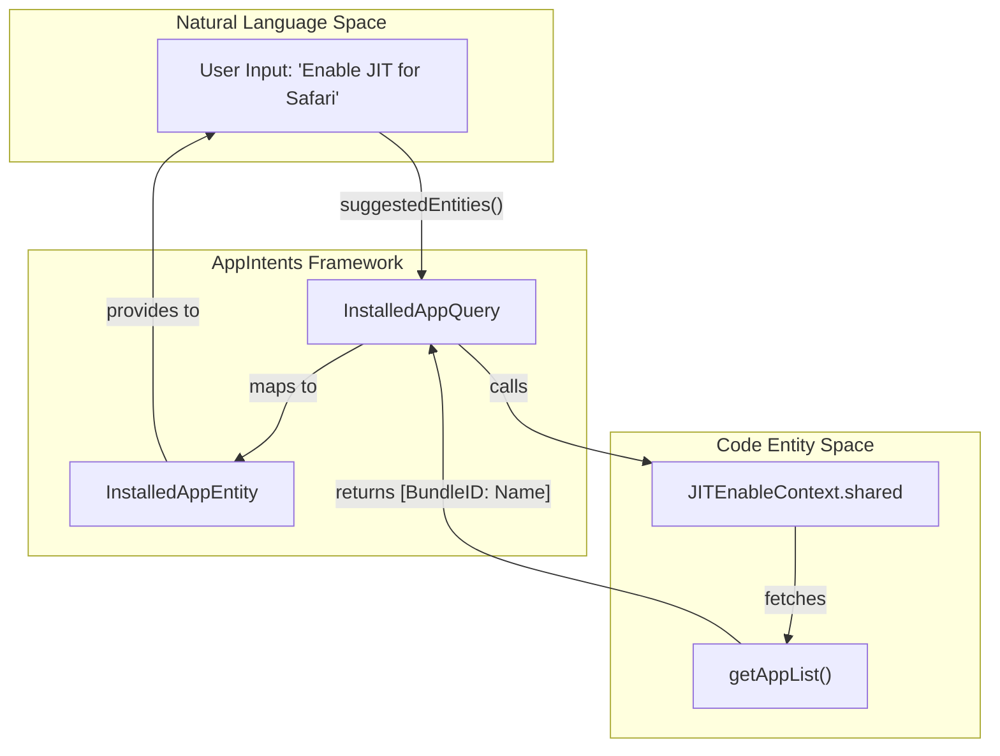
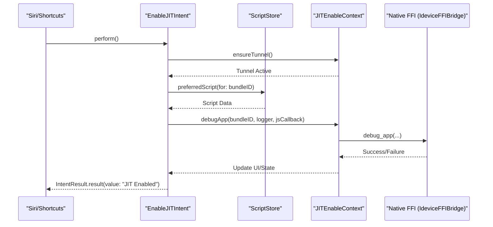

# App Intents and Shortcuts Integration

Relevant source files

The following files were used as context for generating this wiki page:

- [StikJIT/Utilities/DeviceInfoManager.swift](StikJIT/Utilities/DeviceInfoManager.swift)
- [StikJIT/Utilities/Intents.swift](StikJIT/Utilities/Intents.swift)

This section documents the integration of the `AppIntents` framework within StikDebug. These integrations allow users to automate JIT enablement and process management through the Siri and Shortcuts environments on iOS 17.4+.

## Overview

StikDebug exposes internal device management capabilities to the system via the `AppIntents` framework. This enables programmatic control over JIT activation and process termination without requiring manual interaction with the SwiftUI interface. The integration relies on the `JITEnableContext` singleton to bridge high-level intent requests to low-level native services.

### Key Components
*   **Entities**: Represent system objects (Apps, Processes) that can be passed as parameters in Shortcuts.
*   **Queries**: Handle the discovery, filtering, and resolution of entities.
*   **Intents**: Define the specific actions (Enable JIT, Kill Process) available to the user.

---

## Data Entities and Queries

The system defines two primary entities to represent the state of the connected device. These entities use stable identifiers to ensure Shortcuts remain functional even when transient properties (like PIDs) change.

### Installed App Entity
The `InstalledAppEntity` represents an application installed on the target device. It is identified by its Bundle ID [StikJIT/Utilities/Intents.swift:6-19]().

| Property | Type | Description |
| :--- | :--- | :--- |
| `id` | `String` | The unique Bundle Identifier of the application. |
| `displayName` | `String` | The user-visible name of the application. |

The `InstalledAppQuery` resolves these entities by calling `JITEnableContext.shared.getAppList()` [StikJIT/Utilities/Intents.swift:21-28](). It ensures a tunnel is active before fetching to provide an up-to-date list [StikJIT/Utilities/Intents.swift:40-45]().

### Running Process Entity
The `RunningProcessEntity` represents a live process on the device. Because PIDs change every time an app restarts, this entity uses the Bundle ID (or process name as a fallback) as its stable `id` [StikJIT/Utilities/Intents.swift:50-61]().

The entity includes a `resolveCurrentPID()` method which re-scans the device's process list via `ProcessInfoEntry.currentEntries` to find the current PID associated with the stable identifier before performing actions [StikJIT/Utilities/Intents.swift:74-87]().

### Entity Resolution Flow
The following diagram illustrates how Natural Language queries in Siri/Shortcuts are mapped to code entities via the Query classes.

**Intent Entity Resolution Architecture**

Sources: [StikJIT/Utilities/Intents.swift:6-46](), [StikJIT/Utilities/Intents.swift:50-130]()

---

## Programmatic Actions (Intents)

### Enable JIT Intent
The `EnableJITIntent` automates the primary function of the application. It is defined as a `ForegroundContinuableIntent`, meaning it can transition the app to the foreground if necessary [StikJIT/Utilities/Intents.swift:134-141]().

**Implementation Logic**:
1.  **Validation**: Checks if a valid `bundleID` is provided via the `app` parameter [StikJIT/Utilities/Intents.swift:151-153]().
2.  **Tunneling**: Invokes `ensureTunnel()` to verify the connection to the device [StikJIT/Utilities/Intents.swift:155]().
3.  **Script Resolution**: Uses `ScriptStore.preferredScript(for:)` to find the appropriate JIT script for the target Bundle ID [StikJIT/Utilities/Intents.swift:159-162]().
4.  **TXM Handling**: If the device has TXM (Task Execution Management) enabled, it prepares a `DebugAppCallback` to inject JavaScript via `RunJSViewModel` [StikJIT/Utilities/Intents.swift:165-187]().
5.  **Execution**: Calls `JITEnableContext.shared.debugApp(...)` to perform the actual enablement [StikJIT/Utilities/Intents.swift:194]().

### Kill Process Intent
The `KillProcessIntent` allows users to terminate processes programmatically. It utilizes the `RunningProcessEntity` to find the target [StikJIT/Utilities/Intents.swift:218-226]().

**Execution Flow**:
1.  Resolves the current PID using `process.resolveCurrentPID()` [StikJIT/Utilities/Intents.swift:231]().
2.  Invokes `JITEnableContext.shared.killProcess(withPid:)` [StikJIT/Utilities/Intents.swift:236]().

---

## System Integration and Data Flow

The following diagram maps the flow from a Shortcut action to the native device communication layer.

**Shortcuts to Native Bridge Data Flow**

Sources: [StikJIT/Utilities/Intents.swift:150-205](), [StikJIT/Utilities/Intents.swift:229-240]()

## Helper Utilities

### Script Resolution
The `ScriptStore` is used within intents to bridge the `AppIntents` domain with the user's saved script configurations. It retrieves the script associated with a specific app to ensure that Shortcut-based JIT activation uses the same logic as the manual UI-based activation [StikJIT/Utilities/Intents.swift:159]().

### Connection Persistence
Because App Intents may run while the app is in various lifecycle states, `ensureTunnel()` is called at the start of every intent. This function, accessible via `JITEnableContext.shared`, verifies the heartbeat and RSD (Remote Service Discovery) handshake are valid before attempting any device operations [StikJIT/Utilities/Intents.swift:41](), [StikJIT/Utilities/DeviceInfoManager.swift:34]().

### Device Info Integration
While primarily a UI tool, the `DeviceInfoManager` also utilizes `JITEnableContext.shared.ensureTunnel()` during its initialization [StikJIT/Utilities/DeviceInfoManager.swift:34](). This ensures that the underlying communication stack is ready before attempting to fetch device XML data via `ideviceInfoGetXML` [StikJIT/Utilities/DeviceInfoManager.swift:66]().

Sources: [StikJIT/Utilities/Intents.swift:1-240](), [StikJIT/Utilities/DeviceInfoManager.swift:20-58](), [StikJIT/Utilities/DeviceInfoManager.swift:60-73]()