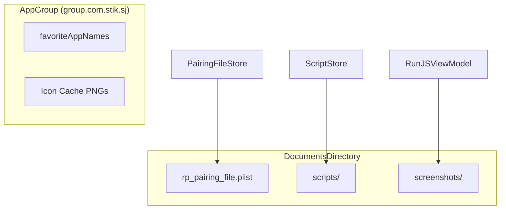

# Project Configuration

Relevant source files

The following files were used as context for generating this wiki page:

- [StikDebug.xcodeproj/project.pbxproj](StikDebug.xcodeproj/project.pbxproj)
- [StikDebug.xcodeproj/project.xcworkspace/xcshareddata/swiftpm/Package.resolved](StikDebug.xcodeproj/project.xcworkspace/xcshareddata/swiftpm/Package.resolved)
- [StikDebug.xcodeproj/xcshareddata/xcschemes/DebugWidgetExtension.xcscheme](StikDebug.xcodeproj/xcshareddata/xcschemes/DebugWidgetExtension.xcscheme)
- [StikDebug.xcodeproj/xcshareddata/xcschemes/StikDebug.xcscheme](StikDebug.xcodeproj/xcshareddata/xcschemes/StikDebug.xcscheme)
- [StikJIT/Info.plist](StikJIT/Info.plist)
- [StikJIT/JSSupport/RunJSView.swift](StikJIT/JSSupport/RunJSView.swift)
- [StikJIT/Utilities/Extensions.swift](StikJIT/Utilities/Extensions.swift)

This document describes the Xcode project structure, build settings, entitlements, and application property list configuration for StikDebug. It covers the technical aspects of how the project is configured to build and run, including compiler settings, code signing, platform support, and required capabilities.

For information about Swift Package dependencies integrated into the project, see [6.2 Swift Package Dependencies](). For details about the CI/CD build pipeline and automation, see [6.3 CI/CD Pipeline]().

---

## Project Structure and Targets

The StikDebug project uses Xcode's modern project format (`objectVersion = 77`) with file system synchronized groups, which automatically manages file membership without explicit `PBXFileReference` entries for most source files. The project defines three primary native targets and a widget extension.

### Target Hierarchy

**Project to Target Mapping**
| Entity | PBX Identifier | Role |
| :--- | :--- | :--- |
| **Project** | `DC6F1D2F2D94EADD0071B2B6` | Root project container [StikDebug.xcodeproj/project.pbxproj:17]() |
| **StikDebug** | `DC6F1D362D94EADD0071B2B6` | Main application target [StikDebug.xcodeproj/project.pbxproj:143]() |
| **StikDebugTests** | `DC6F1D472D94EADF0071B2B6` | Unit test bundle [StikDebug.xcodeproj/project.pbxproj:168]() |
| **StikDebugUITests** | `DC6F1D512D94EADF0071B2B6` | UI test bundle [StikDebug.xcodeproj/project.pbxproj:191]() |
| **DebugWidgetExtension** | `DC139F6B2DE97EA400F63846` | Home screen widget [StikDebug.xcodeproj/xcshareddata/xcschemes/DebugWidgetExtension.xcscheme:18]() |

**Sources:** [StikDebug.xcodeproj/project.pbxproj:14-28](), [StikDebug.xcodeproj/project.pbxproj:143-200](), [StikDebug.xcodeproj/xcshareddata/xcschemes/StikDebug.xcscheme:1-102]()

### File System Synchronized Groups

The project uses `PBXFileSystemSynchronizedRootGroup` for automatic file membership management, eliminating the need for manual file references. The main application source group at `StikJIT/` has one exception defined to prevent `Info.plist` from being included in the compiled sources.

| Group Path | Exception | Purpose |
| :--- | :--- | :--- |
| `StikJIT/` | `Info.plist` | Application source code [StikDebug.xcodeproj/project.pbxproj:63-70]() |
| `StikJITTests/` | None | Unit test source files [StikDebug.xcodeproj/project.pbxproj:71-75]() |
| `StikJITUITests/` | None | UI test source files [StikDebug.xcodeproj/project.pbxproj:76-80]() |

**Sources:** [StikDebug.xcodeproj/project.pbxproj:53-81]()

---

## Build Configurations

The project defines standard build configurations with distinct optimization and debugging settings. Both configurations share common compiler warnings and language standards.

### Configuration Comparison

| Setting | Debug Configuration | Release Configuration |
| :--- | :--- | :--- |
| **Optimization Level** | `GCC_OPTIMIZATION_LEVEL = 0` | Whole Module Optimization |
| **Swift Optimization** | `-Onone` | `wholemodule` |
| **Debug Information** | `dwarf` | `dwarf-with-dsym` |
| **Testability** | `ENABLE_TESTABILITY = YES` | No |
| **Active Arch Only** | `ONLY_ACTIVE_ARCH = YES` | No |

**Sources:** [StikDebug.xcodeproj/project.pbxproj:326-439]()

### Compiler and Language Settings

The project enforces modern language standards for its Swift and native components.

**Language Standards**
- **Swift:** `SWIFT_VERSION = 5.0` [StikDebug.xcodeproj/project.pbxproj:379]()
- **C:** `GCC_C_LANGUAGE_STANDARD = gnu17` [StikDebug.xcodeproj/project.pbxproj:365]()
- **C++:** `CLANG_CXX_LANGUAGE_STANDARD = gnu++20` [StikDebug.xcodeproj/project.pbxproj:338]()

**Sources:** [StikDebug.xcodeproj/project.pbxproj:329-384]()

---

## Main Application Target Settings

The StikDebug application target contains configuration for product identity, search paths, and native integration.

### Product Identity and Versioning

- **Bundle ID:** `com.stik.stikdebug` [StikDebug.xcodeproj/project.pbxproj:473]()
- **Marketing Version:** `3.0.1` [StikDebug.xcodeproj/project.pbxproj:461]()
- **Project Version:** `1` [StikDebug.xcodeproj/project.pbxproj:453]()

### Search Paths and Linking

The build system requires specific search paths to locate the `idevice` xcframework and its headers, which provide the low-level communication layer.

| Setting | Value |
| :--- | :--- |
| `LIBRARY_SEARCH_PATHS` | `$(PROJECT_DIR)/StikJIT/idevice` [StikDebug.xcodeproj/project.pbxproj:455]() |
| `HEADER_SEARCH_PATHS` | `$(PROJECT_DIR)/StikJIT/idevice` [StikDebug.xcodeproj/project.pbxproj:454]() |
| `SWIFT_INCLUDE_PATHS` | `$(PROJECT_DIR)/StikJIT/idevice` [StikDebug.xcodeproj/project.pbxproj:477]() |
| `FRAMEWORK_SEARCH_PATHS` | `$(PROJECT_DIR)/StikJIT/Sources` [StikDebug.xcodeproj/project.pbxproj:456]() |

**Sources:** [StikDebug.xcodeproj/project.pbxproj:454-482]()

---

## Info.plist Configuration

The application property list at [StikJIT/Info.plist]() defines URL schemes, background modes, and exported types.

### URL Scheme Registration

The `stikjit` scheme allows external automation (like Shortcuts) to trigger JIT enablement.

| Key | Value |
| :--- | :--- |
| `CFBundleURLName` | `com.stik.StikJIT.enableJIT` [StikJIT/Info.plist:11]() |
| `CFBundleURLSchemes` | `stikjit` [StikJIT/Info.plist:14]() |

### Background Modes and Connectivity

The app declares background modes to maintain device heartbeats and connectivity.

- **Background Modes:** `audio`, `location`, `fetch` [StikJIT/Info.plist:23-28]()
- **Bonjour Services:** `_stikdebug._tcp`, `_stikdebug._udp` [StikJIT/Info.plist:18-22]()
- **File Sharing:** `UIFileSharingEnabled = true` [StikJIT/Info.plist:29-30]()

### Custom File Types

A custom UTI is declared for `.stiktool` files, which represent bundled mini-tools.
- **Identifier:** `com.stik.StikJIT.stiktool` [StikJIT/Info.plist:43]()
- **Conforms To:** `com.apple.package` [StikJIT/Info.plist:36]()

**Sources:** [StikJIT/Info.plist:1-54]()

---

## Framework and Library Dependencies

### Swift Package Integration

The project integrates external editor components via SPM.

| Package Identity | Version | Role |
| :--- | :--- | :--- |
| `codeeditorview` | `0.15.4` | Script editor UI [StikDebug.xcodeproj/project.xcworkspace/xcshareddata/swiftpm/Package.resolved:10]() |
| `rearrange` | `1.8.1` | Text range management [StikDebug.xcodeproj/project.xcworkspace/xcshareddata/swiftpm/Package.resolved:19]() |

**Sources:** [StikDebug.xcodeproj/project.xcworkspace/xcshareddata/swiftpm/Package.resolved:3-22]()

### Localization Support

StikDebug supports three locales: English (`en`), Spanish (`es`), and Italian (`it`). It utilizes modern String Catalogs (`LOCALIZATION_PREFERS_STRING_CATALOGS = YES`).

**Sources:** [StikDebug.xcodeproj/project.pbxproj:378](), [StikDebug.xcodeproj/project.pbxproj:239-246]()

---

## Data Persistence and Storage

The project defines specific locations and naming conventions for persistent data.

### Storage Locations

| Entity | Path/Key | Purpose |
| :--- | :--- | :--- |
| **Pairing File** | `rp_pairing_file.plist` | Target device pairing data [StikJIT/Utilities/Extensions.swift:12]() |
| **Scripts** | `scripts/` | User and bundled JS scripts [StikJIT/Utilities/Extensions.swift:92]() |
| **App Group** | `group.com.stik.sj` | Shared data between app and widget [StikJIT/Utilities/Extensions.swift:94]() |

**Sources:** [StikJIT/Utilities/Extensions.swift:11-22](), [StikJIT/Utilities/Extensions.swift:91-108](), [StikJIT/JSSupport/RunJSView.swift:148-150]()