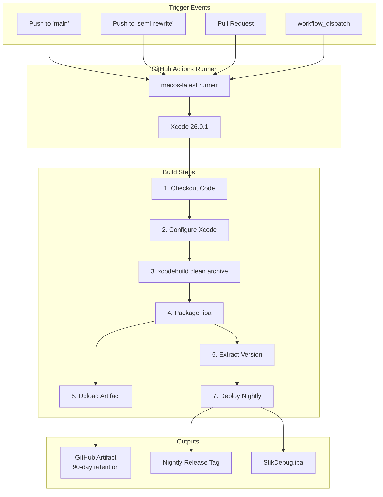
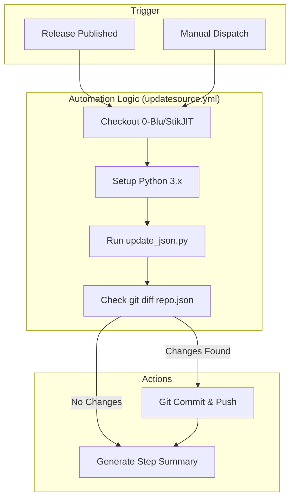
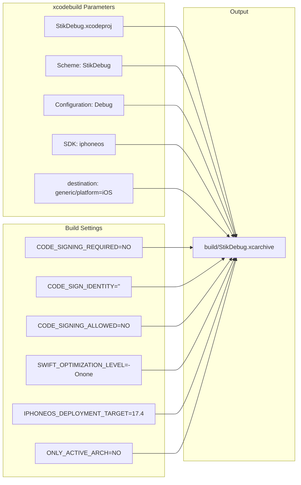

# CI/CD Pipeline

Relevant source files

The following files were used as context for generating this wiki page:

- [.github/ISSUE_TEMPLATE/bug_report.yml](.github/ISSUE_TEMPLATE/bug_report.yml)
- [.github/ISSUE_TEMPLATE/feature_request.yml](.github/ISSUE_TEMPLATE/feature_request.yml)
- [.github/pull_request_template.md](.github/pull_request_template.md)
- [.github/workflows/build_ipa.yml](.github/workflows/build_ipa.yml)
- [.github/workflows/updatesource.yml](.github/workflows/updatesource.yml)
- [.gitignore](.gitignore)

## Purpose and Scope

This document describes the GitHub Actions-based continuous integration and deployment pipeline that automates building, packaging, and distributing StikDebug. The pipeline compiles unsigned debug IPAs, stores them as artifacts, and publishes nightly releases for the main branch. Additionally, it automates the synchronization of release metadata with the application's distribution source. For project configuration details, see [Project Configuration](6.1). For distribution mechanisms and update workflows, see [Distribution and Updates](6.4).

---

## Pipeline Architecture

The CI/CD system consists of two primary workflows: `build_ipa.yml`, which handles compilation and packaging, and `updatesource.yml`, which automates the update of the `repo.json` file upon release publication.

### Build and Release Workflow (`build_ipa.yml`)

The build workflow executes on GitHub-hosted macOS runners and produces installable IPA files without code signing.

**Build and Release Flow Diagram**

**Sources:** [.github/workflows/build_ipa.yml:1-81]()

### Source Update Workflow (`updatesource.yml`)

The update workflow automates the maintenance of the `repo.json` file, ensuring that AltStore/SideStore sources are synchronized with the latest GitHub releases.

**Source Synchronization Flow Diagram**

**Sources:** [.github/workflows/updatesource.yml:1-105]()

---

## Workflow Configuration

### Trigger Conditions

| Workflow | Trigger Type | Branches / Types |
|----------|--------------|------------------|
| `build_ipa.yml` | `push`, `pull_request` | `main`, `semi-rewrite` [[.github/workflows/build_ipa.yml:4-7]()] |
| `build_ipa.yml` | `workflow_dispatch` | Manual [[.github/workflows/build_ipa.yml:8]()] |
| `updatesource.yml` | `release` | `published` [[.github/workflows/updatesource.yml:4-5]()] |
| `updatesource.yml` | `workflow_dispatch` | Manual [[.github/workflows/updatesource.yml:6]()] |

### Permissions

Both workflows require `contents: write` permissions. For `build_ipa.yml`, this allows creating the Nightly release [[.github/workflows/build_ipa.yml:10-11]()]. For `updatesource.yml`, this allows pushing updates to the `repo.json` file in the `0-Blu/StikJIT` repository [[.github/workflows/updatesource.yml:9-10]()].

---

## Build Process (`build_ipa.yml`)

### Xcode Environment Configuration

The workflow configures the runner with Xcode 26.0.1 using `maxim-lobanov/setup-xcode@v1` [[.github/workflows/build_ipa.yml:24-27]()].

### Project Compilation

Executes `xcodebuild clean archive` with specific configuration flags to produce an unsigned debug build.

**Compilation Parameters and Flags**

Key build settings [[.github/workflows/build_ipa.yml:31-43]()]:
- **CODE_SIGNING_ALLOWED=NO**: Explicitly prevents the build system from attempting to sign the binary.
- **IPHONEOS_DEPLOYMENT_TARGET=17.4**: Ensures compatibility with the minimum supported iOS version for the current JIT method.
- **SWIFT_OPTIMIZATION_LEVEL="-Onone"**: Optimization is disabled to decrease build times for CI.

### IPA Packaging

The workflow manually packages the `.app` bundle into an `.ipa` by performing the following operations [[.github/workflows/build_ipa.yml:45-51]()]:
1. Copy the `.app` from the archive: `cp -R build/StikDebug.xcarchive/Products/Applications/StikDebug.app .`
2. Create the standard structure: `mkdir -p Payload`
3. Move the bundle: `cp -R StikDebug.app Payload/`
4. Compress the structure: `zip -r StikDebug.ipa Payload`

---

## Source Automation (`updatesource.yml`)

This workflow manages the metadata for distribution platforms by interacting with the `repo.json` file.

### Execution Logic

1.  **Checkout**: Clones the `0-Blu/StikJIT` repository (where the distribution JSON resides) using a `GITHUB_TOKEN` [[.github/workflows/updatesource.yml:16-21]()].
2.  **Environment**: Sets up Python 3.x and installs `requests` [[.github/workflows/updatesource.yml:23-31]()].
3.  **Update Script**: Executes `python update_json.py` [[.github/workflows/updatesource.yml:55]()]. This script is responsible for fetching the latest release data and updating `repo.json`.
4.  **Synchronization**: If changes are detected in `repo.json` via `git diff`, the workflow commits and pushes the changes back to the `main` branch [[.github/workflows/updatesource.yml:58-69]()].

### Job Summary

The workflow generates a GitHub Step Summary using `$GITHUB_STEP_SUMMARY` to report whether changes were pushed or if the repository was already up to date [[.github/workflows/updatesource.yml:79-105]()].

---

## Artifact and Release Management

### Artifact Retention

The `build_ipa.yml` workflow uploads the resulting IPA with a **90-day retention period** using `actions/upload-artifact@v4` [[.github/workflows/build_ipa.yml:53-59]()].

### Nightly Releases

When a push occurs on the `main` branch, the workflow extracts the `MARKETING_VERSION` from the project file [[.github/workflows/build_ipa.yml:61-65]()] and updates a release tagged `Nightly` [[.github/workflows/build_ipa.yml:67-79]()].

**Nightly Release Conditions:**
- `UPLOAD_IPA` environment variable must be `true` [[.github/workflows/build_ipa.yml:68]()].
- Trigger must be a `push` or `workflow_dispatch` [[.github/workflows/build_ipa.yml:68]()].
- Branch must be `refs/heads/main` [[.github/workflows/build_ipa.yml:68]()].

---

## Issue and Pull Request Templates

The repository includes structured templates to maintain code quality and bug reporting standards:

-   **Bug Report (`bug_report.yml`)**: A form-based template requiring `ios-version`, `device`, and `app-version` [[.github/ISSUE_TEMPLATE/bug_report.yml:1-67]()].
-   **Feature Request (`feature_request.yml`)**: Captures the description, use case, and alternatives considered [[.github/ISSUE_TEMPLATE/feature_request.yml:1-28]()].
-   **Pull Request Template**: Provides a checklist for developers to ensure they have tested on-device and with fresh pairing files [[.github/pull_request_template.md:1-22]()].

**Sources:**
- [.github/workflows/build_ipa.yml:1-81]()
- [.github/workflows/updatesource.yml:1-105]()
- [.github/ISSUE_TEMPLATE/bug_report.yml:1-67]()
- [.github/ISSUE_TEMPLATE/feature_request.yml:1-28]()
- [.github/pull_request_template.md:1-22]()