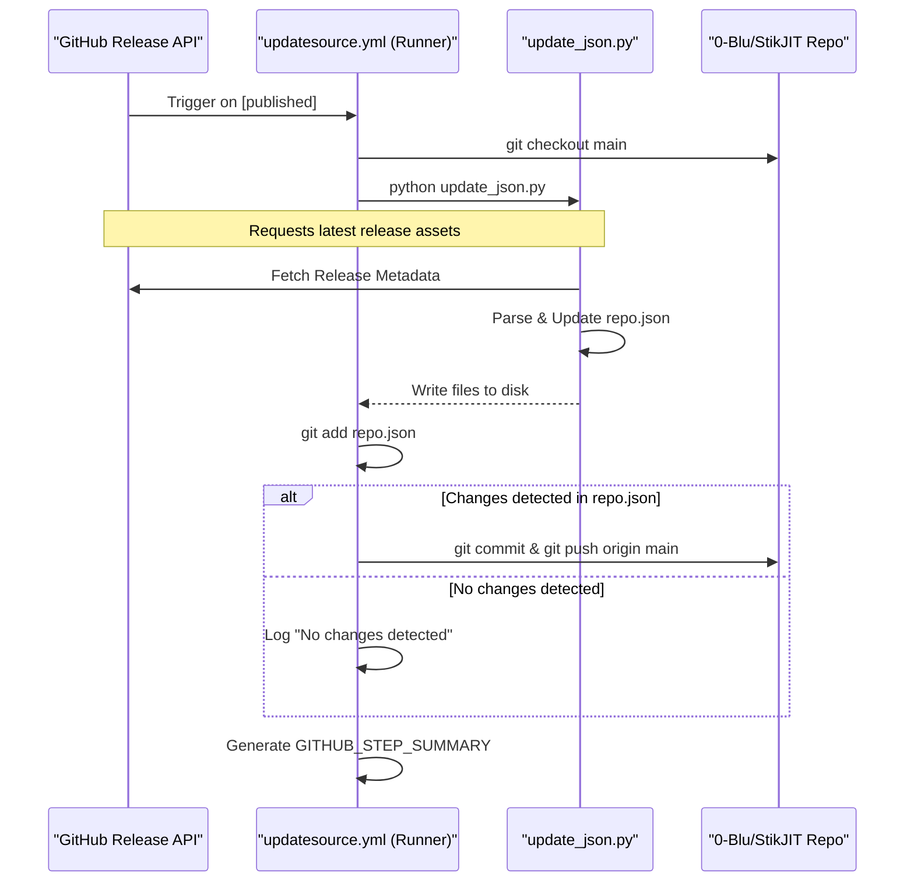

# Distribution and Updates

<details>
<summary>Relevant source files</summary>

The following files were used as context for generating this wiki page:

- [.github/workflows/updatesource.yml](.github/workflows/updatesource.yml)
- [.gitignore](.gitignore)

</details>


## Purpose and Scope

This document explains how StikDebug/StikJIT is distributed to end users and how updates are automated through CI/CD workflows. It covers the GitHub Actions-based build pipeline, the Nightly rolling release system, AltSource repository integration, and the automatic update mechanism via `repo.json` and `update_json.py`. This system ensures that users of sideloading tools like AltStore and SideStore receive update notifications automatically when new releases are published.

---

## Distribution Channels

StikDebug is distributed through three primary channels:

| Channel | Access Method | Update Mechanism | Signing |
|---------|---------------|------------------|---------|
| **GitHub Releases** | Direct download from repository releases page | Manual check and download | Unsigned |
| **AltSource** | Via AltStore/SideStore at `stikdebug.xyz` | Automatic through AltStore refresh | Unsigned |
| **Direct IPA** | Download link from Nightly release | Manual download | Unsigned |

All distribution channels provide the same unsigned Debug build generated by the CI/CD pipeline. Users must sideload the IPA using tools like AltStore, SideStore, or other signing services.

**Sources:** [.github/workflows/updatesource.yml:1-105]()

---

## Automated Update Source Pipeline

### AltSource Update Architecture

The `updatesource.yml` workflow maintains an AltSource-compatible repository that provides automatic update notifications to users of AltStore and SideStore.

Title: Distribution Metadata Sync Flow
```mermaid
graph TB
    subgraph "External_Trigger"
        [ReleaseEvent] -- "types: [published]" --> [UpdateJob]
    end

    subgraph "UpdateJob [updatesource.yml]"
        [Checkout] -- "repository: 0-Blu/StikJIT" --> [SetupPy]
        [SetupPy] -- "python-version: 3.x" --> [RunScript]
        [RunScript] -- "python update_json.py" --> [CheckChanges]
        [CheckChanges] -- "git diff --staged" --> [Push]
    end

    subgraph "Data_Entities"
        [RepoJSON] -- "AltSource Metadata" --> [repo.json]
        [StikJITJSON] -- "App Record" --> [StikJIT.json]
    end

    [RunScript] -- "Updates" --> [RepoJSON]
    [RunScript] -- "Syncs" --> [StikJITJSON]
    [Push] -- "origin main" --> [GitRepo]
```

**Sources:** [.github/workflows/updatesource.yml:3-21](), [.github/workflows/updatesource.yml:45-69]()

### Workflow Trigger and Environment

The workflow is designed to keep the distribution metadata in sync with actual releases. It triggers on two events:
- **Release Publication**: When a new release is published in the main repository `[.github/workflows/updatesource.yml:4-5]()`.
- **Workflow Dispatch**: Allows manual synchronization if a release failed to trigger the update `[.github/workflows/updatesource.yml:6]()`.

The workflow requires explicit write permissions to push the updated `repo.json` back to the distribution repository:
```yaml
permissions:
  contents: write
```
**Sources:** [.github/workflows/updatesource.yml:9-10]()

### Repository Synchronization

Notably, this workflow targets a dedicated distribution repository rather than the source code repository to separate code from distribution metadata:
- **Target Repository**: `0-Blu/StikJIT` `[.github/workflows/updatesource.yml:20]()`
- **Target Branch**: `main` `[.github/workflows/updatesource.yml:21]()`

The update process is handled by a Python environment:
1. **Setup**: Installs `requests` to query GitHub APIs and handle JSON parsing `[.github/workflows/updatesource.yml:31]()`.
2. **Execution**: Runs `update_json.py` which is responsible for parsing the latest release metadata and updating the `repo.json` structure `[.github/workflows/updatesource.yml:55]()`.
3. **Commit Logic**: Uses `git diff --staged --quiet` to determine if the JSON was actually modified before attempting a push to avoid empty commits `[.github/workflows/updatesource.yml:59-69]()`.

---

## Distribution Metadata Formats

### AltSource `repo.json`

The `repo.json` file serves as the primary index for AltStore/SideStore. It follows the AltSource specification, containing:
- **Name/Identifier**: The name of the source (StikJIT).
- **Apps Array**: A list of app objects, including StikDebug.
- **Version Tracking**: The `version` and `versionDate` fields used by clients to detect updates.

### StikJIT.json App Record

A specific `StikJIT.json` file is maintained to store the detailed app record. This format typically includes:
- **Bundle Identifier**: `com.stik.sj`
- **Download URL**: Link to the latest `.ipa` asset from GitHub Releases.
- **Size**: File size in bytes.
- **Changelog**: Markdown or text description of changes extracted from the release body.

---

## Release Tags and Rolling Releases

### Nightly Rolling Release

The system supports a "Nightly" rolling release tag. This allows users to stay on the absolute bleeding edge without waiting for a formal versioned release.
- **Tag**: `Nightly`
- **Behavior**: The `update_json.py` script identifies the asset associated with this tag and updates the `repo.json` to point to the latest build artifact.

### Classic Source

In addition to the standard `repo.json`, the project supports a `classic.json` alternative source. This is often used for compatibility with older versions of sideloading tools or to provide a "stable-only" feed that excludes Nightly builds.

---

## Deployment Diagnostics

The `updatesource.yml` workflow includes a detailed summary generation step using `$GITHUB_STEP_SUMMARY` to provide feedback in the GitHub Actions UI:

| Status | Logic | Summary Output |
| :--- | :--- | :--- |
| **Success** | `steps.update_source.outputs.changes == 'true'` | "✅ Changes Detected and Pushed. The repo.json file has been updated." |
| **No Update** | `steps.update_source.outputs.changes == 'false'` | "🔍 No Changes Detected. The repo.json file is up to date." |
| **Duration** | `always()` | Displays execution duration and next scheduled run `[.github/workflows/updatesource.yml:71-78]()`. |

**Sources:** [.github/workflows/updatesource.yml:79-104]()

### Troubleshooting No-Change Scenarios
The workflow identifies three primary reasons why `repo.json` might not update during a run:
1. The release version is already present in the JSON file. `[.github/workflows/updatesource.yml:93]()`
2. The release does not contain a valid `.ipa` file asset. `[.github/workflows/updatesource.yml:94]()`
3. The release tag does not match the expected semantic versioning or "Nightly" format. `[.github/workflows/updatesource.yml:95]()`

**Sources:** [.github/workflows/updatesource.yml:92-95]()

---

## Summary of Data Flow

Title: Release to AltSource Sequence


**Sources:** [.github/workflows/updatesource.yml:1-105]()