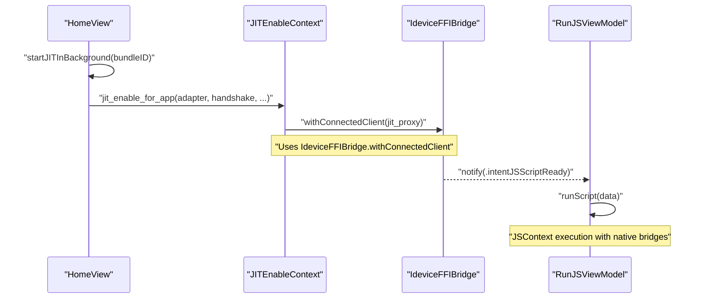
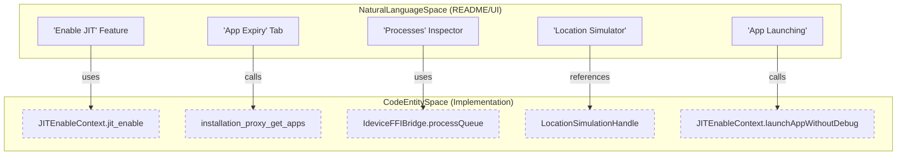

# Glossary

Relevant source files

The following files were used as context for generating this wiki page:

- [README.md](README.md)
- [StikJIT/StikJITApp.swift](StikJIT/StikJITApp.swift)
- [StikJIT/Utilities/IdeviceFFIBridge.swift](StikJIT/Utilities/IdeviceFFIBridge.swift)
- [StikJIT/Utilities/mountDDI.swift](StikJIT/Utilities/mountDDI.swift)
- [StikJIT/Views/ProfileView.swift](StikJIT/Views/ProfileView.swift)
- [StikJIT/idevice/idevice.h](StikJIT/idevice/idevice.h)
- [StikJIT/idevice/libidevice_ffi.a](StikJIT/idevice/libidevice_ffi.a)
- [info.md](info.md)

This page provides definitions for codebase-specific terms, jargon, and domain concepts used within the StikDebug project. It serves as a technical reference for onboarding engineers to understand the relationship between high-level features and their low-level implementations.

## Core Domain Terms

### JIT (Just-In-Time Compilation)
In the context of iOS, JIT allows an application to generate and execute code at runtime. For sideloaded apps, this requires the `get-task-allow` entitlement and a debugger attachment to bypass system restrictions [README.md:27-27](). StikDebug automates this process by acting as a local debugger via a loopback connection [README.md:59-65]().

### Pairing File
A `.mobiledevicepairing` or `.plist` file containing the cryptographic keys necessary to establish a trusted session with the iOS `lockdownd` service [README.md:68-69]().
*   **Implementation:** Handled by `RpPairingFileHandle` in the Swift/C FFI layer [StikJIT/Utilities/mountDDI.swift:10-10]().
*   **Opaque Type:** Defined as a pointer to `IdevicePairingFile` in the C header [StikJIT/idevice/idevice.h:113-113]().

### DDI (Developer Disk Image)
A disk image provided by Apple containing the `debugserver` and other services required for development activities like JIT enablement and process inspection [README.md:32-32]().
*   **Management:** Managed by the `MountingProgress` singleton [StikJIT/StikJITApp.swift:128-128]().
*   **Mounting:** Performed via `JITEnableContext.shared.mountPersonalDDI` [StikJIT/Utilities/mountDDI.swift:39-47]().
*   **Download:** Automates retrieval of `Image.dmg` and `Image.dmg.trustcache` from remote manifests [StikJIT/StikJITApp.swift:165-179]().

### TXM (Text Management)
A hardware-level security feature in newer Apple Silicon chips (A15/M2 and later) that changes how memory regions are marked as executable.
*   **Override:** The `txmOverride` setting allows the app to bypass hardware detection and always attempt to run JIT scripts [StikJIT/StikJITApp.swift:18-18]().

---

## Architecture & Communication

### JITEnableContext
The central Swift singleton that bridges the UI layer to the underlying C-based `idevice` libraries. It manages the lifecycle of the device tunnel and provides methods for JIT, DDI, Profiles, and Process operations [StikJIT/Utilities/mountDDI.swift:32-33](). It is used extensively in `IdeviceFFIBridge` to provide tunnel handles [StikJIT/Utilities/IdeviceFFIBridge.swift:76-83]().

### Tunnel / Adapter
A secure communication channel established between StikDebug and the device's internal services.
*   **AdapterHandle:** An opaque pointer to the low-level connection state [StikJIT/Utilities/mountDDI.swift:11-11](), defined in C as `struct AdapterHandle` [StikJIT/idevice/idevice.h:63-63]().
*   **RsdHandshakeHandle:** Manages the Remote Service Discovery (RSD) handshake required for iOS 17+ [StikJIT/Utilities/mountDDI.swift:12-12](), [StikJIT/idevice/idevice.h:175-175]().
*   **Connectivity:** Global state is tracked via `pubTunnelConnected` [StikJIT/StikJITApp.swift:121-121]().

### Loopback / LocalDevVPN
Since iOS 17.4, many developer services are only accessible over a network interface. StikDebug uses a loopback VPN (like LocalDevVPN) to route traffic back to the device itself [README.md:65-65]().

### Data Flow: JIT Enablement
The following diagram illustrates the flow from a user action to the execution of a JIT script.

**JIT Activation Sequence**

**Sources:** [StikJIT/Utilities/IdeviceFFIBridge.swift:102-118](), [README.md:74-77](), [StikJIT/Utilities/mountDDI.swift:32-33]()

---

## Scripting & Execution

### JSContext Sandbox
A JavaScript execution environment where automation scripts run. StikDebug injects native functions into this context.

| Function | Description | Implementation Context |
| :--- | :--- | :--- |
| `get_pid()` | Returns the PID of the target application. | `RunJSViewModel` |
| `send_command(cmd)` | Sends GDB/LLDB remote protocol commands. | `RunJSViewModel` |
| `prepare_memory_region()` | Configures JIT memory pages. | `RunJSViewModel` |
| `log(msg)` | Forwards script logs to the LogManager. | `LogManager` |

### FunctionGuard
A Swift `actor` used to prevent race conditions when starting the tunnel or enabling JIT. It ensures that if a task is already running, subsequent calls wait for the existing task's result [StikJIT/StikJITApp.swift:191-195]().

---

## Technical Mapping: UI to Code

The following diagram maps high-level features mentioned in the `README.md` to their corresponding internal implementations and FFI bridges.

**Feature to Entity Mapping**

**Sources:** [StikJIT/Utilities/IdeviceFFIBridge.swift:12-126](), [StikJIT/idevice/idevice.h:121-128](), [README.md:26-34]()

---

## Auxiliary Systems

### Background Keep-Alive
Methods used to prevent iOS from suspending StikDebug.
*   **Silent Audio:** Uses `BackgroundAudioManager` to play inaudible sound [StikJIT/StikJITApp.swift:134-136]().
*   **Location:** Uses `BackgroundLocationManager` to maintain an active background state via GPS.

### DNSChecker
A utility class that performs POSIX `getaddrinfo` lookups to verify network connectivity and detect if Apple's servers (e.g., `gs.apple.com`) are being blocked by the local network [StikJIT/StikJITApp.swift:25-67]().

### CMSDecoderHelper
A helper used to decode CMS-signed data, primarily for extracting the Plist content from `.mobileprovision` files [StikJIT/Views/ProfileView.swift:28-28]().

### Plist / Plist_t
An opaque pointer to a property list object used by the `idevice` FFI [StikJIT/idevice/idevice.h:217-217](). Utilities like `plist_to_bin` and `plist_free` are used to convert these to Swift-readable `Data` [StikJIT/Utilities/IdeviceFFIBridge.swift:154-161]().

**Sources:**
* [StikJIT/StikJITApp.swift:13-195]()
* [StikJIT/Utilities/IdeviceFFIBridge.swift:12-205]()
* [StikJIT/Utilities/mountDDI.swift:10-47]()
* [StikJIT/idevice/idevice.h:28-217]()
* [StikJIT/Views/ProfileView.swift:10-45]()
* [README.md:26-82]()