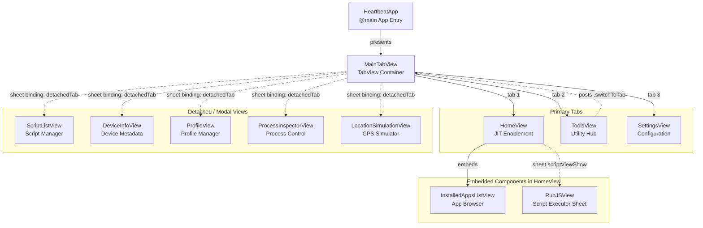

# User Interface

Relevant source files

The following files were used as context for generating this wiki page:

- [StikJIT/Utilities/TabConfiguration.swift](StikJIT/Utilities/TabConfiguration.swift)
- [StikJIT/Views/HomeView.swift](StikJIT/Views/HomeView.swift)
- [StikJIT/Views/MainTabView.swift](StikJIT/Views/MainTabView.swift)
- [StikJIT/Views/SettingsView.swift](StikJIT/Views/SettingsView.swift)

This document provides an architectural overview of StikDebug's user interface layer, covering the SwiftUI view hierarchy, navigation patterns, and interaction models. For detailed documentation on specific UI subsystems, see the child pages: [Tab Navigation System](#2.1), [Home View and JIT Control](#2.2), [Settings and Configuration](#2.3), [Application Browser](#2.4), [Script Management](#2.5), [Console and Logging Interface](#2.6), [Provisioning Profile Management](#2.7), and [Tools View and Auxiliary Interfaces](#2.8).

For information about the application entry point and lifecycle management, see [Application Lifecycle](#3.1). For backend systems that the UI interacts with, see [Core Systems](#3) and [Device Communication](#4).

## Architecture Overview

The user interface is built entirely with SwiftUI and follows a dynamic navigation pattern combining a tab bar with a detached modal system for auxiliary tools. The architecture consists of three layers:

1.  **Navigation Layer**: `MainTabView` serves as the root container, managing tab selection and the presentation of "detached" views as modal sheets [StikJIT/Views/MainTabView.swift:21-129]().
2.  **Primary Views**: Configurable tabs providing core functionality like the `HomeView` (Apps), `ToolsView`, and `SettingsView` [StikJIT/Views/MainTabView.swift:28-38]().
3.  **Auxiliary Views**: Specialized tools (Processes, Location, Device Info) that can either exist as tabs or be presented as detached modals via the `ToolsView` hub [StikJIT/Views/MainTabView.swift:96-103]().

All UI views communicate with the application core through the `JITEnableContext` singleton for device operations and `LogManager` for logging. State persistence uses `@AppStorage` property wrappers backed by `UserDefaults` [StikJIT/Views/SettingsView.swift:11-20]().

Sources: [StikJIT/Views/MainTabView.swift:21-129](), [StikJIT/Views/HomeView.swift:75-120](), [StikJIT/Views/SettingsView.swift:9-60]()

## View Hierarchy

The following diagram maps the SwiftUI view structure to actual class names in the codebase:

Sources: [StikJIT/Views/MainTabView.swift:21-129](), [StikJIT/Views/HomeView.swift:92-114](), [StikJIT/Views/SettingsView.swift:47-58]()

## Navigation Patterns

StikDebug implements a hybrid navigation mechanism governed by the `TabConfiguration` system:

### Tab Navigation

`MainTabView` manages a `TabView` that displays a set of `displayTabs` [StikJIT/Views/MainTabView.swift:64-70](). While the UI defaults to Home, Tools, and Settings as primary entry points, the underlying system is designed to support a dynamic set of `TabDescriptor` objects [StikJIT/Views/MainTabView.swift:10-15](). The selection is persisted via `@AppStorage("primaryTabSelection")` [StikJIT/Views/MainTabView.swift:23]().

### Detached Modal Presentation

Views that are not currently part of the active tab bar are presented as "detached" modals. This is handled via a `NotificationCenter` observer for `.switchToTab` [StikJIT/Views/MainTabView.swift:18-20]():

- If the requested tab ID is in the current `selectedTabDescriptors`, the `selection` binding is updated to switch tabs [StikJIT/Views/MainTabView.swift:98-99]().
- If the ID is not in the active set, it is assigned to `detachedTab`, which triggers a `.sheet` presentation [StikJIT/Views/MainTabView.swift:114-125]().

Sources: [StikJIT/Views/MainTabView.swift:21-129](), [StikJIT/Utilities/TabConfiguration.swift:3-44]()

## State Management Architecture

The UI layer uses three categories of state management:

| State Type | Mechanism | Scope | Examples |
|------------|-----------|-------|----------|
| **User Preferences** | `@AppStorage` → `UserDefaults` | App-wide, persisted | `autoQuitAfterEnablingJIT`, `keepAliveAudio`, `txmOverride` |
| **View-Local State** | `@State` private properties | Single view lifetime | `isProcessing`, `scriptViewShow`, `isShowingPairingFilePicker` |
| **Shared Observable State** | `@ObservedObject` to singletons | App-wide, reactive | `MountingProgress.shared`, `InstalledAppsViewModel` |

### AppStorage Usage

**HomeView** [StikJIT/Views/HomeView.swift:77-86]():
- `autoQuitAfterEnablingJIT`: Controls automatic app termination after JIT enablement.
- `bundleID`: Stores the last selected bundle identifier.
- `defaultScriptName`: Name of the default script to execute.

**SettingsView** [StikJIT/Views/SettingsView.swift:11-20]():
- `txmOverride`: Override TXM detection (stored at `UserDefaults.Keys.txmOverride`).
- `keepAliveAudio`, `keepAliveLocation`: Background keep-alive toggles.
- `customTargetIP`: Custom device IP override for the connection tunnel.
- `enabledTabIdentifiers`: Serialized string of enabled tabs managed by `TabConfiguration`.

Sources: [StikJIT/Views/HomeView.swift:77-86](), [StikJIT/Views/SettingsView.swift:11-20]()

## URL Scheme Handling

`HomeView` implements the app's URL scheme API through the `.onOpenURL` modifier [StikJIT/Views/HomeView.swift:120-181](). This allows external automation (Shortcuts/Widgets) to control the JIT lifecycle.

| Scheme | Parameters | Action |
|--------|-----------|--------|
| `stikjit://enable-jit` | `pid`, `bundle-id`, `script-data` (base64url), `script-name` | Triggers `startJITInBackground` with provided config [StikJIT/Views/HomeView.swift:124-150](). |
| `stikjit://kill-process` | `pid` | Invokes `JITEnableContext.shared.killProcess` [StikJIT/Views/HomeView.swift:151-168](). |
| `stikjit://launch-app` | `bundle-id` | Invokes `JITEnableContext.shared.launchAppWithoutDebug` [StikJIT/Views/HomeView.swift:169-175](). |

The handler uses a `JITEnableConfiguration` struct [StikJIT/Views/HomeView.swift:11-16]() to buffer parameters if the view has not yet appeared (`pendingJITEnableConfiguration`).

Sources: [StikJIT/Views/HomeView.swift:11-181]()

## Application Browser

The `InstalledAppsListView` is the primary interface for selecting targets. It categorizes applications into two main tabs via an `AppListTab` enum:
- **JIT**: Shows debuggable applications.
- **Other**: Shows system and non-debuggable applications for launching without JIT.

It supports searching, pinning system apps, and managing "Recent" and "Favorite" lists which are synchronized with the widget via the `group.com.stik.sj` App Group. For details, see [Application Browser](#2.4).

Sources: [StikJIT/Views/HomeView.swift:93-97]()

## Script and Profile Management

### Script Management
`ScriptListView` provides the interface for managing JavaScript automation. It operates in two modes:
1. **Management Mode**: Full CRUD operations for scripts in the documents directory.
2. **Picker Mode**: A simplified view for assigning a script to a specific app bundle.
For details, see [Script Management](#2.5).

### Provisioning Profiles
`ProfileView` (labeled as "App Expiry" in the UI) allows users to inspect `.mobileprovision` files. It decodes CMS-signed data to display app identifiers, UUIDs, and expiration dates. For details, see [Provisioning Profile Management](#2.7).

Sources: [StikJIT/Views/MainTabView.swift:31-34](), [StikJIT/Views/SettingsView.swift:50-54]()

## Visual Feedback and Progress

The UI provides real-time feedback for long-running operations:
- **DDI Mounting**: `HomeView` observes `MountingProgress.shared` to show mounting status [StikJIT/Views/HomeView.swift:88]().
- **DDI Download**: `SettingsView` displays progress and status messages during DDI retrieval via `ddiDownloadProgress` and `ddiStatusMessage` [StikJIT/Views/SettingsView.swift:29-30]().
- **Importing**: Progress is tracked via `importProgress` in `SettingsView` during pairing file processing [StikJIT/Views/SettingsView.swift:25]().

Sources: [StikJIT/Views/HomeView.swift:88-119](), [StikJIT/Views/SettingsView.swift:22-32]()