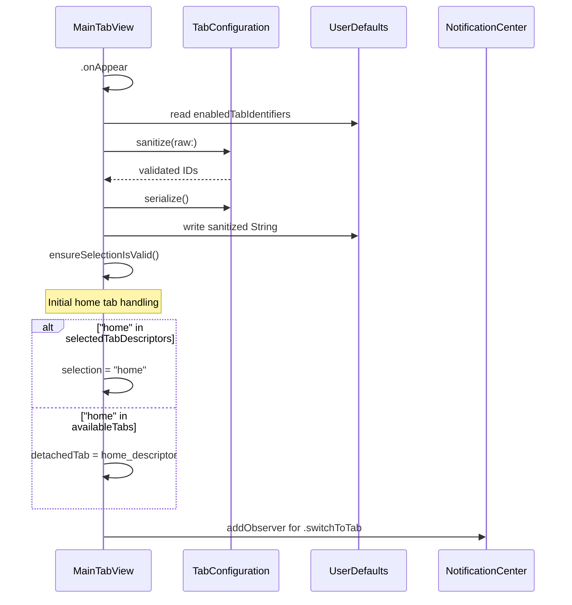

# Tab Navigation System

<details>
<summary>Relevant source files</summary>

The following files were used as context for generating this wiki page:

- [StikJIT/Utilities/TabConfiguration.swift](StikJIT/Utilities/TabConfiguration.swift)
- [StikJIT/Views/MainTabView.swift](StikJIT/Views/MainTabView.swift)
- [StikJIT/Views/MapSelectionView.swift](StikJIT/Views/MapSelectionView.swift)
- [StikJIT/Views/ProcessInspectorView.swift](StikJIT/Views/ProcessInspectorView.swift)
- [StikJIT/Views/ToolsView.swift](StikJIT/Views/ToolsView.swift)

</details>


## Purpose and Scope

This document explains the tab-based navigation system implemented in `MainTabView` that serves as the primary interface structure for StikDebug/StikJIT. The system manages tab definitions through `TabDescriptor` structs, persists user preferences via `@AppStorage`, and enforces validation rules through the `TabConfiguration` utility. Dynamic tab switching is supported through notification-based routing, with tabs either switching inline or presenting as modal sheets.

For individual view implementations displayed in each tab, see sections 2.2-2.8. For the tab customization UI in Settings, see section 2.3.

## Architecture Overview

The navigation system is built around `MainTabView`, which coordinates tab descriptors, user preferences, and dynamic switching mechanisms.

**`MainTabView` — Components and Relationships**

```mermaid
graph TB
    subgraph "MainTabView.swift"
        [MainTabView]
        [TabDescriptor_struct]
        [SwitchNotification_Name]
        [configurableTabs_computed]
        [availableTabs_computed]
        [displayTabs_computed]
        [selectedTabDescriptors_computed]
        [settingsTab_constant]
        [ensureSelectionIsValid_func]
    end

    subgraph "State_Management"
        [AS_enabledTabIdentifiers]
        [AS_primaryTabSelection]
        [State_detachedTab]
        [State_switchObserver]
        [State_didSetInitialHome]
    end

    subgraph "TabConfiguration.swift"
        [TabConfiguration_enum]
        [storageKey_const]
        [sanitize_func]
        [serialize_func]
        [allowedIDs_prop]
        [defaultIDs_prop]
    end

    subgraph "Feature_Views"
        [HomeView]
        [ScriptListView]
        [ToolsView]
        [DeviceInfoView]
        [SettingsView]
        [ProfileView]
        [ProcessInspectorView]
        [LocationSimulationView]
    end

    [MainTabView] --> [TabDescriptor_struct]
    [MainTabView] --> [SwitchNotification_Name]
    [MainTabView] --> [AS_enabledTabIdentifiers]
    [MainTabView] --> [AS_primaryTabSelection]
    [MainTabView] --> [State_detachedTab]
    [MainTabView] --> [State_switchObserver]
    [MainTabView] --> [State_didSetInitialHome]
    [MainTabView] --> [configurableTabs_computed]
    [MainTabView] --> [displayTabs_computed]
    [MainTabView] --> [selectedTabDescriptors_computed]
    [MainTabView] --> [ensureSelectionIsValid_func]

    [configurableTabs_computed] --> [availableTabs_computed]
    [AS_enabledTabIdentifiers] --> [selectedTabDescriptors_computed]
    [selectedTabDescriptors_computed] --> [TabConfiguration_enum]
    [TabConfiguration_enum] --> [sanitize_func]
    [TabConfiguration_enum] --> [serialize_func]
    [TabConfiguration_enum] --> [allowedIDs_prop]
    [TabConfiguration_enum] --> [defaultIDs_prop]
    [storageKey_const] --> [AS_enabledTabIdentifiers]

    [configurableTabs_computed] --> [HomeView]
    [configurableTabs_computed] --> [ScriptListView]
    [configurableTabs_computed] --> [ToolsView]
    [configurableTabs_computed] --> [DeviceInfoView]
    [configurableTabs_computed] --> [ProfileView]
    [configurableTabs_computed] --> [ProcessInspectorView]
    [configurableTabs_computed] --> [LocationSimulationView]
    [settingsTab_constant] --> [SettingsView]
```

Sources: [StikJIT/Views/MainTabView.swift:21-129](), [StikJIT/Utilities/TabConfiguration.swift:3-44]()

## TabDescriptor Structure

The `TabDescriptor` struct serves as the fundamental building block for tab definitions, encapsulating all information needed to render a tab.

| Property | Type | Purpose |
|----------|------|---------|
| `id` | `String` | Unique identifier used for tab selection and configuration storage |
| `title` | `String` | Display name shown in the tab bar |
| `systemImage` | `String` | SF Symbol name for the tab icon |
| `builder` | `() -> AnyView` | Closure that constructs the view for this tab |

The struct conforms to `Identifiable` using the `id` property, allowing it to be used directly in SwiftUI `ForEach` constructs [StikJIT/Views/MainTabView.swift:10-15]().

**Tab Definition Pattern (from configurableTabs):**

The `configurableTabs` computed property constructs tab descriptors using this pattern:
`TabDescriptor(id: "home", title: "Apps", systemImage: "square.grid.2x2") { AnyView(HomeView()) }` [StikJIT/Views/MainTabView.swift:30]().

Sources: [StikJIT/Views/MainTabView.swift:10-15](), [StikJIT/Views/MainTabView.swift:28-39]()

## Tab Definitions

### `configurableTabs` — All Registerable Tabs

`configurableTabs` is a computed property that defines every tab the system knows about. These are used both for tab descriptor lookups and notification-based switching.

| Tab ID | Title | System Image | View |
|--------|-------|--------------|------|
| `"home"` | Apps | `square.grid.2x2` | `HomeView()` |
| `"scripts"` | Scripts | `scroll` | `ScriptListView()` |
| `"tools"` | Tools | `wrench.and.screwdriver` | `ToolsView()` |
| `"deviceinfo"` | Device Info | `iphone.and.arrow.forward` | `DeviceInfoView()` |
| `"profiles"` | App Expiry | `calendar.badge.clock` | `ProfileView()` |
| `"processes"` | Processes | `rectangle.stack.person.crop` | `ProcessInspectorView()` |
| `"location"` | Location | `location` | `LocationSimulationView()` |

`availableTabs` is an alias for `configurableTabs` [StikJIT/Views/MainTabView.swift:41-43]().

### Settings Tab (Always Present)

`settingsTab` is a separate constant, always injected into `displayTabs` regardless of user configuration:

| Tab ID | Title | System Image | View |
|--------|-------|--------------|------|
| `"settings"` | Settings | `gearshape.fill` | `SettingsView()` |

Sources: [StikJIT/Views/MainTabView.swift:28-47]()

### `displayTabs` vs `selectedTabDescriptors`

These two computed properties serve different roles:

| Property | Source | Purpose |
|---|---|---|
| `displayTabs` | Hardcoded IDs: `["home", "tools"]` + `settingsTab` | What actually renders in the `TabView` |
| `selectedTabDescriptors` | Read from `@AppStorage(enabledTabIdentifiers)` via `TabConfiguration.sanitize` | Used to decide whether a notification-requested tab can be shown inline or needs a detached sheet |

**`displayTabs` Implementation:**
The `displayTabs` computed property constructs a fixed array of exactly three tabs:
1. Looks up `"home"` descriptor from `configurableTabs` [StikJIT/Views/MainTabView.swift:65-67]()
2. Looks up `"tools"` descriptor from `configurableTabs` [StikJIT/Views/MainTabView.swift:65-67]()
3. Inserts `settingsTab` at position `min(2, tabs.count)` (effectively index 2) [StikJIT/Views/MainTabView.swift:68]()

This creates a hardcoded tab bar of **Apps → Tools → Settings**, regardless of user preferences stored in `enabledTabIdentifiers`. User preferences in `enabledTabIdentifiers` only affect which tabs can be switched to via notification or shown in detached sheets [StikJIT/Views/MainTabView.swift:64-70]().

**`selectedTabDescriptors` Implementation:**
Maps sanitized IDs from `enabledTabIdentifiers` to descriptors from `availableTabs`. If an ID in storage no longer matches any available tab, `compactMap` silently drops it [StikJIT/Views/MainTabView.swift:49-54]().

Sources: [StikJIT/Views/MainTabView.swift:49-70]()

## Tab Configuration System

### Storage and Serialization

`enabledTabIdentifiers` is persisted as a comma-separated string via `@AppStorage`:

```swift
@AppStorage(TabConfiguration.storageKey) private var enabledTabIdentifiers: String = TabConfiguration.defaultRawValue
```

`TabConfiguration` provides static methods for sanitization and serialization.

**`TabConfiguration` — Serialization Flow**

```mermaid
graph LR
    [RawString] -- "@AppStorage(enabledTabIdentifiers)" --> [Sanitize]
    [Sanitize] -- "TabConfiguration.sanitize(raw:)" --> [ValidatedIDs]
    [ValidatedIDs] -- "[String]" --> [Serialize]
    [Serialize] -- "TabConfiguration.serialize()" --> [Persisted]
    [Persisted] -- "String" --> [UserDefaults]
```

Sources: [StikJIT/Views/MainTabView.swift:22](), [StikJIT/Utilities/TabConfiguration.swift:17-43]()

### Validation Rules

`sanitize(ids:)` enforces these constraints in order:

1. **Allowed IDs only** — ID must be present in `allowedIDs` (`coreIDs` + `"profiles"`, `"processes"`, `"location"`) [StikJIT/Utilities/TabConfiguration.swift:27]()
2. **No duplicates** — each ID may appear at most once in the result [StikJIT/Utilities/TabConfiguration.swift:28-30]()
3. **Maximum count** — stops at `maxSelectableTabs` (currently `12`) [StikJIT/Utilities/TabConfiguration.swift:31-33]()
4. **Fallback** — if result is empty after filtering, returns `defaultIDs` [StikJIT/Utilities/TabConfiguration.swift:35-37]()

**`TabConfiguration.sanitize(ids:)` — Decision Logic**

```mermaid
graph TD
    [Start] --> [CheckAllowed]
    [CheckAllowed] -- "No" --> [Skip]
    [CheckAllowed] -- "Yes" --> [CheckDupe]
    [CheckDupe] -- "Yes" --> [Skip]
    [CheckDupe] -- "No" --> [CheckMax]
    [CheckMax] -- "Yes" --> [CheckEmpty]
    [CheckMax] -- "No" --> [AddToResult]
    [AddToResult] --> [CheckAllowed]
    [Skip] --> [CheckAllowed]
    [CheckEmpty] -- "Yes" --> [UseDefault]
    [CheckEmpty] -- "No" --> [Return]
    [UseDefault] --> [Return]
```

Sources: [StikJIT/Utilities/TabConfiguration.swift:24-39]()

### `TabConfiguration` Constants

| Constant | Value | Purpose |
|---|---|---|
| `storageKey` | `"enabledTabIdentifiers"` | `@AppStorage` key used by `MainTabView` |
| `maxSelectableTabs` | `12` | Hard ceiling on number of enabled tabs |
| `coreIDs` (private) | `["home", "scripts", "tools", "deviceinfo"]` | Base IDs always in `allowedIDs` |
| `allowedIDs` | `coreIDs` + `["profiles", "processes", "location"]` | Full set of valid tab IDs (7 total) |
| `defaultIDs` | `["home", "scripts", "tools", "deviceinfo", "profiles", "processes", "location"]` | Fallback when storage is empty or invalid |
| `defaultRawValue` | `serialize(defaultIDs)` | Pre-serialized default string |

Sources: [StikJIT/Utilities/TabConfiguration.swift:4-15]()

## Selection State Management

### Primary Selection

The active tab is tracked in `@AppStorage("primaryTabSelection")` and bound directly to `TabView(selection: $selection)`:

```swift
@AppStorage("primaryTabSelection") private var selection: String = TabConfiguration.defaultIDs.first ?? "home"
```

Sources: [StikJIT/Views/MainTabView.swift:23]()

### `ensureSelectionIsValid()`

Validates that `selection` refers to a tab currently in `displayTabs`. If not, it falls back to the first available tab or `settingsTab.id` [StikJIT/Views/MainTabView.swift:56-62]().

**`ensureSelectionIsValid()` — Decision Logic**

```mermaid
graph TD
    [GetIDs] -- "displayTabs.map { id }" --> [Contains]
    [Contains] -- "Yes" --> [Valid]
    [Contains] -- "No" --> [Reset]
    [Reset] -- "selection = ids.first" --> [End]
```

This runs in two places:
- On `MainTabView` `.onAppear` [StikJIT/Views/MainTabView.swift:87]()
- In `.onChange(of: enabledTabIdentifiers)` [StikJIT/Views/MainTabView.swift:111-113]()

Sources: [StikJIT/Views/MainTabView.swift:56-62]()

## Tab Switching Mechanism

### `Notification.Name.switchToTab`

Any code in the app can request a tab switch by posting to `NotificationCenter`. The notification name is declared as an extension on `Notification.Name` [StikJIT/Views/MainTabView.swift:17-19](). The `object` must be a `String` tab ID.

### Switching Logic

`MainTabView` registers a `switchObserver` in `.onAppear` and removes it in `.onDisappear` to avoid leaks [StikJIT/Views/MainTabView.swift:96-110]().

**`switchToTab` Notification Handling**

```mermaid
flowchart TD
    [Post] -- "NotificationCenter.post(name: .switchToTab, object: tabID)" --> [Receive]
    [Receive] -- "switchObserver handler fires" --> [CastID]
    [CastID] -- "nil" --> [Ignore1]
    [CastID] -- "String" --> [CheckSelected]
    [CheckSelected] -- "Yes" --> [SetSelection]
    [CheckSelected] -- "No" --> [CheckAvailable]
    [CheckAvailable] -- "Yes" --> [ShowDetached]
    [CheckAvailable] -- "No" --> [Ignore2]
```

Sources: [StikJIT/Views/MainTabView.swift:17-19](), [StikJIT/Views/MainTabView.swift:96-103]()

## Detached Tab System

When a requested tab is not in `displayTabs`, the system presents it modally as a "detached tab" rather than switching inline.

### Triggering Detached Presentation

`@State private var detachedTab: TabDescriptor?` drives the sheet. It is set in two situations:

| Scenario | Location |
|---|---|
| Initial launch and `"home"` is not in `displayTabs` but in `availableTabs` | [StikJIT/Views/MainTabView.swift:91-93]() |
| `switchToTab` notification received for a tab not in `selectedTabDescriptors` but present in `availableTabs` | [StikJIT/Views/MainTabView.swift:100-102]() |

### Sheet Presentation

The `.sheet(item: $detachedTab)` modifier on the `TabView` is triggered whenever `detachedTab` becomes non-nil. The sheet wraps `descriptor.builder()` in a `NavigationStack` with a toolbar "Close" button that sets `detachedTab = nil` [StikJIT/Views/MainTabView.swift:114-125]().

Sources: [StikJIT/Views/MainTabView.swift:25](), [StikJIT/Views/MainTabView.swift:114-125]()

## ToolsView Hub

The `ToolsView` acts as a central hub for auxiliary tools that may or may not be pinned to the main tab bar. It provides a `NavigationStack` with a `List` of `ToolItem` entries [StikJIT/Views/ToolsView.swift:10-51]().

**`ToolsView` Navigation Map**

| Tool | ID | Destination View | Detail |
|---|---|---|---|
| Scripts | `scripts` | `ScriptListView()` | Manage and run JS scripts |
| Console | `console` | `ConsoleLogsView()` | Live device logs |
| Device Info | `deviceinfo` | `DeviceInfoView()` | View detailed device metadata |
| App Expiry | `profiles` | `ProfileView()` | Check app expiration dates |
| Processes | `processes` | `ProcessInspectorView()` | Inspect running apps |
| Location Simulation | `location` | `LocationSimulationView()` | Simulate GPS location |

Sources: [StikJIT/Views/ToolsView.swift:19-28]()

## Initialization Sequence

**`MainTabView.onAppear` — Initialization Flow**



Sources: [StikJIT/Views/MainTabView.swift:85-104]()