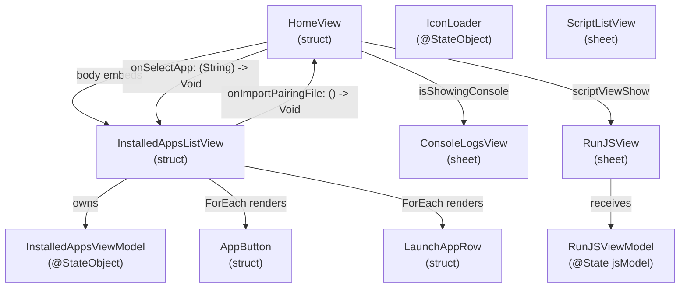
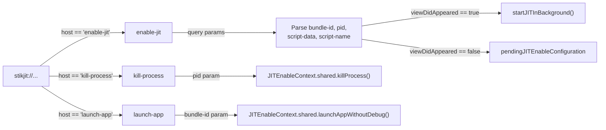

# Home View and JIT Control

Relevant source files

The following files were used as context for generating this wiki page:

- [StikJIT/JSSupport/ScriptListView.swift](StikJIT/JSSupport/ScriptListView.swift)
- [StikJIT/Views/HomeView.swift](StikJIT/Views/HomeView.swift)
- [StikJIT/Views/InstalledAppsListView.swift](StikJIT/Views/InstalledAppsListView.swift)
- [StikJIT/Views/SettingsView.swift](StikJIT/Views/SettingsView.swift)

## Purpose and Scope

This document describes the **HomeView** component and its role as the primary interface for JIT enablement operations. HomeView serves as the main entry point for users to select applications and trigger JIT compilation debugging. It coordinates app selection, script execution, pairing file management, and URL scheme-based automation.

For application browsing implementation details, see [Application Browser](). For JavaScript execution environment, see [JavaScript Execution Environment](). For the underlying JIT enablement backend, see [JIT Enablement Engine]().

---

## Component Architecture

### Core Components

| Component | File | Responsibility |
|-----------|------|----------------|
| `HomeView` | [StikJIT/Views/HomeView.swift:75-181]() | Primary JIT control interface, URL scheme handler, workflow coordinator. |
| `InstalledAppsListView` | [StikJIT/Views/InstalledAppsListView.swift:15-195]() | App selection UI with favorites/recents management. |
| `JITEnableConfiguration` | [StikJIT/Views/HomeView.swift:11-16]() | Configuration struct for JIT requests. |
| `DebugKeepAliveLease` | [StikJIT/Views/HomeView.swift:18-73]() | Private class managing background task lifecycle and audio/location stay-alive. |
| `ScriptListView` | [StikJIT/JSSupport/ScriptListView.swift:12-141]() | Script selection interface used in picker mode. |

**Sources:** [StikJIT/Views/HomeView.swift:11-181](), [StikJIT/Views/InstalledAppsListView.swift:15-195](), [StikJIT/JSSupport/ScriptListView.swift:12-141]()

---

### HomeView Component Hierarchy

**Sources:** [StikJIT/Views/HomeView.swift:75-119](), [StikJIT/Views/InstalledAppsListView.swift:15-195]()

---

## HomeView Implementation

### State Management

HomeView maintains several `@State` and `@AppStorage` properties for UI and workflow control:

| Property | Type | Purpose |
|----------|------|---------|
| `bundleID` | `@AppStorage` | Currently selected bundle identifier [StikJIT/Views/HomeView.swift:78](). |
| `doAutoQuitAfterEnablingJIT` | `@AppStorage` | Auto-exit flag after JIT enablement [StikJIT/Views/HomeView.swift:77](). |
| `selectedScript` | `@AppStorage` | Default script name from `UserDefaults.Keys.defaultScriptName` [StikJIT/Views/HomeView.swift:86](). |
| `isProcessing` | `@State` | JIT operation in progress indicator [StikJIT/Views/HomeView.swift:79](). |
| `viewDidAppeared` | `@State` | View lifecycle tracking for URL scheme handling [StikJIT/Views/HomeView.swift:80](). |
| `pendingJITEnableConfiguration` | `@State` | Queued JIT request from URL scheme if view not yet appeared [StikJIT/Views/HomeView.swift:81](). |
| `scriptViewShow` | `@State` | RunJSView sheet presentation state [StikJIT/Views/HomeView.swift:84](). |
| `jsModel` | `@State` | Active `RunJSViewModel?` instance [StikJIT/Views/HomeView.swift:87](). |
| `mounting` | `@ObservedObject` | Shared `MountingProgress` singleton for DDI status [StikJIT/Views/HomeView.swift:88](). |

**Sources:** [StikJIT/Views/HomeView.swift:77-90]()

---

### URL Scheme Handler

HomeView responds to three URL scheme commands via `.onOpenURL` [StikJIT/Views/HomeView.swift:120-181]():

**URL Scheme Parameters:**

| Scheme | Parameters | Example |
|--------|------------|---------|
| `enable-jit` | `bundle-id`, `pid`, `script-data` (base64url), `script-name` | `stikjit://enable-jit?bundle-id=com.app.id&script-name=custom.js` |
| `kill-process` | `pid` | `stikjit://kill-process?pid=1234` |
| `launch-app` | `bundle-id` | `stikjit://launch-app?bundle-id=com.app.id` |

**Implementation Details:**

- **enable-jit:** Constructs `JITEnableConfiguration`. If `script-data` is missing, it falls back to `ScriptStore.preferredScript(for:)` [StikJIT/Views/HomeView.swift:141-145]().
- **kill-process:** Resets `pubTunnelConnected`, restarts the tunnel in the background, and executes `JITEnableContext.shared.killProcess` on a background thread [StikJIT/Views/HomeView.swift:151-168]().
- **launch-app:** Invokes `JITEnableContext.shared.launchAppWithoutDebug` directly [StikJIT/Views/HomeView.swift:169-180]().

**Sources:** [StikJIT/Views/HomeView.swift:120-181]()

---

### Script Selection Logic

HomeView coordinates script selection through `ScriptStore` and the global default settings:

1. **Manual Assignment:** Users can assign a script to a specific bundle ID via context menus in the app list (handled by `BundleScriptMap`).
2. **Default Script:** A global default script name is stored in `UserDefaults` and used when no specific script is requested [StikJIT/Views/HomeView.swift:86]().
3. **Picker Mode:** `ScriptListView` can be presented in picker mode to let users manually select a script file from the local filesystem [StikJIT/JSSupport/ScriptListView.swift:30-32]().

**Sources:** [StikJIT/Views/HomeView.swift:86-87](), [StikJIT/JSSupport/ScriptListView.swift:30-51]()

---

## JIT Enablement Workflow

### Background Lifecycle and Keep-Alive

To ensure JIT activation succeeds when the app is backgrounded (e.g., when switching to the target app), `HomeView` uses `DebugKeepAliveLease` [StikJIT/Views/HomeView.swift:18-73]().

- **Activation:** Calls `BackgroundAudioManager.shared.requestStart()` and `BackgroundLocationManager.shared.requestStart()` [StikJIT/Views/HomeView.swift:57-58]().
- **Task Management:** Begins a `UIBackgroundTaskIdentifier` named "StikDebugDebugSession" to provide extra execution time [StikJIT/Views/HomeView.swift:59]().
- **Invalidation:** Stops background services and ends the task once JIT is enabled or fails [StikJIT/Views/HomeView.swift:36-44]().

**Sources:** [StikJIT/Views/HomeView.swift:18-73]()

---

## InstalledAppsListView Implementation

### Tab Architecture and Filtering

`InstalledAppsListView` separates apps into **JIT** (debuggable) and **Other** (system/non-debuggable) categories using an internal `AppListTab` enum [StikJIT/Views/InstalledAppsListView.swift:122-134]().

- **JIT Tab:** Shows apps with `get-task-allow`. Includes Favorites (max 4) and Recents [StikJIT/Views/InstalledAppsListView.swift:20-28]().
- **Other Tab:** Combines `nonDebuggableApps` and `systemApps` for standard launching without JIT [StikJIT/Views/InstalledAppsListView.swift:91-98]().

### Search and Sorting
The view implements normalized search filtering [StikJIT/Views/InstalledAppsListView.swift:142-153](). Apps are sorted case-insensitively by display name [StikJIT/Views/InstalledAppsListView.swift:61-69]().

**Sources:** [StikJIT/Views/InstalledAppsListView.swift:15-162]()

---

## Integration with Settings

The Home View's behavior is heavily influenced by `SettingsView` configurations:

| Setting | Code Entity | Effect on Home View |
|---------|-------------|---------------------|
| **Keep-Alive** | `keepAliveAudio`, `keepAliveLocation` | Determines if background services are toggled via `BackgroundAudioManager` or `BackgroundLocationManager` [StikJIT/Views/SettingsView.swift:100-122](). |
| **TXM Override** | `overrideTXMDetection` | Forces the JIT engine to bypass hardware checks [StikJIT/Views/SettingsView.swift:129-136](). |
| **DDI Management** | `MountingProgress` | HomeView monitors this shared singleton to ensure developer images are mounted before attempting JIT [StikJIT/Views/HomeView.swift:88](). |

**Sources:** [StikJIT/Views/SettingsView.swift:9-136](), [StikJIT/Views/HomeView.swift:88-119]()