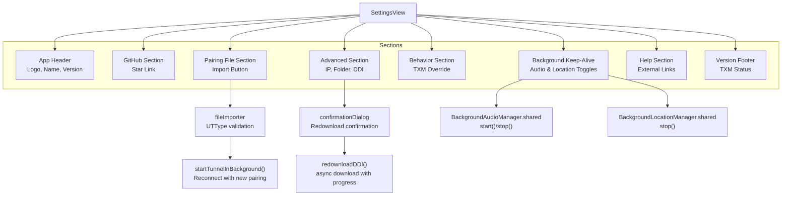
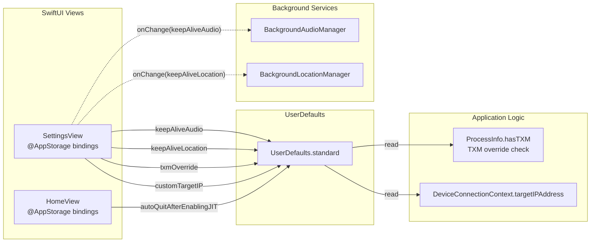
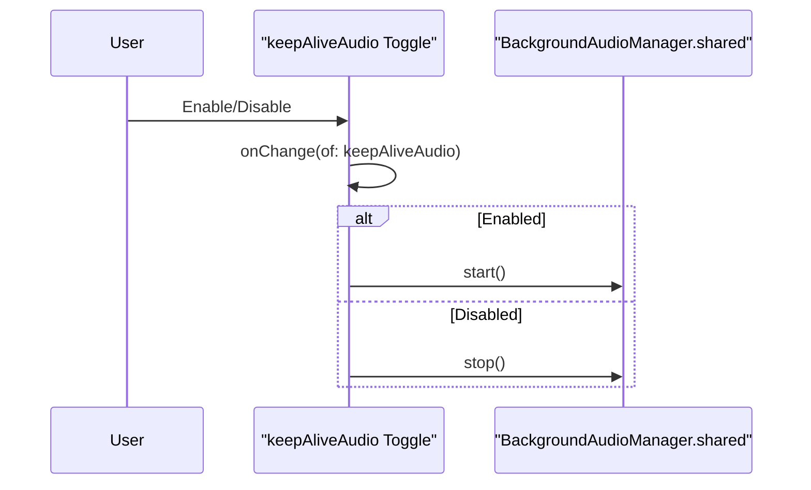
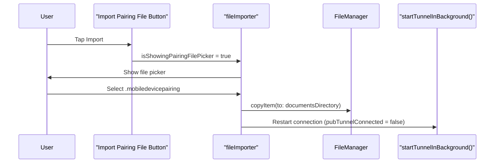

# Settings and Configuration

Relevant source files

The following files were used as context for generating this wiki page:

- [StikJIT/Utilities/TabConfiguration.swift](StikJIT/Utilities/TabConfiguration.swift)
- [StikJIT/Views/HomeView.swift](StikJIT/Views/HomeView.swift)
- [StikJIT/Views/MainTabView.swift](StikJIT/Views/MainTabView.swift)
- [StikJIT/Views/SettingsView.swift](StikJIT/Views/SettingsView.swift)

This document describes the user-facing settings interface, configuration options, and persistence mechanisms in StikDebug. It covers all settings exposed through the `SettingsView`, behavior toggles scattered across the application, and the underlying `@AppStorage` key-value system that persists user preferences.

For background service implementation details, see [Background Keep-Alive Services](5.5). For DDI file management internals, see [Developer Disk Image Management](3.4). For tab configuration system architecture, see [Tab Configuration System](5.3).

---

## Settings View Structure

The primary settings interface is implemented in `SettingsView`, accessible via the main tab bar. It organizes configuration options into distinct sections using SwiftUI's `Form` and `Section` components.

Title: SettingsView UI and Logic Flow

**Sources:** [StikJIT/Views/SettingsView.swift:60-153](), [StikJIT/Views/SettingsView.swift:11-31]()

---

## Storage and Persistence

All settings are persisted using SwiftUI's `@AppStorage` property wrapper, which automatically syncs with `UserDefaults`. The following table catalogs all configuration keys across the application:

| Key | Type | Default | Location | Purpose |
|-----|------|---------|----------|---------|
| `autoQuitAfterEnablingJIT` | `Bool` | `false` | `HomeView` | Exit app after successful JIT enablement |
| `selectedAppIcon` | `String` | `"AppIcon"` | `SettingsView` | Current app icon identifier |
| `enableAdvancedOptions` | `Bool` | `false` | `SettingsView` | Show advanced UI features |
| `enableAdvancedBetaOptions` | `Bool` | `false` | `SettingsView` | Show beta/experimental features |
| `enableTesting` | `Bool` | `false` | `SettingsView` | Testing mode flag |
| `txmOverride` | `Bool` | `false` | `SettingsView` | Force script execution regardless of TXM detection |
| `keepAliveAudio` | `Bool` | `true` | `SettingsView` | Enable silent audio playback |
| `keepAliveLocation` | `Bool` | `true` | `SettingsView` | Enable background location service |
| `customTargetIP` | `String` | `""` | `SettingsView` | Override default device IP (10.7.0.1) |
| `enabledTabIdentifiers` | `String` | `TabConfiguration.defaultRawValue` | `SettingsView` | Serialized tab configuration |
| `primaryTabSelection` | `String` | `"home"` | `SettingsView` | Active tab identifier |
| `bundleID` | `String` | `""` | `HomeView` | Last selected bundle identifier |
| `DefaultScriptName` | `String` | `"attachDetach.js"` | `HomeView` | Default script for execution |

Title: Data Persistence and State Flow

**Sources:** [StikJIT/Views/SettingsView.swift:11-21](), [StikJIT/Views/HomeView.swift:77-78](), [StikJIT/Utilities/TabConfiguration.swift:4-15]()

---

## Background Keep-Alive Configuration

Two settings control the application's ability to remain active in the background, critical for maintaining the heartbeat connection and enabling JIT operations without user intervention.

### Silent Audio Keep-Alive

When enabled (default: `true`), the app plays inaudible audio to prevent iOS from suspending it. The toggle immediately starts or stops the `BackgroundAudioManager` service:

Title: Background Audio Lifecycle

**Implementation:**
- Toggle defined at [StikJIT/Views/SettingsView.swift:100-111]().
- `onChange` handler invokes `BackgroundAudioManager.shared.start()` or `.stop()`.

### Background Location Keep-Alive

When enabled (default: `true`), the app can request low-accuracy location updates during long-running operations. The `HomeView` uses a `DebugKeepAliveLease` class to manage these background requirements during active sessions.

**Implementation:**
- The `DebugKeepAliveLease` class at [StikJIT/Views/HomeView.swift:18-73]() coordinates both `BackgroundAudioManager` and `BackgroundLocationManager` during a JIT session.
- The toggle at [StikJIT/Views/SettingsView.swift:112-121]() only stops the service when disabled; it does not proactively start it, as the lease handles on-demand activation.

**Sources:** [StikJIT/Views/SettingsView.swift:100-125](), [StikJIT/Views/HomeView.swift:18-73]()

---

## TXM Override Behavior

The "Always Run Scripts" toggle (`txmOverride`) bypasses hardware TXM (Trusted Execution Monitor) detection, allowing script execution on non-TXM devices. This is critical for testing or for users who want script-based JIT enablement regardless of detected hardware capabilities.

**Key Code Paths:**
1. **Toggle UI:** [StikJIT/Views/SettingsView.swift:129-136]().
2. **Persistence:** Uses `UserDefaults.Keys.txmOverride` [StikJIT/Views/SettingsView.swift:15]().

---

## Pairing File Management

The pairing file import interface allows users to establish trust with an iOS device by importing a `.mobiledevicepairing` or `.mobiledevicepair` file.

Title: Pairing File Import Flow

**Implementation Details:**
- **UI Entry:** Button at [StikJIT/Views/SettingsView.swift:89-91]() sets `isShowingPairingFilePicker`.
- **Tunnel Restart:** In a production environment, importing a new pairing file typically requires setting `pubTunnelConnected = false` and calling `startTunnelInBackground()` to establish a new RSD session [StikJIT/Views/HomeView.swift:99-100]().

**Sources:** [StikJIT/Views/SettingsView.swift:88-96](), [StikJIT/Views/HomeView.swift:82-83]()

---

## Advanced Settings

### Target Device IP

The `customTargetIP` field allows users to override the default device IP address (10.7.0.1). This is used by the application to determine the target for all network-based FFI calls when a tunnel is active.

**Implementation:**
- Text field bound to `@AppStorage("customTargetIP")` [StikJIT/Views/SettingsView.swift:140-147]().

### App Folder Access

The "App Folder" button is designed to provide quick access to the application's internal directory for debugging or manual file management [StikJIT/Views/SettingsView.swift:148-150]().

### DDI Redownload

The "Redownload DDI" button triggers a refresh of Developer Disk Image files with progress tracking.
- **State Variables:** `isRedownloadingDDI`, `ddiDownloadProgress`, and `ddiStatusMessage` manage the UI during the operation [StikJIT/Views/SettingsView.swift:28-31]().
- **Confirmation:** Triggers `showDDIConfirmation = true` [StikJIT/Views/SettingsView.swift:151-153]().

---

## Tab Customization

Users can customize which tabs appear in the main navigation bar. The configuration is persisted as a comma-separated string of identifiers using `TabConfiguration.storageKey`.

**Implementation:**
- Options defined in `tabOptions` include `home`, `scripts`, `tools`, `deviceinfo`, `profiles`, `processes`, and `location` [StikJIT/Views/SettingsView.swift:47-58]().
- The current selection is tracked via `primaryTabSelection` [StikJIT/Views/SettingsView.swift:20]().
- The `MainTabView` dynamically builds the UI based on `enabledTabIdentifiers` [StikJIT/Views/MainTabView.swift:49-54]().
- The `TabConfiguration` utility provides sanitization and serialization logic [StikJIT/Utilities/TabConfiguration.swift:17-44]().

**Sources:** [StikJIT/Views/SettingsView.swift:19-20](), [StikJIT/Views/SettingsView.swift:47-58](), [StikJIT/Utilities/TabConfiguration.swift:4-15](), [StikJIT/Views/MainTabView.swift:21-40]()