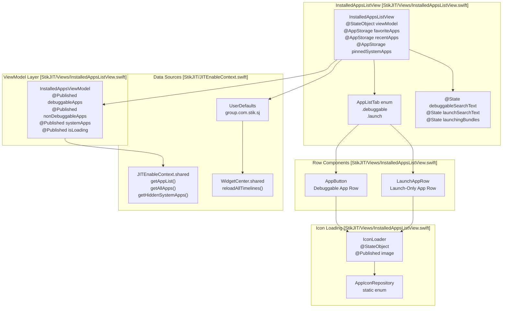
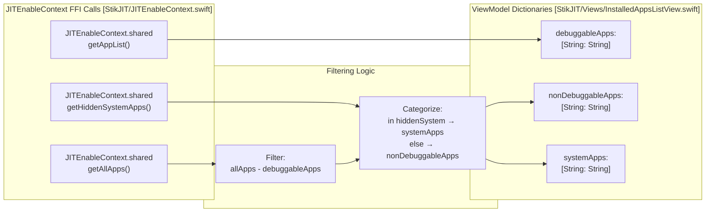
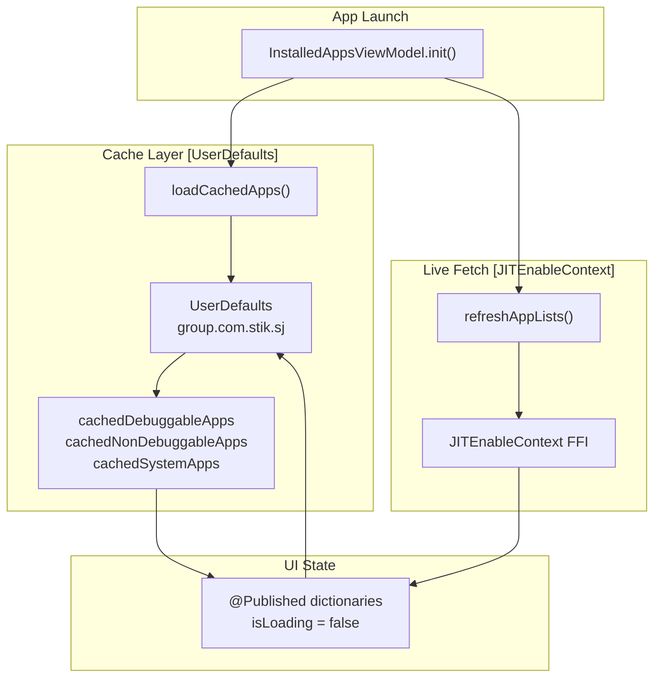

# Application Browser

Relevant source files

The following files were used as context for generating this wiki page:

- [StikJIT/JSSupport/ScriptListView.swift](StikJIT/JSSupport/ScriptListView.swift)
- [StikJIT/Utilities/AppStoreIconFetcher.swift](StikJIT/Utilities/AppStoreIconFetcher.swift)
- [StikJIT/Views/InstalledAppsListView.swift](StikJIT/Views/InstalledAppsListView.swift)

## Purpose and Scope

The `InstalledAppsListView` provides a comprehensive interface for browsing, filtering, favoriting, and managing iOS applications installed on the connected device. The view supports two primary workflows: selecting debuggable apps to enable JIT compilation and launching non-debuggable or hidden system apps directly via CoreDevice protocols.

For JavaScript script assignment to specific apps, see page 2.5. For the underlying device communication that retrieves app lists, see page 4.3.

---

## View Architecture

The application browser is implemented as `InstalledAppsListView`, a SwiftUI view that presents a tabbed interface with two distinct app categories. The view uses an MVVM pattern with `InstalledAppsViewModel` handling all data fetching and caching logic.

### Component Diagram
Title: Application Browser Architecture

Sources: [StikJIT/Views/InstalledAppsListView.swift:15-40](), [StikJIT/Views/InstalledAppsListView.swift:122-134](), [StikJIT/Views/InstalledAppsListView.swift:1101-1117]()

### Tab System

The view presents two tabs via the `AppListTab` enumeration [StikJIT/Views/InstalledAppsListView.swift:122-134]():

| Tab value | `title` | Purpose | App Sources |
|-----------|---------|---------|-------------|
| `.debuggable` | `"JIT"` | Apps with `get-task-allow` entitlement | `debuggableApps` from `JITEnableContext.getAppList()` |
| `.launch` | `"Other"` | Non-debuggable and hidden system apps | Combined `nonDebuggableApps` + `systemApps` |

The Launch Apps tab merges two categories into a single unified list via `combinedLaunchApps`, with system app names taking precedence when bundle IDs overlap [StikJIT/Views/InstalledAppsListView.swift:91-98]().

Sources: [StikJIT/Views/InstalledAppsListView.swift:122-134](), [StikJIT/Views/InstalledAppsListView.swift:91-108]()

---

## Data Model and Categorization

### App Categories

The `InstalledAppsViewModel` maintains three dictionaries mapping bundle IDs to display names:

Title: App Categorization Logic

Sources: [StikJIT/Views/InstalledAppsListView.swift:1142-1183](), [StikJIT/Views/InstalledAppsListView.swift:1124-1141]()

### Caching Strategy

The view model implements a three-layer caching system:

Title: App List Caching Flow

Sources: [StikJIT/Views/InstalledAppsListView.swift:1137-1140](), [StikJIT/Views/InstalledAppsListView.swift:1185-1211]()

---

## User Collections and Persistence

### Favorites System

Users can favorite up to 4 debuggable apps. Favorites are stored in both the standard app domain (`@AppStorage`) and the shared app group suite for widget access.

| Storage Key | Location | Max Count | Purpose |
|-------------|----------|-----------|---------|
| `favoriteApps` | `@AppStorage` + shared suite | 4 | Bundle IDs |
| `favoriteAppNames` | Shared suite only | 4 | Display names for widgets |

The favorites array enforces a hard limit at the `@AppStorage` property level [StikJIT/Views/InstalledAppsListView.swift:21-28](). Favorite names are computed and persisted to the shared suite under the key `"favoriteAppNames"` [StikJIT/Views/InstalledAppsListView.swift:437-446]().

Sources: [StikJIT/Views/InstalledAppsListView.swift:21-28](), [StikJIT/Views/InstalledAppsListView.swift:437-449]()

### Recents Tracking

The most recently selected 3 debuggable apps are tracked automatically. When an app is favorited via `AppButton.toggleFavorite()`, it is automatically removed from recents [StikJIT/Views/InstalledAppsListView.swift:684-693]() to avoid duplication in the UI.

Sources: [StikJIT/Views/InstalledAppsListView.swift:673-682](), [StikJIT/Views/InstalledAppsListView.swift:86-88]()

### System App Pinning

Launch-tab apps support pinning for quick access from the home screen. Up to 8 apps can be pinned. The `toggleSystemPin()` function [StikJIT/Views/InstalledAppsListView.swift:481-498]() inserts new pins at index 0 and enforces the limit by truncating both arrays.

Sources: [StikJIT/Views/InstalledAppsListView.swift:38-39](), [StikJIT/Views/InstalledAppsListView.swift:481-498]()

---

## Icon Loading System

### Three-Tier Caching Architecture

The `AppIconRepository` enum implements a sophisticated caching strategy with memory, disk, and network tiers:

1. **Memory**: Check `NSCache` for instant return (up to 2000 images, 64 MB) [StikJIT/Views/InstalledAppsListView.swift:904-915]().
2. **Disk**: Load PNG from app group container `icons/<bundleID>.png`.
3. **Network**: Fetch from `AppStoreIconFetcher.getIcon(for:)` [StikJIT/Utilities/AppStoreIconFetcher.swift:15-30]().

### Concurrency Control

Network fetches are throttled using `AsyncSemaphore` with 4 concurrent permits [StikJIT/Views/InstalledAppsListView.swift:896](). The `IconFetchRegistry` actor [StikJIT/Views/InstalledAppsListView.swift:842-857]() deduplicates simultaneous requests for the same bundle ID.

Sources: [StikJIT/Views/InstalledAppsListView.swift:842-885](), [StikJIT/Views/InstalledAppsListView.swift:939-959](), [StikJIT/Utilities/AppStoreIconFetcher.swift:15-30]()

### IconLoader Component

Each `AppButton` and `LaunchAppRow` instantiates an `IconLoader` observable object [StikJIT/Views/InstalledAppsListView.swift:1041-1075](). The `IconLoader` initializer checks memory cache synchronously for instant display [StikJIT/Views/InstalledAppsListView.swift:1047-1052]().

Sources: [StikJIT/Views/InstalledAppsListView.swift:1041-1075](), [StikJIT/Views/InstalledAppsListView.swift:530-550]()

---

## Search and Filtering

Each tab maintains independent search state (`debuggableSearchText` and `launchSearchText`). The `normalizedSearchString(_:)` helper [StikJIT/Views/InstalledAppsListView.swift:142-146]() uses Unicode-normalized, case-insensitive, diacritic-insensitive matching.

Both bundle identifiers and display names are tested for substring containment via `matches(_:bundleID:name:)` [StikJIT/Views/InstalledAppsListView.swift:148-153]().

Sources: [StikJIT/Views/InstalledAppsListView.swift:34-35](), [StikJIT/Views/InstalledAppsListView.swift:142-153](), [StikJIT/Views/InstalledAppsListView.swift:71-76]()

---

## Row Components

### AppButton (Debuggable Apps)

The `AppButton` struct [StikJIT/Views/InstalledAppsListView.swift:514-733]() represents a single debuggable app row.

- **Tap** → `selectApp()`: add to `recentApps`, call `onSelectApp(bundleID)` closure [StikJIT/Views/InstalledAppsListView.swift:673-682]().
- **Context Menu**: toggle favorite, copy bundle ID, assign/reset script [StikJIT/Views/InstalledAppsListView.swift:552-643]().

### LaunchAppRow (Non-Debuggable Apps)

The `LaunchAppRow` struct [StikJIT/Views/InstalledAppsListView.swift:737-840]() displays apps that can only be launched.

- **Tap** → `launchAction()` closure → `InstalledAppsViewModel.launchWithoutDebug(bundleID:completion:)` [StikJIT/Views/InstalledAppsListView.swift:1213-1220]().
- **Context Menu**: pin/unpin from home (`toggleSystemPin`), copy bundle ID [StikJIT/Views/InstalledAppsListView.swift:481-498]().

---

## Performance Optimizations

- **Icon Loading Control**: Controlled by `loadAppIconsOnJIT` preference [StikJIT/Views/InstalledAppsListView.swift:30]().
- **Image Preparation**: Uses `AppIconRepository.prepareForDisplay(_:)` to decode images on background threads [StikJIT/Views/InstalledAppsListView.swift:1032-1037]().
- **Transaction Disablement**: Tab transitions explicitly disable animations [StikJIT/Views/InstalledAppsListView.swift:167-168]().

Sources: [StikJIT/Views/InstalledAppsListView.swift:30](), [StikJIT/Views/InstalledAppsListView.swift:1032-1037](), [StikJIT/Views/InstalledAppsListView.swift:167-168]()