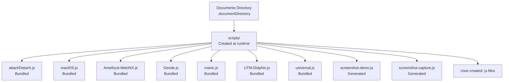
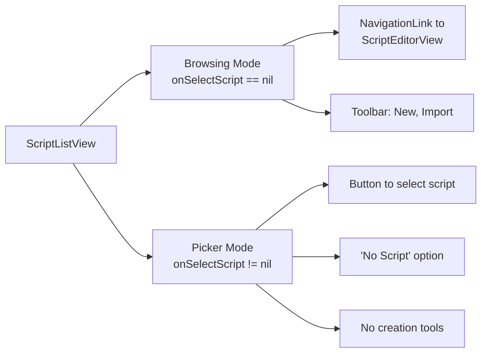
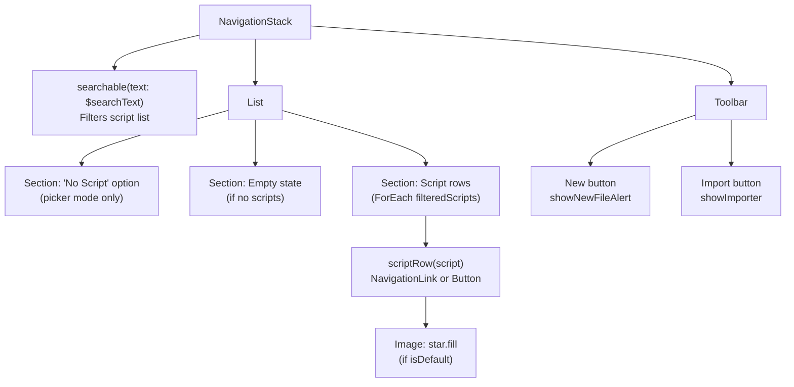
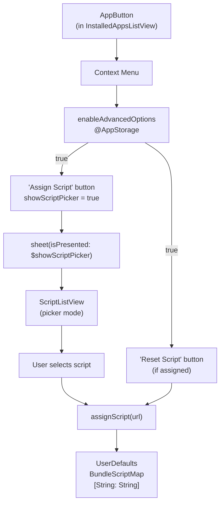

# Script Management

Relevant source files

The following files were used as context for generating this wiki page:

- [StikJIT/JSSupport/ScriptEditorView.swift](StikJIT/JSSupport/ScriptEditorView.swift)
- [StikJIT/JSSupport/ScriptListView.swift](StikJIT/JSSupport/ScriptListView.swift)
- [StikJIT/Scripts/universal.js](StikJIT/Scripts/universal.js)
- [StikJIT/Views/InstalledAppsListView.swift](StikJIT/Views/InstalledAppsListView.swift)

## Purpose and Scope

This document describes the script management subsystem in StikDebug, which enables users to create, import, organize, and assign JavaScript files that extend JIT enablement functionality. Scripts are stored locally in the app's documents directory, can be assigned to specific bundle identifiers via `BundleScriptMap`, and are executed by the JavaScript execution environment during JIT operations. For details on how scripts are executed, see [3.6. JavaScript Execution Environment](). For information about how scripts are selected and triggered during JIT enablement, see [3.3. JIT Enablement Engine]().

---

## Script Storage Architecture

Scripts are stored as `.js` files in a dedicated directory within the app's documents folder. The system automatically creates this directory and populates it with bundled scripts on first launch.

### Directory Structure

**Sources:** [StikJIT/JSSupport/ScriptListView.swift:203-248]()

The `scriptsDirectory()` function [StikJIT/JSSupport/ScriptListView.swift:203-220]() ensures the scripts directory exists and calls `ensureDefaultScripts()` [StikJIT/JSSupport/ScriptListView.swift:222-248]() to copy bundled scripts from the app bundle if they don't already exist. Scripts are accessible via the Files app due to `UIFileSharingEnabled` in the project configuration.

### Bundled Scripts

The following scripts are copied from the main bundle on first launch:

| Script Name | Bundle Resource | Purpose |
|-------------|----------------|---------|
| `attachDetach.js` | `attachDetach.js` | Basic attach/detach pattern |
| `maciOS.js` | `maciOS.js` | macOS-specific operations |
| `Amethyst-MeloNX.js` | `Amethyst-MeloNX.js` | Amethyst/MeloNX game support |
| `Geode.js` | `Geode.js` | Geode framework support |
| `manic.js` | `manic.js` | Manic-specific operations |
| `UTM-Dolphin.js` | `UTM-Dolphin.js` | UTM and Dolphin emulator support |
| `universal.js` | `universal.js` | Universal JIT syscall handling (vAttach, brk 0xf00d) |

**Sources:** [StikJIT/JSSupport/ScriptListView.swift:224-240](), [StikJIT/Scripts/universal.js:1-31]()

Two additional scripts are generated programmatically:

- **screenshot-demo.js** [StikJIT/JSSupport/ScriptListView.swift:241-243]() - Demonstrates attaching to a process, capturing a screenshot, and detaching.
- **screenshot-capture.js** [StikJIT/JSSupport/ScriptListView.swift:244-247]() - Standalone screenshot capture without debug commands.

**Sources:** [StikJIT/JSSupport/ScriptListView.swift:347-398]()

---

## Script List View

The `ScriptListView` [StikJIT/JSSupport/ScriptListView.swift:12-167]() provides the primary interface for browsing and managing scripts. It supports two modes: browsing mode and picker mode.

### View Modes

**Sources:** [StikJIT/JSSupport/ScriptListView.swift:30-32]()

The mode is determined by the `onSelectScript` closure parameter [StikJIT/JSSupport/ScriptListView.swift:30]():
- **Browsing mode** (`nil`): Full editing capabilities with navigation to `ScriptEditorView`.
- **Picker mode** (non-`nil`): Simple selection interface for script assignment.

### User Interface Layout

**Sources:** [StikJIT/JSSupport/ScriptListView.swift:40-167]()

The view displays scripts in a searchable list [StikJIT/JSSupport/ScriptListView.swift:102-106]() with filtering logic [StikJIT/JSSupport/ScriptListView.swift:34-37](). Each script row [StikJIT/JSSupport/ScriptListView.swift:172-199]() shows the filename with a star icon for the default script [StikJIT/JSSupport/ScriptListView.swift:173,181-182,193-195]().

---

## Script Operations

### Create New Script

The creation flow [StikJIT/JSSupport/ScriptListView.swift:262-279]() sanitizes the filename, ensures the `.js` extension, checks for conflicts, and writes an empty file to the scripts directory.

**Sources:** [StikJIT/JSSupport/ScriptListView.swift:111-113,121-124,262-279]()

### Import Script

Import operations [StikJIT/JSSupport/ScriptListView.swift:293-313]() run on a background queue with a busy indicator [StikJIT/JSSupport/ScriptListView.swift:294](), replace existing files with the same name, and reload the script list upon completion. It utilizes `UTType(filenameExtension: "js")` to restrict file selection [StikJIT/JSSupport/ScriptListView.swift:134]().

**Sources:** [StikJIT/JSSupport/ScriptListView.swift:114-116,132-140,293-313]()

### Delete Script

Deletion is triggered via swipe actions [StikJIT/JSSupport/ScriptListView.swift:71-78]() or context menu [StikJIT/JSSupport/ScriptListView.swift:91-94](), both presenting a confirmation alert [StikJIT/JSSupport/ScriptListView.swift:126-131]() before executing `deleteScript(script)` [StikJIT/JSSupport/ScriptListView.swift:281-291]().

**Sources:** [StikJIT/JSSupport/ScriptListView.swift:71-78,86-94,126-131,281-291]()

---

## Script Assignment to Apps

Scripts can be assigned to specific app bundle identifiers through the app list interface. This mapping is stored in `UserDefaults` under the key `BundleScriptMap`.

### Assignment Interface

**Sources:** [StikJIT/Views/InstalledAppsListView.swift:596-607,624-629,695-716]()

Script assignment is only visible when `enableAdvancedOptions` is enabled [StikJIT/Views/InstalledAppsListView.swift:522,596-607](). The `AppButton` displays a sheet with `ScriptListView` in picker mode [StikJIT/Views/InstalledAppsListView.swift:624-629](), which calls `assignScript()` upon selection [StikJIT/Views/InstalledAppsListView.swift:626-628]().

### Assignment Storage

The mapping stores only the **filename** (not full path) [StikJIT/Views/InstalledAppsListView.swift:699]() as the value, with the bundle identifier as the key. This allows scripts to be portable if the scripts directory location changes. The current assignment is retrieved using `currentAssignment(for:)` [StikJIT/Views/InstalledAppsListView.swift:713-716]().

**Sources:** [StikJIT/Views/InstalledAppsListView.swift:695-707]()

---

## Script Editor Interface

The `ScriptEditorView` [StikJIT/JSSupport/ScriptEditorView.swift:12-66]() provides a dedicated environment for modifying JavaScript content.

### Implementation Details

- **Core Editor:** Uses `CodeEditor` from the `CodeEditorView` package [StikJIT/JSSupport/ScriptEditorView.swift:31-36]().
- **Language Support:** Set to `.none` [StikJIT/JSSupport/ScriptEditorView.swift:35](), though it utilizes `LanguageSupport` types for messages and positioning.
- **Theming:** Automatically switches between `Theme.defaultDark` and `Theme.defaultLight` based on the system `colorScheme` [StikJIT/JSSupport/ScriptEditorView.swift:21-23]().
- **Persistence:** Content is loaded on appearance via `loadScript()` [StikJIT/JSSupport/ScriptEditorView.swift:59-61]() and saved to the filesystem via `saveScript()` [StikJIT/JSSupport/ScriptEditorView.swift:63-65]() when the user taps the "Save" toolbar button [StikJIT/JSSupport/ScriptEditorView.swift:48-54]().

**Sources:** [StikJIT/JSSupport/ScriptEditorView.swift:12-66]()

---

## Default Script Configuration

A single script can be designated as the default, stored in `@AppStorage(UserDefaults.Keys.defaultScriptName)` [StikJIT/JSSupport/ScriptListView.swift:17]().

### Setting Default Script

The default script is designated via `saveDefaultScript(url)` [StikJIT/JSSupport/ScriptListView.swift:257-260](), which stores the filename in `UserDefaults`. It is visually indicated with a yellow star icon [StikJIT/JSSupport/ScriptListView.swift:173,181-182,193-195]() next to its name in the list.

**Sources:** [StikJIT/JSSupport/ScriptListView.swift:87-89,257-260]()

### Default Script Usage

The default script name is used as a fallback when no script is explicitly assigned to a bundle identifier in the `BundleScriptMap`. The actual selection logic is implemented in the JIT enablement engine during the activation flow.

**Sources:** [StikJIT/JSSupport/ScriptListView.swift:17,173]()