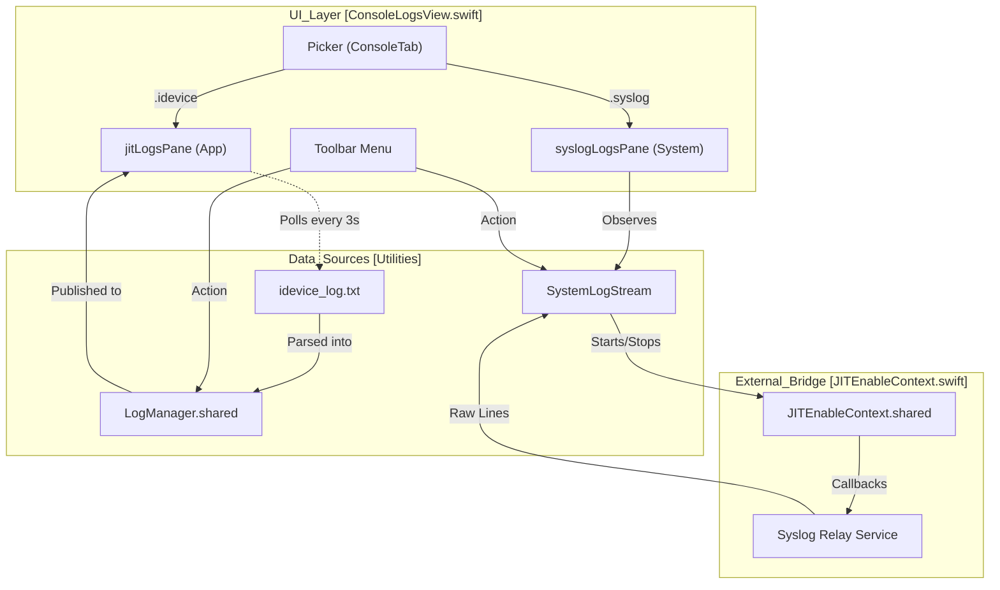
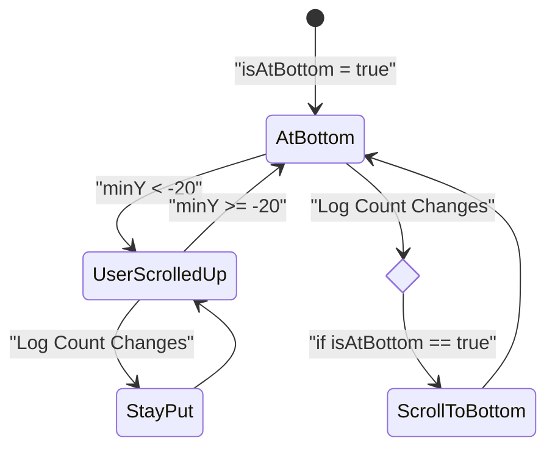

# Console and Logging Interface

Relevant source files

The following files were used as context for generating this wiki page:

- [StikJIT/Utilities/LogManager.swift](StikJIT/Utilities/LogManager.swift)
- [StikJIT/Utilities/LogManagerBridge.swift](StikJIT/Utilities/LogManagerBridge.swift)
- [StikJIT/Utilities/SystemLogStream.swift](StikJIT/Utilities/SystemLogStream.swift)
- [StikJIT/Views/ConsoleLogsView.swift](StikJIT/Views/ConsoleLogsView.swift)

## Purpose and Scope

This page documents `ConsoleLogsView` — the dual-pane logging interface in StikDebug — along with the `LogManager` and `SystemLogStream` classes that power it. The interface surfaces two independent log streams: **App** logs (persistent application and JIT engine events) and **System** logs (real-time syslog relay from the connected device).

The logging system provides filtering, export capabilities, real-time streaming with speed control, and intelligent auto-scroll behavior to assist in debugging JIT enablement and device communication issues.

---

## High-Level Structure

`ConsoleLogsView` is a `NavigationStack` that uses a segmented `Picker` in the toolbar to switch between two distinct panes: `jitLogsPane` and `syslogLogsPane` [StikJIT/Views/ConsoleLogsView.swift:11-61]().

**Diagram: Console and Logging Component Architecture**

Sources: [StikJIT/Views/ConsoleLogsView.swift:11-62](), [StikJIT/Utilities/LogManager.swift:10-13](), [StikJIT/Utilities/SystemLogStream.swift:11-19](), [StikJIT/Utilities/SystemLogStream.swift:57-65]()

---

## App Logs (idevice Tab)

The **App** tab displays logs generated by the StikDebug application itself, including JIT enablement steps, DDI mounting progress, and script execution output.

### Data Flow and Persistence
App logs are backed by `LogManager.shared`. While the app is running, logs are kept in memory. The `ConsoleLogsView` also implements a polling mechanism to read from `idevice_log.txt` in the Documents directory to ensure persistence across sessions.

- **Polling:** A `Timer` fires every 3.0 seconds (`appLogRefreshInterval`) [StikJIT/Views/ConsoleLogsView.swift:30-31]().
- **Parsing:** `loadIdeviceLogsAsync` reads the log file and converts raw text into `LogEntry` objects [StikJIT/Views/ConsoleLogsView.swift:405-430]().
- **Optimization:** The system tracks `lastProcessedLineCount` to only parse new lines appended to the file since the last poll [StikJIT/Views/ConsoleLogsView.swift:483-500]().

### Log Entry Categorization
Lines are categorized into `LogType` levels based on keyword matching within `createLogEntry(from:)`:
- **ERROR:** Matches "ERROR" or "Error" [StikJIT/Views/ConsoleLogsView.swift:440]().
- **WARNING:** Matches "WARNING" or "Warning" [StikJIT/Views/ConsoleLogsView.swift:442]().
- **DEBUG:** Matches "DEBUG" [StikJIT/Views/ConsoleLogsView.swift:444]().
- **INFO:** Default fallback [StikJIT/Views/ConsoleLogsView.swift:446]().

### LogManager Singleton
`LogManager` handles the in-memory buffer of logs and provides thread-safe access for both Swift and Objective-C components via `LogManagerBridge`.

- **Capacity:** The buffer is capped at 1000 entries. When exceeded, it removes the oldest 100 entries [StikJIT/Utilities/LogManager.swift:57]().
- **Prefix Stripping:** To prevent visual clutter, `LogManager` strips redundant prefixes like "INFO: " or "DBG: " from incoming strings before storage [StikJIT/Utilities/LogManager.swift:37-53]().
- **Objective-C Bridge:** `LogManagerBridge` allows the underlying C/Obj-C communication libraries to post logs to the UI using `@objc` methods [StikJIT/Utilities/LogManagerBridge.swift:10-32]().

Sources: [StikJIT/Utilities/LogManager.swift:10-102](), [StikJIT/Views/ConsoleLogsView.swift:405-543](), [StikJIT/Utilities/LogManagerBridge.swift:10-32]()

---

## System Logs (syslog Tab)

The **System** tab provides a real-time stream of the iOS system log (syslog) from the connected device via the `syslog_relay` service.

### SystemLogStream Implementation
`SystemLogStream` manages the lifecycle of the syslog connection and the resulting data buffer.

- **Lifecycle:** The stream starts when the view appears and stops when it disappears [StikJIT/Views/ConsoleLogsView.swift:256-263](), [StikJIT/Views/ConsoleLogsView.swift:110-112]().
- **Connection:** It uses `JITEnableContext.shared.startSyslogRelay` to attach to the device service, receiving raw lines in a closure [StikJIT/Utilities/SystemLogStream.swift:57-65]().
- **Error Recovery:** If the stream drops, `scheduleAutoRetry()` attempts to reconnect every 2 seconds [StikJIT/Utilities/SystemLogStream.swift:202-216]().

### Real-time Control and Speed
The interface allows users to control the flow of data to prevent UI lag during high-volume logging:
- **Pause/Resume:** Users can toggle `isPaused` via `togglePause()` to freeze the view while the buffer continues to collect in the background [StikJIT/Utilities/SystemLogStream.swift:91-110]().
- **Speed Selection:** The `updateInterval` property controls how frequently `pendingEntries` are flushed to the `entries` array. Options include **Live (0.0s)** up to **2.0s** [StikJIT/Views/ConsoleLogsView.swift:31](), [StikJIT/Utilities/SystemLogStream.swift:23-36]().
- **Batching:** When `updateInterval` is 0 (Live), a `batchTimer` flushes entries every 0.1s to maintain responsiveness without overwhelming the main thread [StikJIT/Utilities/SystemLogStream.swift:139-151]().

### Filtering
A search bar allows for real-time filtering of the syslog buffer.
- **Implementation:** The `filteredSyslogEntries` computed property performs a case-insensitive search on the `raw` log string [StikJIT/Views/ConsoleLogsView.swift:34-40]().
- **Visuals:** Filtered results are rendered with the same color-coded formatting as the main stream using `createSyslogAttributedString` [StikJIT/Views/ConsoleLogsView.swift:222-234]().

Sources: [StikJIT/Utilities/SystemLogStream.swift:11-217](), [StikJIT/Views/ConsoleLogsView.swift:199-234]()

---

## UI Features and Behavior

### Auto-Scroll Logic
Both panes implement "Sticky Scroll" behavior. The view automatically scrolls to the bottom only if the user was already at the bottom of the list.

**Diagram: Auto-Scroll State Machine**

- **Detection:** `GeometryReader` and `ScrollOffsetPreferenceKey` track the `minY` of the content relative to the scroll view [StikJIT/Views/ConsoleLogsView.swift:164-185]().
- **Threshold:** A offset of `-20` or greater relative to the coordinate space is considered "at the bottom" [StikJIT/Views/ConsoleLogsView.swift:609-614]().

### Export and Clipboard
- **Copy:** Logs are formatted with timestamps and type tags before being placed on the `UIPasteboard.general.string` [StikJIT/Views/ConsoleLogsView.swift:550-593]().
- **ShareLink:** The App logs can be exported as a raw file (`idevice_log.txt`) using the native iOS `ShareLink` [StikJIT/Views/ConsoleLogsView.swift:273-288]().

### Visual Formatting
Logs are rendered using `AttributedString` to provide distinct colors for different components via `createLogAttributedString` and `createSyslogAttributedString`:
- **Timestamps:** Gray [StikJIT/Views/ConsoleLogsView.swift:318]().
- **Log Levels:** Color-coded via `colorForLogType` (Red for Error, Green for Info, Yellow for Warning) [StikJIT/Views/ConsoleLogsView.swift:370-376]().
- **Font:** 11pt Monospaced system font for consistent alignment [StikJIT/Views/ConsoleLogsView.swift:153]().

Sources: [StikJIT/Views/ConsoleLogsView.swift:153-185](), [StikJIT/Views/ConsoleLogsView.swift:305-390](), [StikJIT/Views/ConsoleLogsView.swift:550-593]()